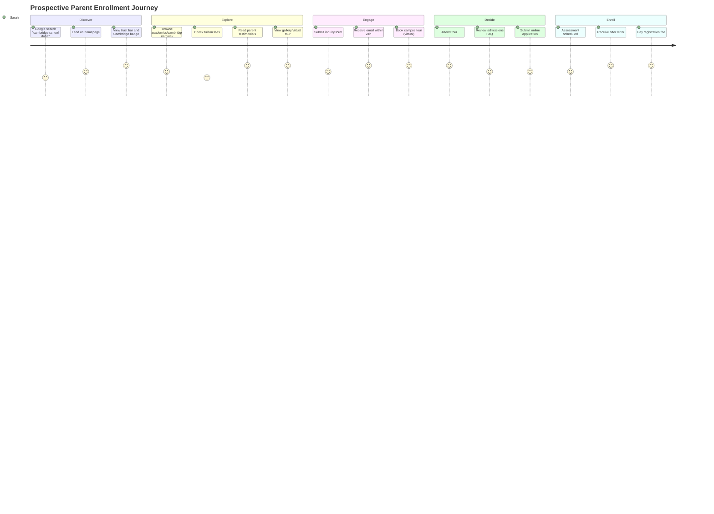
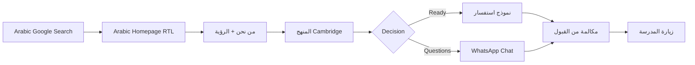
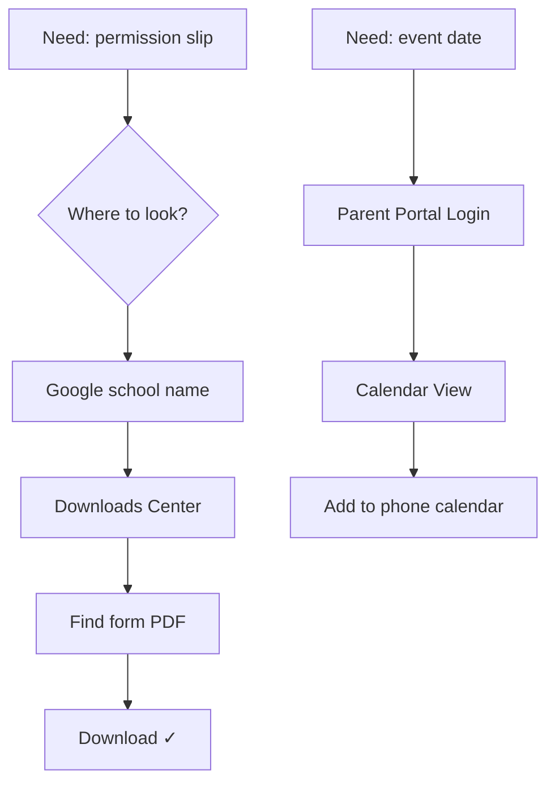

# 03 — UX Personas & Customer Journey Maps

---

## 1. Persona Overview

Six primary personas represent Alashbal's digital audience. Each persona has distinct goals, pain points, devices, and success metrics.

---

## 2. Persona Definitions

### P1 — Sarah Al-Mansouri · Prospective Parent (Expat)

| Attribute    | Detail                         |
| ------------ | ------------------------------ |
| Age          | 34                             |
| Location     | Relocating from UK to Doha     |
| Family       | 2 children (ages 5, 8)         |
| Income       | Upper-middle                   |
| Device       | iPhone 15 (70%), MacBook (30%) |
| Language     | English primary, basic Arabic  |
| Tech comfort | High                           |

**Goals:**

- Find a Cambridge-accredited school near Old Airport/work location
- Compare curriculum, fees, and admission timeline before relocating
- Book a virtual tour before arriving in Qatar
- Feel confident about school quality and community

**Pain Points:**

- Overwhelmed by 20+ school options in Doha
- Limited time zone overlap for phone calls
- Needs fee transparency upfront
- Distrusts outdated websites

**Quote:** _"If I can't book a tour online and see the campus, I won't even add it to my shortlist."_

**Success Metric:** Completes inquiry form + books tour within 2 sessions.

---

### P2 — Ahmed Hassan · Prospective Parent (Local Qatari)

| Attribute    | Detail                         |
| ------------ | ------------------------------ |
| Age          | 38                             |
| Location     | Doha (permanent resident)      |
| Family       | 3 children (ages 3, 7, 12)     |
| Language     | Arabic primary, English fluent |
| Device       | iPhone, iPad                   |
| Tech comfort | Medium                         |

**Goals:**

- School with strong Arabic/Islamic integration alongside Cambridge
- Reputation and accreditation verification
- Sibling admission for multiple children
- Arabic website for spouse/family to review

**Pain Points:**

- English-only sites exclude family decision-makers
- Wants to see cultural values reflected, not just Western branding
- Needs WhatsApp contact option

**Quote:** _"أحتاج موقع يعرض المنهج بالعربي وأرى صور من المدرسة الحقيقية."_

**Success Metric:** Views Arabic site, submits inquiry via WhatsApp or form.

---

### P3 — Maria Santos · Current Parent

| Attribute    | Detail                      |
| ------------ | --------------------------- |
| Age          | 41                          |
| Location     | Doha (2 years)              |
| Child        | 1 child in Primary (Year 3) |
| Language     | English + French            |
| Device       | iPhone, laptop              |
| Tech comfort | Medium                      |

**Goals:**

- Access school calendar, news, and announcements
- Download forms (permission slips, reports)
- Contact teachers/administration quickly
- Stay informed about events and fees

**Pain Points:**

- No parent portal on current site
- Information scattered across WhatsApp groups and emails
- Can't find documents when needed

**Quote:** _"I just want one place to check the calendar and download whatever form my child needs."_

**Success Metric:** Uses portal/downloads monthly; NPS ≥ 8.

---

### P4 — James Okonkwo · Teacher / Recruit

| Attribute    | Detail                                        |
| ------------ | --------------------------------------------- |
| Age          | 29                                            |
| Location     | Searching internationally (currently Nigeria) |
| Language     | English                                       |
| Device       | Laptop, Android phone                         |
| Tech comfort | High                                          |

**Goals:**

- Understand school culture, curriculum, and facilities
- Find open teaching positions with clear requirements
- Assess professional development opportunities
- Quick application for roles

**Pain Points:**

- School websites rarely have useful careers sections
- Slow sites on mobile data
- Vague job descriptions

**Quote:** _"Show me what it's like to teach here and what you need from me — don't make me dig."_

**Success Metric:** Views careers page, submits application.

---

### P5 — Fatima Al-Kuwari · Student (Prospective, Age 14)

| Attribute    | Detail           |
| ------------ | ---------------- |
| Age          | 14               |
| Location     | Doha             |
| Language     | Arabic + English |
| Device       | iPhone (90%)     |
| Tech comfort | Very high        |

**Goals:**

- See what student life looks like (clubs, sports, friends)
- Check if school has STEM/robotics programs
- Watch student testimonial videos
- Share school website with friends

**Pain Points:**

- School sites feel like they're "for parents only"
- Boring, text-heavy pages
- No social media integration

**Quote:** _"If the website looks old, I'll assume the school is old too."_

**Success Metric:** Spends 3+ minutes on Student Life; shares page.

---

### P6 — David Chen · Education Partner / Agent

| Attribute    | Detail                      |
| ------------ | --------------------------- |
| Age          | 45                          |
| Role         | Education consultancy agent |
| Language     | English, Mandarin           |
| Device       | Laptop                      |
| Tech comfort | High                        |

**Goals:**

- Quick access to admission requirements, fees, and documents
- Downloadable prospectus/brochure
- Direct admissions contact
- Reliable, professional digital presence to recommend to clients

**Pain Points:**

- Can't send clients to a site that looks unprofessional
- Needs PDF downloads and clear fee tables
- Slow response = lost placement

**Quote:** _"I need a link I can send to families that answers 80% of their questions instantly."_

**Success Metric:** Downloads prospectus; refers 3+ families/quarter.

---

## 3. Persona Priority Matrix

| Persona                   | Business Impact | Digital Maturity Needed | Release Priority     |
| ------------------------- | --------------- | ----------------------- | -------------------- |
| P1 Sarah (Expat Parent)   | ★★★★★           | High                    | MVP (Sprint 1–3)     |
| P2 Ahmed (Local Parent)   | ★★★★★           | High (AR/RTL)           | MVP (Sprint 2–3)     |
| P3 Maria (Current Parent) | ★★★★☆           | Medium                  | Phase 2 (Sprint 5–6) |
| P6 David (Agent)          | ★★★★☆           | Medium                  | MVP (Sprint 3)       |
| P5 Fatima (Student)       | ★★★☆☆           | High (visual)           | MVP (Sprint 3)       |
| P4 James (Recruit)        | ★★★☆☆           | Low                     | Phase 2 (Sprint 6)   |

---

## 4. Customer Journey Maps

### 4.1 Journey A — Prospective Parent: Discovery → Enrollment

**Persona:** P1 Sarah (Expat Parent)  
**Duration:** 2–8 weeks  
**Channels:** Google Search → Website → Email → Tour → Application



| Stage    | Touchpoint     | Emotion    | Pain Risk        | Design Response          |
| -------- | -------------- | ---------- | ---------------- | ------------------------ |
| Discover | Google SERP    | Curious    | Competitor ads   | SEO + rich snippets      |
| Land     | Homepage hero  | Hopeful    | Slow load        | <2s LCP, video hero      |
| Explore  | Academics      | Evaluating | Info overload    | Age-band cards, clear IA |
| Explore  | Fees           | Anxious    | Hidden costs     | Transparent fee table    |
| Engage   | Inquiry form   | Motivated  | Long form        | 5-field micro-form       |
| Engage   | Email response | Validated  | No reply 48h+    | 24h SLA + auto-confirm   |
| Decide   | Tour           | Excited    | Hard to schedule | Calendar booking widget  |
| Enroll   | Application    | Committed  | Paper process    | Online multi-step form   |

**Key Metrics:**

- Homepage → Inquiry: 8% conversion target
- Inquiry → Tour booked: 60% target
- Tour → Application: 40% target

---

### 4.2 Journey B — Local Parent: Arabic Research → WhatsApp Contact

**Persona:** P2 Ahmed (Local Parent)



| Stage     | Touchpoint      | Critical Requirement                |
| --------- | --------------- | ----------------------------------- |
| Discover  | Arabic SERP     | hreflang + AR content               |
| Browse    | RTL layout      | Mirror UI, Arabic typography        |
| Trust     | Cambridge badge | Arabic explanation of accreditation |
| Contact   | WhatsApp        | Pre-filled message, business hours  |
| Follow-up | Phone call      | CRM-tracked from web inquiry        |

---

### 4.3 Journey C — Current Parent: Daily Information Need

**Persona:** P3 Maria (Current Parent)



| Stage         | Touchpoint            | Phase   |
| ------------- | --------------------- | ------- |
| Quick info    | Public downloads page | MVP     |
| Calendar      | Parent portal         | Phase 2 |
| Communication | Portal messages       | Phase 2 |
| Emergency     | Homepage alert banner | MVP     |

---

### 4.4 Journey D — Teacher Recruitment

**Persona:** P4 James (Teacher)

| Stage     | Page               | Content Needed                  |
| --------- | ------------------ | ------------------------------- |
| Discover  | Google / LinkedIn  | Careers page indexed            |
| Evaluate  | About + Academics  | Culture, curriculum, facilities |
| Assess    | Careers listing    | Role, requirements, benefits    |
| Apply     | Application form   | CV upload, cover letter         |
| Follow-up | Email confirmation | Timeline, next steps            |

---

## 5. Cross-Journey Design Requirements

### Universal UX Principles

| Principle              | Implementation                                               |
| ---------------------- | ------------------------------------------------------------ |
| 3-click rule           | Any key info within 3 clicks from homepage                   |
| 5-second test          | Value proposition clear in 5 seconds                         |
| Dual CTA               | Every major page: primary (Tour/Apply) + secondary (Inquire) |
| Progressive disclosure | Accordions/tabs for dense info (fees, FAQs)                  |
| Error prevention       | Form validation inline, not on submit                        |
| Feedback               | Loading states, success confirmations, email receipts        |

### Device Strategy

| Device  | Traffic Share (est.) | Priority               |
| ------- | -------------------- | ---------------------- |
| Mobile  | 65%                  | Design mobile-first    |
| Desktop | 30%                  | Full experience        |
| Tablet  | 5%                   | Responsive breakpoints |

### Accessibility Across Journeys

- All forms keyboard-navigable
- Tour booking screen-reader compatible
- Arabic RTL does not break English LTR components
- Color contrast ≥ 4.5:1 on all text
- Touch targets ≥ 44×44px on mobile

---

## 6. Emotion Map Summary

```
Emotion
  ↑
  │     ╭──╮                    ╭────╮
  │    ╱    ╲    ╭──╮         ╱      ╲
  │   ╱      ╲  ╱    ╲       ╱        ╲── Enrolled
  │  ╱        ╲╱      ╲─────╱
  │ ╱  Curious    Evaluating   Anxious    Confident
  └────────────────────────────────────────────→ Time
     Discover  Explore  Fees  Engage  Tour  Apply
```

**Critical emotion dips to design away:**

1. **Fees page** — anxiety about hidden costs → transparent tables
2. **Post-inquiry silence** — doubt → auto-confirmation + 24h SLA
3. **Application complexity** — frustration → save-and-resume, progress bar

---

## 7. Journey-to-Feature Mapping

| Journey Stage | MVP Feature                     | Phase 2 Feature         |
| ------------- | ------------------------------- | ----------------------- |
| Discover      | SEO, Schema, OG                 | Blog, local SEO         |
| Explore       | Academics pages, Gallery        | Virtual tour            |
| Trust         | Accreditation bar, Testimonials | Awards, stats           |
| Engage        | Inquiry form, WhatsApp          | AI chat                 |
| Tour          | Book-a-tour form                | Calendar integration    |
| Apply         | Application form (basic)        | OpenApply integration   |
| Retain        | News, Downloads                 | Parent portal, Calendar |
