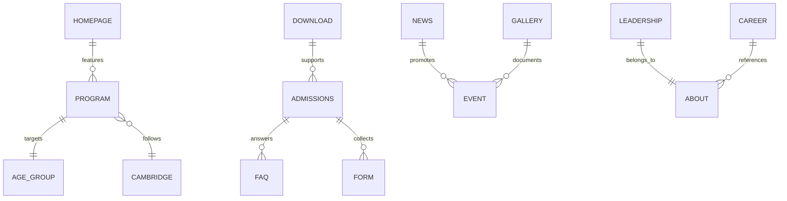

# 05 — Information Architecture

---

## 1. IA Principles

1. **Audience-first grouping** — organize by user intent, not internal departments
2. **Max 7 top-level items** — cognitive load limit (Miller's Law)
3. **Admissions always visible** — persistent CTA + nav item
4. **Flat where possible** — max 3 levels deep
5. **Locale-prefixed URLs** — `/en/`, `/ar/`, `/fr/`

---

## 2. Complete Sitemap

```
Alashbal International School
│
├── 🏠 Home                                    [/]
│
├── 📖 About
│   ├── Our Story                              [/about]
│   ├── Mission, Vision & Values               [/about/mission-vision]
│   ├── Leadership Team                        [/about/leadership]
│   ├── Accreditations & Partnerships          [/about/accreditations]
│   ├── Campus & Facilities                    [/about/campus]
│   └── Virtual Tour                           [/about/virtual-tour]        [P1]
│
├── 🎓 Academics
│   ├── Academic Overview                      [/academics]
│   ├── Early Years (Ages 3–5)                 [/academics/early-years]
│   ├── Primary (Ages 5–11)                    [/academics/primary]
│   ├── Middle School (Ages 11–14)             [/academics/middle-school]
│   ├── High School (Ages 14–18)               [/academics/high-school]
│   ├── Cambridge Pathway                      [/academics/cambridge-pathway]
│   ├── STEM Program                           [/academics/stem]
│   ├── AI & Robotics                          [/academics/ai-robotics]
│   ├── Languages (EN/AR/FR)                   [/academics/languages]
│   └── Learning Support                       [/academics/learning-support]  [P2]
│
├── 📝 Admissions                              [/admissions]
│   ├── How to Apply                           [/admissions/how-to-apply]
│   ├── Tuition & Fees                         [/admissions/tuition-fees]
│   ├── Inquire Now                            [/admissions/inquire]
│   ├── Book a Tour                            [/admissions/book-a-tour]
│   ├── Online Application                     [/admissions/apply]            [P1]
│   ├── FAQs                                   [/admissions/faqs]
│   ├── Age & Year Group Guide                 [/admissions/age-guide]
│   └── Relocating to Qatar                    [/admissions/relocating]       [P1]
│
├── 🌟 Student Life
│   ├── Overview                               [/student-life]
│   ├── Clubs & Activities                     [/student-life/clubs]
│   ├── Sports                                 [/student-life/sports]
│   ├── Events                                 [/student-life/events]
│   ├── Gallery                                [/student-life/gallery]
│   └── Library                                [/student-life/library]        [P2]
│
├── 📰 News & Media
│   ├── News Listing                           [/news]
│   └── Article Detail                         [/news/{slug}]
│
├── 💼 Careers
│   ├── Open Positions                         [/careers]
│   └── Position Detail                        [/careers/{slug}]
│
├── 📥 Downloads                               [/downloads]
│
├── ❓ FAQs                                    [/faqs]
│
├── 📞 Contact                                 [/contact]
│
├── 🔒 Portals (Authenticated)
│   ├── Parent Portal                          [/portal/parent]               [P1]
│   ├── Student Portal                         [/portal/student]              [P2]
│   └── Teacher Portal                         [/portal/teacher]              [P2]
│
├── 🔧 Admin (Authenticated)
│   └── CMS Dashboard                          [/admin]                       [P1]
│
└── ⚖️ Legal
    ├── Privacy Policy                         [/privacy]
    └── Terms of Use                           [/terms]
```

**Total public pages at launch:** ~35  
**Total at full maturity:** ~50+

---

## 3. Primary Navigation

### 3.1 Desktop Mega Menu

```
┌─────────────────────────────────────────────────────────────────────────────┐
│ [Logo]  About ▾  Academics ▾  Admissions ▾  Student Life ▾  News  Contact  │
│                                          [🌐 EN▾] [🔍] [Book a Tour]       │
└─────────────────────────────────────────────────────────────────────────────┘
```

**About ▾**

| Column 1            | Column 2        |
| ------------------- | --------------- |
| Our Story           | Leadership Team |
| Mission & Vision    | Accreditations  |
| Campus & Facilities | Virtual Tour    |

**Academics ▾**

| Column 1    | Column 2      | Column 3          |
| ----------- | ------------- | ----------------- |
| Early Years | Middle School | Cambridge Pathway |
| Primary     | High School   | STEM              |
|             |               | AI & Robotics     |

**Admissions ▾**

| Column 1     | Column 2            |
| ------------ | ------------------- |
| How to Apply | Tuition & Fees      |
| Inquire Now  | FAQs                |
| Book a Tour  | Age Guide           |
| Apply Online | Relocating to Qatar |

**Student Life ▾**

| Column 1           | Column 2 |
| ------------------ | -------- |
| Clubs & Activities | Events   |
| Sports             | Gallery  |

### 3.2 Mobile Navigation

```
┌──────────────────────┐
│ [Logo]    [🌐] [☰]  │
├──────────────────────┤
│  Book a Tour  (CTA)  │
│  ─────────────────── │
│  About            ▸  │
│  Academics        ▸  │
│  Admissions       ▸  │
│  Student Life     ▸  │
│  News                │
│  Careers             │
│  Contact             │
│  Downloads           │
│  ─────────────────── │
│  Parent Portal       │
│  📞 +974 4450 7882   │
└──────────────────────┘
```

### 3.3 Utility Navigation (Top Bar)

```
info@aisdoha.net  |  +974 4450 7882  |  Parent Portal  |  🌐 EN / AR / FR
```

---

## 4. Homepage Information Hierarchy

```
┌─────────────────────────────────────────────┐
│ 1. Sticky Header + Utility Bar                │  wayfinding
├─────────────────────────────────────────────┤
│ 2. Hero (Video + Headline + Dual CTA)         │  conversion
├─────────────────────────────────────────────┤
│ 3. Trust Bar (Cambridge + Accreditations)     │  trust
├─────────────────────────────────────────────┤
│ 4. Why Alashbal (3–4 value pillars)         │  differentiation
├─────────────────────────────────────────────┤
│ 5. Learning Journey (Age-band cards)          │  exploration
├─────────────────────────────────────────────┤
│ 6. Cambridge Pathway highlight                │  curriculum
├─────────────────────────────────────────────┤
│ 7. STEM & Innovation spotlight                │  innovation
├─────────────────────────────────────────────┤
│ 8. Principal's Message (video)                │  leadership
├─────────────────────────────────────────────┤
│ 9. Stats (students, nationalities, years)     │  social proof
├─────────────────────────────────────────────┤
│ 10. Testimonials carousel                     │  social proof
├─────────────────────────────────────────────┤
│ 11. Latest News (3 cards)                     │  freshness
├─────────────────────────────────────────────┤
│ 12. Upcoming Events                           │  engagement
├─────────────────────────────────────────────┤
│ 13. Campus Gallery preview                    │  visual trust
├─────────────────────────────────────────────┤
│ 14. Admissions CTA banner                     │  conversion
├─────────────────────────────────────────────┤
│ 15. Footer                                    │  navigation
└─────────────────────────────────────────────┘
```

---

## 5. Page Template Matrix

| Template    | Used By                             | Key Components                                  |
| ----------- | ----------------------------------- | ----------------------------------------------- |
| **Landing** | Home                                | Hero video, trust bar, stats, testimonials, CTA |
| **Hub**     | Academics, Admissions, Student Life | Section header, card grid, sidebar CTA          |
| **Detail**  | Program pages, About sub-pages      | Hero image, breadcrumbs, content blocks, FAQ    |
| **Listing** | News, Events, Careers, Gallery      | Filterable grid, pagination                     |
| **Article** | News detail, Career detail          | Rich text, author, date, related items          |
| **Form**    | Inquire, Book Tour, Apply           | Multi-step form, validation, confirmation       |
| **Contact** | Contact                             | Map, form, contact cards, hours                 |
| **Legal**   | Privacy, Terms                      | Prose content, last updated date                |
| **Portal**  | Parent/Student/Teacher              | Dashboard, sidebar nav, data tables             |
| **Admin**   | CMS                                 | CRUD tables, rich editor, media library         |

---

## 6. URL Design Rules

| Rule                  | Example                                |
| --------------------- | -------------------------------------- |
| Lowercase, hyphenated | `/academics/early-years`               |
| Locale prefix         | `/ar/academics/early-years`            |
| No trailing slash     | `/about` not `/about/`                 |
| No file extensions    | `/downloads` not `/downloads.html`     |
| Slugs max 4 words     | `/news/aiss-robotics-competition-2026` |
| Breadcrumbs match URL | Home > Academics > Early Years         |

---

## 7. Search Architecture

### 7.1 Global Search (Phase 1)

- Search bar in header (desktop) and mobile menu
- Indexes: all public pages, news, FAQs, downloads
- Results grouped by type: Pages, News, Downloads, FAQs
- Keyboard shortcut: `Ctrl+K` / `⌘+K`

### 7.2 Search Index Schema

| Field       | Type   | Boost |
| ----------- | ------ | ----- |
| title       | text   | 3.0   |
| description | text   | 2.0   |
| content     | text   | 1.0   |
| type        | filter | —     |
| locale      | filter | —     |
| url         | stored | —     |

---

## 8. Content Relationships



---

## 9. Redirect & Migration Map

| Old (Wix)     | New                         | Priority |
| ------------- | --------------------------- | -------- |
| `/`           | `/en`                       | P0       |
| `/about`      | `/en/about`                 | P0       |
| `/admissions` | `/en/admissions`            | P0       |
| `/contact`    | `/en/contact`               | P0       |
| `/our-team`   | `/en/about/leadership`      | P0       |
| `/academics`  | `/en/academics`             | P1       |
| All 404s      | `/en` (with GSC monitoring) | P0       |

---

## 10. Navigation Analytics Plan

Track via GA4:

- Nav click heatmap (which items used most)
- Mega menu engagement rate
- Mobile hamburger open rate
- Search usage rate
- CTA click-through (Book Tour vs Inquire)
- Breadcrumb back-navigation rate

**Review cadence:** Monthly for first 6 months, then quarterly.
