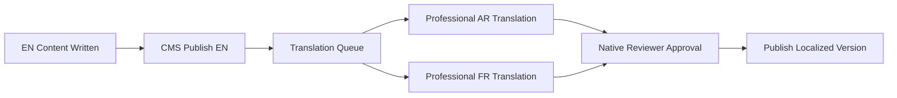

# 06 — Content Strategy

---

## 1. Content Mission

> Position Alashbal International School as Doha's most forward-thinking Cambridge-accredited institution — through authentic storytelling, transparent information, and multilingual content that converts curious families into enrolled students.

---

## 2. Voice & Tone

### 2.1 Brand Voice Attributes

| Attribute           | Description                      | Example                                                 |
| ------------------- | -------------------------------- | ------------------------------------------------------- |
| **Confident**       | Assert quality without arrogance | "Cambridge-accredited excellence in the heart of Doha"  |
| **Warm**            | Welcoming, community-focused     | "We can't wait to welcome your family"                  |
| **Clear**           | Plain language, no jargon        | "Children aged 3–5 explore through play-based learning" |
| **Forward-looking** | Innovation, future-ready         | "Preparing students for careers that don't exist yet"   |
| **Inclusive**       | Multicultural, respectful        | "90+ nationalities, one community"                      |

### 2.2 Tone by Context

| Context            | Tone                          | Formality   |
| ------------------ | ----------------------------- | ----------- |
| Homepage hero      | Inspiring, bold               | Medium      |
| Admissions         | Helpful, reassuring           | Medium-high |
| Academics          | Informative, precise          | High        |
| Student life       | Energetic, fun                | Low-medium  |
| Leadership message | Personal, sincere             | Medium      |
| Legal pages        | Clear, direct                 | High        |
| Error messages     | Friendly, helpful             | Low         |
| Arabic content     | Respectful, warm (فصحى مبسطة) | Medium-high |
| French content     | Professional, elegant         | Medium-high |

### 2.3 Writing Rules

1. **Active voice** — "We nurture" not "Students are nurtured"
2. **Short sentences** — max 25 words average
3. **Scannable** — bullets, subheadings every 200 words
4. **Specific** — "Ages 3–5" not "young children"
5. **CTA-driven** — every page ends with a clear next step
6. **No ALL CAPS** in body text (headings only, sparingly)
7. **Avoid** clichés: "world-class" (max 1× per page), "cutting-edge" (replace with specifics)

---

## 3. Content Pillars

| Pillar          | Purpose                             | Primary Pages           |
| --------------- | ----------------------------------- | ----------------------- |
| **Excellence**  | Academic rigor, Cambridge pathway   | Academics, Cambridge    |
| **Innovation**  | STEM, AI, Robotics, technology      | STEM, AI pages          |
| **Community**   | Belonging, diversity, warmth        | About, Student Life     |
| **Opportunity** | Future pathways, global readiness   | High School, Admissions |
| **Trust**       | Accreditations, leadership, history | About, Accreditations   |

---

## 4. Page-Level Content Plan

### 4.1 Homepage

| Section                     | Content Source                                  | Word Count        | Status            |
| --------------------------- | ----------------------------------------------- | ----------------- | ----------------- |
| Hero headline               | New copy                                        | 15 words          | Write             |
| Hero subtext                | Adapt from current slogan                       | 30 words          | Adapt             |
| Value pillars (×4)          | New (premium, Cambridge, innovation, community) | 200 words         | Write             |
| Learning journey cards (×5) | New per age band                                | 250 words         | Write             |
| Cambridge highlight         | New + Cambridge guidelines                      | 150 words         | Write             |
| STEM spotlight              | New                                             | 100 words         | Write             |
| Principal message           | Adapt Head of School letter                     | 200 words + video | Adapt             |
| Stats                       | School data needed                              | 4 stats           | **Data required** |
| Testimonials (×3)           | Collect from stakeholders                       | 150 words         | **Collect**       |
| News preview                | CMS                                             | Dynamic           | CMS               |
| CTA banner                  | New                                             | 40 words          | Write             |

### 4.2 About Pages

| Page             | Key Content                              | Source                            |
| ---------------- | ---------------------------------------- | --------------------------------- |
| Our Story        | School history, founding, growth         | **Stakeholder input needed**      |
| Mission & Vision | Existing mission/vision (refined)        | Adapt from current site           |
| Leadership       | Head of School bio + photo, SLT profiles | **Photos + bios required**        |
| Accreditations   | Cambridge, MoE Qatar, others             | **Verify current accreditations** |
| Campus           | Facility descriptions + photos           | **Photography required**          |

### 4.3 Academics Pages

| Page              | Key Content                                | Source                             |
| ----------------- | ------------------------------------------ | ---------------------------------- |
| Overview          | Curriculum philosophy                      | Write                              |
| Early Years       | Play-based, Cambridge Early Years          | Write + Cambridge materials        |
| Primary           | Cambridge Primary programme                | Write + Cambridge materials        |
| Middle School     | Transition, subject breadth                | Write                              |
| High School       | IGCSE/A-Level or Cambridge Upper Secondary | Write + **confirm pathway**        |
| Cambridge Pathway | Detailed Cambridge explanation             | Write + Cambridge brand guidelines |
| STEM              | Labs, competitions, curriculum integration | Write + **program details needed** |
| AI & Robotics     | Club, curriculum, equipment                | Write + **program details needed** |
| Languages         | EN/AR/FR offering                          | Write                              |

### 4.4 Admissions Pages

| Page                | Key Content                          | Source                          |
| ------------------- | ------------------------------------ | ------------------------------- |
| How to Apply        | 6–7 step process                     | Write (benchmark Hamilton/GEMS) |
| Tuition & Fees      | Fee table by year group              | **Data required from school**   |
| Inquire             | 5-field form + reassurance copy      | Write                           |
| Book a Tour         | Calendar + expectations copy         | Write                           |
| FAQs                | 30+ questions                        | Write                           |
| Age Guide           | Year group ↔ age ↔ birth date table  | Write                           |
| Relocating to Qatar | Expat guide (housing, visa, schools) | Write                           |

### 4.5 Student Life Pages

| Page     | Key Content                    | Source                   |
| -------- | ------------------------------ | ------------------------ |
| Overview | Holistic development narrative | Write                    |
| Clubs    | Club listing with descriptions | **Data required**        |
| Sports   | Sports offered, facilities     | **Data required**        |
| Events   | Dynamic from CMS               | CMS                      |
| Gallery  | Photo/video gallery            | **Photography required** |

---

## 5. Multilingual Content Strategy

### 5.1 Language Priority

| Language     | Launch        | Coverage Target                                | Notes                         |
| ------------ | ------------- | ---------------------------------------------- | ----------------------------- |
| English (EN) | MVP (100%)    | All pages                                      | Default locale                |
| Arabic (AR)  | MVP (80%)     | All public pages                               | RTL, professional translation |
| French (FR)  | Phase 2 (60%) | Key pages (Home, About, Admissions, Academics) | For francophone families      |

### 5.2 Translation Workflow

| Step                | Owner                   | SLA             |
| ------------------- | ----------------------- | --------------- |
| EN content creation | School + Content writer | Per sprint      |
| Translation         | Professional translator | 3 business days |
| Review              | Native-speaking staff   | 1 business day  |
| Publish             | CMS editor              | Same day        |

### 5.3 RTL Content Rules

- All AR pages use `dir="rtl"` and Arabic typography tokens
- Numbers, emails, phone numbers remain LTR
- Images with text: create AR versions where text is embedded
- Cambridge logo: use standard (not mirrored)

---

## 6. Media Content Requirements

### 6.1 Photography Shot List (Launch)

| Category             | Shots Needed                          | Priority |
| -------------------- | ------------------------------------- | -------- |
| Campus exterior      | 5 (different angles, golden hour)     | P0       |
| Classrooms           | 8 (EY, Primary, Middle, HS, STEM lab) | P0       |
| Students learning    | 12 (diverse, candid, age ranges)      | P0       |
| Teachers teaching    | 6 (with permission forms)             | P0       |
| Leadership portraits | 4 (Head of School + SLT)              | P0       |
| Sports/facilities    | 4                                     | P1       |
| Events/activities    | 6                                     | P1       |
| Food/cafeteria       | 2                                     | P2       |
| **Total**            | **~47 photos**                        |          |

### 6.2 Video Content

| Video                     | Duration         | Priority |
| ------------------------- | ---------------- | -------- |
| Hero loop (campus b-roll) | 15–30s, no audio | P0       |
| Principal welcome         | 2–3 min          | P0       |
| Student testimonial (×2)  | 60s each         | P1       |
| Parent testimonial (×1)   | 60s              | P1       |
| Virtual campus tour       | 3–5 min          | P1       |
| STEM/Robotics demo        | 60s              | P2       |

### 6.3 Document Assets

| Document          | Format                   | Priority |
| ----------------- | ------------------------ | -------- |
| School prospectus | PDF (designed)           | P0       |
| Admissions guide  | PDF                      | P0       |
| Fee structure     | PDF + web table          | P0       |
| Application forms | PDF (until online apply) | P0       |
| Uniform guide     | PDF                      | P1       |
| Parent handbook   | PDF (portal later)       | P2       |

---

## 7. SEO Content Calendar (First 6 Months)

| Month | Article                                              | Target Keyword             |
| ----- | ---------------------------------------------------- | -------------------------- |
| M1    | "Why Choose a Cambridge School in Doha"              | cambridge school qatar     |
| M1    | "Admissions Open 2026–2027"                          | school admissions doha     |
| M2    | "A Parent's Guide to International Schools in Qatar" | international school doha  |
| M2    | "STEM Education at Alashbal"                         | stem school qatar          |
| M3    | "Relocating to Qatar: School Guide for Families"     | relocating qatar schools   |
| M3    | Student achievement story                            | brand + long-tail          |
| M4    | "Early Years Education: What to Expect"              | early years school doha    |
| M4    | Event recap (Open Day)                               | local                      |
| M5    | "AI & Robotics in Modern Education"                  | innovation education qatar |
| M5    | Teacher spotlight                                    | employer brand             |
| M6    | "Cambridge IGCSE Explained for Parents"              | cambridge igcse qatar      |
| M6    | Year-in-review                                       | brand                      |

---

## 8. Content Governance

### 8.1 Roles

| Role               | Responsibility                       |
| ------------------ | ------------------------------------ |
| **Content Owner**  | Head of School or delegated SLT      |
| **Content Editor** | School marketing/admin staff         |
| **Content Writer** | External writer or dev team (launch) |
| **Translator**     | Professional AR/FR translators       |
| **Reviewer**       | SLT approval for public content      |
| **Developer**      | CMS setup, SEO implementation        |

### 8.2 Review Cadence

| Content Type          | Review Frequency                   |
| --------------------- | ---------------------------------- |
| Homepage              | Quarterly                          |
| Admissions/fees       | Monthly (or on change)             |
| Academics             | Annually (or on curriculum change) |
| News                  | Per publish (editor review)        |
| Leadership bios       | Annually                           |
| Legal (privacy/terms) | Annually                           |
| FAQs                  | Quarterly                          |

### 8.3 Content Quality Checklist

- [ ] Matches brand voice and tone
- [ ] Scannable (headings, bullets)
- [ ] CTA present at bottom
- [ ] Meta title + description set
- [ ] Alt text on all images
- [ ] Internal links to related pages (2+)
- [ ] Spelling/grammar checked
- [ ] Arabic/French versions queued
- [ ] Approved by content owner
- [ ] Schema markup verified

---

## 9. Existing Content Migration Map

| Current Content               | Action                        | New Location                      |
| ----------------------------- | ----------------------------- | --------------------------------- |
| Slogan                        | Keep (minor edit)             | Homepage hero                     |
| Mission statement             | Refine                        | /about/mission-vision             |
| Vision statement              | Refine                        | /about/mission-vision             |
| Welcome message (full letter) | Condense to 200 words + video | /about/leadership                 |
| Cambridge logo/badge          | Keep                          | Trust bar + /about/accreditations |
| Contact info                  | Keep                          | /contact + footer                 |
| Navigation items              | Expand                        | Full sitemap                      |
| "Let's Chat"                  | Upgrade                       | WhatsApp FAB + AI chat (P1)       |

---

## 10. Content Risks & Dependencies

| Risk                        | Impact                       | Mitigation                                                       |
| --------------------------- | ---------------------------- | ---------------------------------------------------------------- |
| No professional photography | Launch looks incomplete      | Schedule photo day Week -4; use branded illustrations as interim |
| Fee data not provided       | Can't publish admissions     | Placeholder with "Contact admissions" until data received        |
| Cambridge brand compliance  | Legal issue                  | Follow Cambridge International brand guidelines strictly         |
| Arabic translation delay    | AR site incomplete at launch | Launch EN first; AR within 2 weeks                               |
| No testimonials collected   | Weak social proof            | Interview 3 families + principal at photo day                    |
| Curriculum pathway unclear  | Wrong academic content       | Confirm Cambridge stages with academic lead before writing       |
