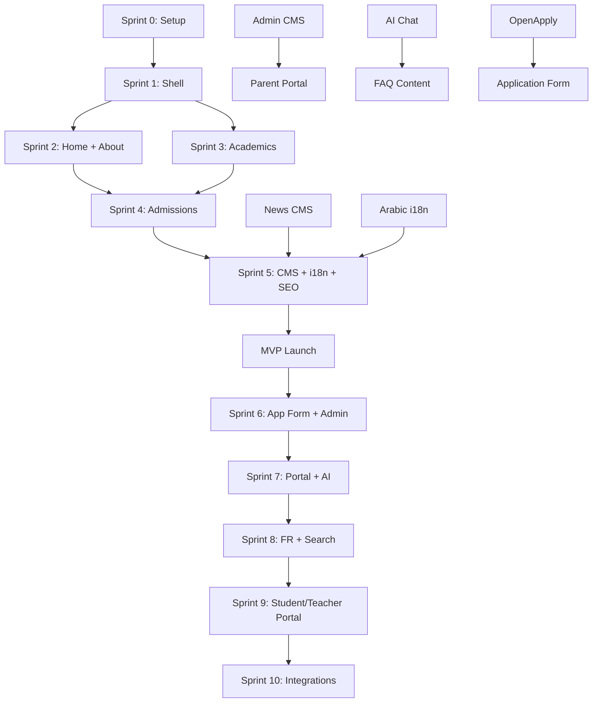

# 07 — Feature Prioritization (MoSCoW)

**Method:** MoSCoW (Must / Should / Could / Won't)  
**Mapping:** Must = MVP (Sprints 1–4) · Should = Phase 2 (Sprints 5–7) · Could = Phase 3 (Sprints 8–10) · Won't = Out of scope v1

---

## 1. MoSCoW Matrix

### MUST HAVE — MVP Launch (Sprints 1–4, ~8 weeks)

| ID  | Feature                                          | Persona    | Rationale                    |
| --- | ------------------------------------------------ | ---------- | ---------------------------- |
| M01 | Responsive homepage with video hero              | P1, P2, P5 | First impression, conversion |
| M02 | Trust bar (Cambridge + accreditations)           | P1, P2, P6 | Trust within 5 seconds       |
| M03 | About pages (story, mission, leadership)         | P1, P6     | Credibility                  |
| M04 | Academic program pages (5 age bands + Cambridge) | P1, P2     | Core evaluation content      |
| M05 | Admissions hub + how-to-apply steps              | P1, P2, P6 | Primary conversion path      |
| M06 | Inquiry form with email notification             | P1, P2     | Lead capture                 |
| M07 | Book-a-tour form                                 | P1, P2     | Second conversion path       |
| M08 | Tuition & fees page                              | P1, P2     | Decision-critical info       |
| M09 | Admissions FAQ (30+ questions)                   | P1, P6     | SEO + self-service           |
| M10 | Contact page with map                            | P1, P2     | Local trust                  |
| M11 | News listing + article pages (CMS)               | P3, P5     | Freshness, engagement        |
| M12 | Gallery (photo grid + lightbox)                  | P5, P1     | Visual trust                 |
| M13 | Student life overview + clubs + sports           | P5         | Student engagement           |
| M14 | EN/AR bilingual with RTL                         | P2         | Qatar market requirement     |
| M15 | WhatsApp floating action button                  | P2         | Preferred local channel      |
| M16 | Global navigation (mega menu)                    | All        | Wayfinding                   |
| M17 | Footer with sitemap links                        | All        | Navigation + SEO             |
| M18 | SEO (meta, schema, sitemap, robots)              | All        | Discoverability              |
| M19 | WCAG 2.2 AA compliance                           | All        | Legal + inclusive            |
| M20 | Lighthouse 90+ performance                       | All        | UX + SEO                     |
| M21 | Dark mode toggle                                 | P5         | Modern expectation           |
| M22 | Cookie consent banner                            | All        | Legal compliance             |
| M23 | 301 redirects from Wix                           | All        | SEO preservation             |
| M24 | Privacy policy + Terms pages                     | All        | Legal compliance             |
| M25 | Downloads center (PDFs)                          | P3, P6     | Prospectus, forms            |
| M26 | Careers listing page                             | P4         | Recruitment                  |
| M27 | Events listing                                   | P1, P3     | Open days, school events     |
| M28 | Breadcrumb navigation                            | All        | Wayfinding + SEO             |
| M29 | Language switcher (EN/AR)                        | P2         | Multilingual                 |
| M30 | Mobile-first responsive design                   | All        | 65% mobile traffic           |

---

### SHOULD HAVE — Phase 2 (Sprints 5–7, ~6 weeks)

| ID  | Feature                                    | Persona        | Rationale                |
| --- | ------------------------------------------ | -------------- | ------------------------ |
| S01 | Online application form (multi-step)       | P1, P2         | Reduce friction vs PDF   |
| S02 | Admin CMS dashboard                        | Content editor | Self-service content     |
| S03 | Parent portal (login, calendar, downloads) | P3             | Retention, convenience   |
| S04 | Virtual campus tour (360° or video)        | P1             | Remote family evaluation |
| S05 | AI chat assistant (admissions FAQ)         | P1, P2         | 24/7 support             |
| S06 | French language (FR)                       | FR families    | Market expansion         |
| S07 | Global search (⌘K)                         | All            | Findability              |
| S08 | Newsletter subscription                    | P3             | Engagement               |
| S09 | Testimonial video integration              | P1, P5         | Social proof             |
| S10 | Interactive campus map                     | P1             | Location clarity         |
| S11 | STEM & AI/Robotics dedicated pages         | P5             | Differentiation          |
| S12 | Relocating to Qatar guide                  | P1             | Expat support            |
| S13 | Email automation (inquiry confirmation)    | P1             | SLA compliance           |
| S14 | Google Analytics 4 + conversion tracking   | Marketing      | Measurement              |
| S15 | Open day event registration with countdown | P1             | Urgency                  |
| S16 | Staff/team directory with roles            | P1             | Humanization             |
| S17 | Social media feed integration              | P5             | Freshness                |
| S18 | Age & year group equivalency table         | P1, P6         | Decision support         |

---

### COULD HAVE — Phase 3 (Sprints 8–10, ~6 weeks)

| ID  | Feature                             | Persona   | Rationale                    |
| --- | ----------------------------------- | --------- | ---------------------------- |
| C01 | Student portal                      | P5        | Student engagement           |
| C02 | Teacher portal                      | P4        | Staff utility                |
| C03 | OpenApply integration               | P1        | Industry-standard admissions |
| C04 | Live chat (human agent hours)       | P1, P2    | Premium support              |
| C05 | PWA (installable, offline basics)   | P3        | Mobile convenience           |
| C06 | Push notifications (events)         | P3        | Engagement                   |
| C07 | Blog with categories and tags       | All       | SEO depth                    |
| C08 | Video gallery / media center        | P5        | Rich media                   |
| C09 | Alumni section                      | P6        | Long-term brand              |
| C10 | Comparison tool (vs other schools)  | P1        | Decision support             |
| C11 | Fee calculator                      | P1        | Interactive utility          |
| C12 | Multi-campus support (future)       | All       | Scalability                  |
| C13 | A/B testing framework               | Marketing | Optimization                 |
| C14 | Personalization (returning visitor) | P1        | Conversion lift              |

---

### WON'T HAVE — Out of Scope v1

| ID  | Feature                         | Reason                               |
| --- | ------------------------------- | ------------------------------------ |
| W01 | Full LMS integration            | Separate system; link only           |
| W02 | Online payment processing       | Regulatory complexity; manual for v1 |
| W03 | Live video streaming            | Infrastructure cost                  |
| W04 | Mobile native app               | PWA sufficient for v1                |
| W05 | Parent-teacher messaging        | Requires portal maturity             |
| W06 | Student grades/results online   | Privacy + system integration         |
| W07 | Boarding school features        | Not applicable                       |
| W08 | Multi-school network CMS        | Single school v1                     |
| W09 | Blockchain credentials          | No business case                     |
| W10 | Custom mobile app (iOS/Android) | Cost vs PWA                          |

---

## 2. Feature-to-Sprint Mapping

| Sprint  | Weeks | Features                                      | Deliverable                    |
| ------- | ----- | --------------------------------------------- | ------------------------------ |
| **S0**  | 1     | Project setup, design tokens, CI/CD           | Dev environment ready          |
| **S1**  | 2     | M16, M17, M30, M19 (base), M29, Design System | Shell + navigation             |
| **S2**  | 2     | M01, M02, M03, M28                            | Homepage + About               |
| **S3**  | 2     | M04, M13, M12                                 | Academics + Student Life       |
| **S4**  | 2     | M05–M10, M06, M07, M25, M27                   | Admissions + Contact           |
| **S5**  | 2     | M11, M14 (AR), M18, M20, M23                  | CMS + i18n + SEO + Launch prep |
| **—**   | —     | **🚀 MVP LAUNCH**                             | **Public site live**           |
| **S6**  | 2     | S01, S02, S13, S14                            | Application form + Admin CMS   |
| **S7**  | 2     | S03, S04, S05, S08                            | Portal + Virtual tour + AI     |
| **S8**  | 2     | S06, S07, S09–S12                             | FR + Search + Content pages    |
| **S9**  | 2     | C01, C02, C05                                 | Student/Teacher portal + PWA   |
| **S10** | 2     | C03, C07, C14, polish                         | OpenApply + optimization       |

---

## 3. Feature Dependency Graph

---

## 4. Effort Estimation (Story Points)

| Feature Group                | Points          | Sprint        |
| ---------------------------- | --------------- | ------------- |
| Design System + Shell        | 21              | S0–S1         |
| Homepage                     | 13              | S2            |
| About section (5 pages)      | 13              | S2            |
| Academics (8 pages)          | 21              | S3            |
| Student Life (4 pages)       | 8               | S3            |
| Admissions (7 pages + forms) | 21              | S4            |
| Contact + Downloads          | 5               | S4            |
| CMS (news, events, gallery)  | 13              | S5            |
| i18n (EN/AR)                 | 13              | S5            |
| SEO + Performance            | 8               | S5            |
| Launch prep + QA             | 8               | S5            |
| **MVP Total**                | **~144 points** | **~8 weeks**  |
| Admin CMS                    | 13              | S6            |
| Application form             | 13              | S6            |
| Parent portal                | 21              | S7            |
| AI chat                      | 8               | S7            |
| Virtual tour                 | 8               | S7            |
| FR + Search                  | 13              | S8            |
| Student/Teacher portal       | 21              | S9            |
| OpenApply + polish           | 13              | S10           |
| **Full Platform Total**      | **~254 points** | **~20 weeks** |

_Velocity assumption: 18 points/sprint (2 devs + 1 designer)_

---

## 5. Success Criteria per Release

### MVP Launch (Gate G4)

| Criteria                 | Target                   |
| ------------------------ | ------------------------ |
| Pages live               | 35+ public pages (EN)    |
| Arabic coverage          | 80% of public pages      |
| Lighthouse Performance   | ≥ 90                     |
| Lighthouse Accessibility | ≥ 95                     |
| Lighthouse SEO           | ≥ 95                     |
| WCAG 2.2 AA              | Zero critical violations |
| Forms working            | Inquiry + Tour booking   |
| 301 redirects            | 100% of old URLs         |
| Uptime                   | 99.9%                    |

### Full Platform (Gate G5)

| Criteria                     | Target                   |
| ---------------------------- | ------------------------ |
| All MoSCoW "Must" + "Should" | Delivered                |
| Parent portal                | 50+ active users month 1 |
| AI chat                      | 70% query resolution     |
| Online applications          | 10+ submissions month 1  |
| FR coverage                  | 60% of key pages         |
| Organic traffic              | 500+ sessions/month      |

---

## 6. Feature Kill Criteria

If behind schedule, cut in this order (least impact first):

1. ~~Dark mode~~ → defer to Phase 2
2. ~~Events listing~~ → static page instead of CMS
3. ~~Careers page~~ → simple PDF link
4. ~~Gallery lightbox~~ → simple grid
5. ~~French language~~ → Phase 2 (already planned)
6. **Never cut:** Admissions forms, EN/AR, SEO, accessibility, performance
