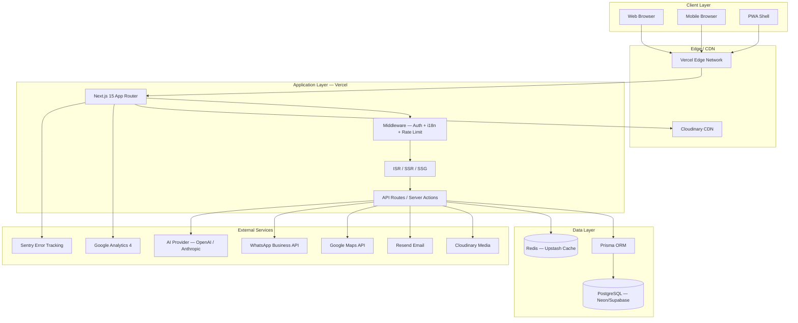
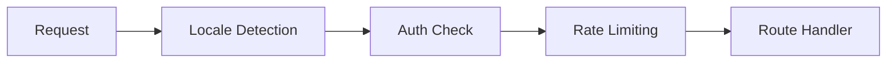
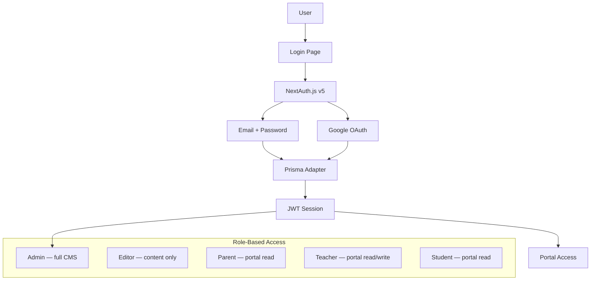
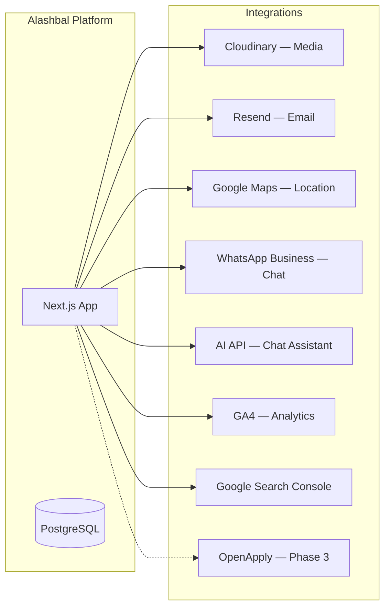
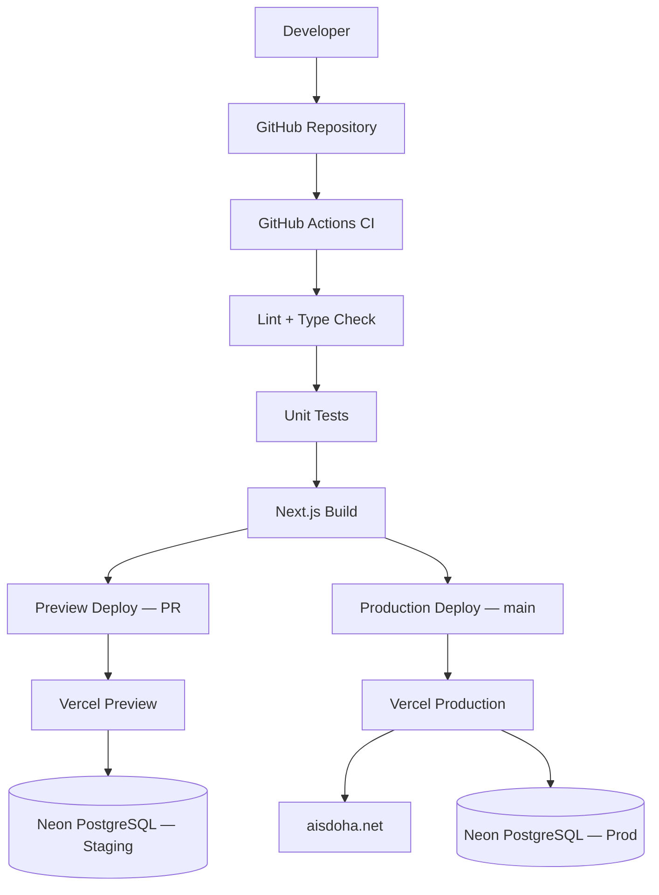

# 08 — Technical Architecture

---

## 1. Architecture Overview



---

## 2. Technology Stack

| Layer      | Technology                | Version | Justification                           |
| ---------- | ------------------------- | ------- | --------------------------------------- |
| Framework  | Next.js                   | 15.x    | App Router, RSC, ISR, API routes        |
| Language   | TypeScript                | 5.x     | Type safety, team scalability           |
| Styling    | Tailwind CSS              | 3.x     | Utility-first, design token integration |
| Components | Shadcn UI                 | Latest  | Accessible, customizable primitives     |
| Animation  | Framer Motion             | 11.x    | Scroll animations, page transitions     |
| Icons      | Lucide React              | Latest  | Consistent, lightweight                 |
| i18n       | next-intl                 | 3.x     | App Router native, RTL support          |
| Forms      | React Hook Form           | 7.x     | Performance, minimal re-renders         |
| Validation | Zod                       | 3.x     | Schema validation, type inference       |
| ORM        | Prisma                    | 5.x     | Type-safe queries, migrations           |
| Database   | PostgreSQL                | 16.x    | Relational, robust, scalable            |
| Auth       | NextAuth.js               | 5.x     | OAuth, credentials, session management  |
| Media      | Cloudinary                | —       | Transform, optimize, CDN delivery       |
| Email      | Resend                    | —       | Transactional email, templates          |
| Hosting    | Vercel                    | —       | Next.js native, edge, preview deploys   |
| Cache      | Upstash Redis             | —       | Rate limiting, session cache, ISR       |
| Monitoring | Sentry                    | —       | Error tracking, performance             |
| Analytics  | Vercel Analytics + GA4    | —       | Web vitals + conversion tracking        |
| CI/CD      | GitHub Actions            | —       | Lint, test, build, deploy               |
| Search     | Built-in (PostgreSQL FTS) | —       | Phase 1; Algolia optional Phase 2       |

---

## 3. Application Architecture

### 3.1 Next.js App Router Structure

```
app/
├── [locale]/                    # i18n wrapper (en, ar, fr)
│   ├── layout.tsx               # Root layout (header, footer)
│   ├── page.tsx                 # Homepage
│   ├── about/
│   │   ├── page.tsx
│   │   ├── mission-vision/page.tsx
│   │   ├── leadership/page.tsx
│   │   ├── accreditations/page.tsx
│   │   └── campus/page.tsx
│   ├── academics/
│   │   ├── page.tsx
│   │   ├── early-years/page.tsx
│   │   ├── primary/page.tsx
│   │   ├── middle-school/page.tsx
│   │   ├── high-school/page.tsx
│   │   ├── cambridge-pathway/page.tsx
│   │   ├── stem/page.tsx
│   │   ├── ai-robotics/page.tsx
│   │   └── languages/page.tsx
│   ├── admissions/
│   │   ├── page.tsx
│   │   ├── how-to-apply/page.tsx
│   │   ├── tuition-fees/page.tsx
│   │   ├── inquire/page.tsx
│   │   ├── book-a-tour/page.tsx
│   │   ├── apply/page.tsx
│   │   ├── faqs/page.tsx
│   │   └── age-guide/page.tsx
│   ├── student-life/
│   ├── news/
│   │   ├── page.tsx
│   │   └── [slug]/page.tsx
│   ├── careers/
│   ├── contact/page.tsx
│   ├── downloads/page.tsx
│   ├── faqs/page.tsx
│   ├── privacy/page.tsx
│   └── terms/page.tsx
├── portal/
│   ├── parent/
│   ├── student/
│   └── teacher/
├── admin/
│   ├── dashboard/
│   ├── news/
│   ├── events/
│   ├── gallery/
│   ├── inquiries/
│   ├── applications/
│   └── settings/
├── api/
│   ├── auth/[...nextauth]/route.ts
│   ├── inquiries/route.ts
│   ├── tours/route.ts
│   ├── applications/route.ts
│   ├── newsletter/route.ts
│   ├── search/route.ts
│   ├── chat/route.ts
│   └── webhooks/route.ts
├── sitemap.ts
├── robots.ts
└── layout.tsx
```

### 3.2 Rendering Strategy

| Page Type                         | Strategy             | Revalidation      |
| --------------------------------- | -------------------- | ----------------- |
| Homepage                          | ISR                  | 3600s (1 hour)    |
| Static content (About, Academics) | ISR                  | 86400s (24 hours) |
| News listing                      | ISR                  | 600s (10 min)     |
| News article                      | ISR                  | 3600s             |
| Admissions forms                  | SSR                  | —                 |
| Portal pages                      | SSR (auth required)  | —                 |
| Admin CMS                         | SSR (auth required)  | —                 |
| API routes                        | Serverless functions | —                 |
| Downloads                         | SSG                  | Build time        |

### 3.3 Middleware Pipeline



**Middleware responsibilities:**

1. Locale detection from URL prefix (`/en`, `/ar`, `/fr`)
2. Auth guard for `/portal/*` and `/admin/*`
3. Rate limiting on `/api/inquiries`, `/api/tours`, `/api/chat` (10 req/min/IP)
4. Security headers injection (CSP, HSTS, X-Frame-Options)

---

## 4. Component Architecture

```
components/
├── ui/                  # Shadcn primitives (button, input, card, etc.)
├── layout/              # Header, Footer, Sidebar, Breadcrumbs
├── sections/            # Page sections (Hero, TrustBar, Testimonials, etc.)
├── forms/               # InquiryForm, TourForm, ApplicationForm, ContactForm
├── cms/                 # NewsCard, EventCard, GalleryGrid, RichText
├── portal/              # Dashboard, Calendar, DocumentList
├── admin/               # DataTable, RichEditor, MediaPicker
├── shared/              # LanguageSwitcher, DarkModeToggle, WhatsAppFAB, Search
└── providers/           # ThemeProvider, AuthProvider, IntlProvider
```

**Pattern:** Server Components by default; Client Components only for interactivity (forms, animations, toggles).

---

## 5. API Design

### 5.1 Public API Endpoints

| Method | Endpoint            | Purpose                  | Auth         |
| ------ | ------------------- | ------------------------ | ------------ |
| POST   | `/api/inquiries`    | Submit admission inquiry | Rate limited |
| POST   | `/api/tours`        | Book a campus tour       | Rate limited |
| POST   | `/api/applications` | Submit application       | Rate limited |
| POST   | `/api/newsletter`   | Newsletter signup        | Rate limited |
| POST   | `/api/contact`      | General contact form     | Rate limited |
| GET    | `/api/search?q=`    | Global search            | Public       |
| POST   | `/api/chat`         | AI chat message          | Rate limited |
| GET    | `/api/news`         | News feed (JSON)         | Public       |
| GET    | `/api/events`       | Events feed (JSON)       | Public       |

### 5.2 Admin API Endpoints

| Method | Endpoint                   | Purpose               | Auth  |
| ------ | -------------------------- | --------------------- | ----- |
| CRUD   | `/api/admin/news`          | Manage news articles  | Admin |
| CRUD   | `/api/admin/events`        | Manage events         | Admin |
| CRUD   | `/api/admin/gallery`       | Manage gallery images | Admin |
| GET    | `/api/admin/inquiries`     | View inquiries        | Admin |
| PATCH  | `/api/admin/inquiries/:id` | Update inquiry status | Admin |
| CRUD   | `/api/admin/downloads`     | Manage documents      | Admin |
| CRUD   | `/api/admin/careers`       | Manage job listings   | Admin |
| POST   | `/api/admin/media/upload`  | Upload to Cloudinary  | Admin |

### 5.3 Request/Response Pattern

```typescript
// Standard API response envelope
type ApiResponse<T> = {
  success: boolean;
  data?: T;
  error?: { code: string; message: string };
  meta?: { page: number; total: number };
};
```

---

## 6. Authentication Architecture



| Role         | Permissions                                |
| ------------ | ------------------------------------------ |
| `admin`      | Full CMS, user management, settings        |
| `editor`     | News, events, gallery, downloads CRUD      |
| `admissions` | View/manage inquiries, applications, tours |
| `parent`     | Portal: calendar, downloads, announcements |
| `teacher`    | Portal: calendar, class resources          |
| `student`    | Portal: calendar, announcements            |

---

## 7. Email Architecture

| Trigger               | Template               | Recipient           | Service |
| --------------------- | ---------------------- | ------------------- | ------- |
| Inquiry submitted     | `inquiry-confirmation` | Parent + Admissions | Resend  |
| Tour booked           | `tour-confirmation`    | Parent + Admissions | Resend  |
| Application submitted | `application-received` | Parent + Admissions | Resend  |
| Newsletter signup     | `newsletter-welcome`   | Subscriber          | Resend  |
| Admin: new inquiry    | `admin-inquiry-alert`  | Admissions team     | Resend  |

---

## 8. Integration Architecture



---

## 9. Deployment Architecture



### 9.1 Environments

| Environment | Branch    | URL                 | Database                  |
| ----------- | --------- | ------------------- | ------------------------- |
| Development | local     | localhost:3000      | Local PostgreSQL / Docker |
| Staging     | `develop` | staging.aisdoha.net | Neon staging              |
| Production  | `main`    | aisdoha.net         | Neon production           |

### 9.2 CI/CD Pipeline

```yaml
# .github/workflows/ci.yml (reference)
on: [push, pull_request]
jobs:
  ci:
    steps:
      - checkout
      - install dependencies
      - lint (eslint + prettier)
      - type-check (tsc --noEmit)
      - unit tests (vitest)
      - build (next build)
      - lighthouse CI (on preview deploy)
      - deploy (vercel --prod on main)
```

---

## 10. Caching Strategy

| Layer             | Strategy                         | TTL                    |
| ----------------- | -------------------------------- | ---------------------- |
| CDN (Vercel Edge) | Static assets, ISR pages         | Per-page revalidation  |
| Redis (Upstash)   | API rate limit counters          | 60s windows            |
| Redis             | Search results cache             | 300s                   |
| Redis             | Session data                     | 24h                    |
| Browser           | `Cache-Control` on static assets | 31536000s (1 year)     |
| Browser           | Service Worker (PWA)             | Shell + critical pages |

---

## 11. Error Handling

| Layer             | Strategy                                            |
| ----------------- | --------------------------------------------------- |
| API routes        | Try/catch → structured error response → Sentry      |
| Server Components | Error boundaries per route segment                  |
| Client Components | React error boundaries + fallback UI                |
| Forms             | Inline validation (Zod) + server-side re-validation |
| Global            | `app/error.tsx` + `app/not-found.tsx` branded pages |

---

## 12. Scalability Considerations

| Concern      | Current (v1)         | Scale Path                                  |
| ------------ | -------------------- | ------------------------------------------- |
| Traffic      | 5K visits/month      | Vercel auto-scales serverless               |
| Database     | Single Neon instance | Read replicas at 50K+ visits                |
| Media        | Cloudinary free/pro  | Auto-scales with CDN                        |
| Search       | PostgreSQL FTS       | Migrate to Algolia at 100+ pages            |
| CMS          | Custom admin         | Could migrate to Sanity if complexity grows |
| Multi-school | Single tenant        | Add `schoolId` column pattern for future    |
