# 09 — Database Design

**ORM:** Prisma  
**Database:** PostgreSQL 16  
**Hosting:** Neon (serverless PostgreSQL)

---

## 1. Entity Relationship Diagram

```mermaid
erDiagram
    User ||--o{ Account : has
    User ||--o{ Session : has
    User ||--o{ Inquiry : submits
    User ||--o{ TourBooking : books
    User ||--o{ Application : submits
    User ||--o{ NewsArticle : authors
    User {
        string id PK
        string email UK
        string name
        string role
        string image
        datetime createdAt
        datetime updatedAt
    }

    Account {
        string id PK
        string userId FK
        string provider
        string providerAccountId
    }

    Session {
        string id PK
        string sessionToken UK
        string userId FK
        datetime expires
    }

    Inquiry ||--o| InquiryNote : has
    Inquiry {
        string id PK
        string parentName
        string email
        string phone
        string childName
        int childAge
        string yearGroup
        string message
        string locale
        string status
        datetime createdAt
    }

    TourBooking {
        string id PK
        string parentName
        string email
        string phone
        int numChildren
        datetime preferredDate
        string preferredTime
        string tourType
        string locale
        string status
        datetime createdAt
    }

    Application ||--|{ ApplicationDocument : includes
    Application {
        string id PK
        string userId FK
        string childFirstName
        string childLastName
        date childDob
        string yearGroup
        string previousSchool
        string parentName
        string parentEmail
        string parentPhone
        string nationality
        string status
        json formData
        datetime createdAt
        datetime updatedAt
    }

    ApplicationDocument {
        string id PK
        string applicationId FK
        string fileName
        string fileUrl
        string fileType
        datetime uploadedAt
    }

    NewsArticle ||--o{ NewsTranslation : has
    NewsArticle {
        string id PK
        string slug UK
        string authorId FK
        string featuredImage
        string status
        datetime publishedAt
        datetime createdAt
        datetime updatedAt
    }

    NewsTranslation {
        string id PK
        string articleId FK
        string locale
        string title
        string excerpt
        text content
        string metaTitle
        string metaDescription
    }

    Event ||--o{ EventTranslation : has
    Event {
        string id PK
        string slug UK
        string featuredImage
        datetime startDate
        datetime endDate
        string location
        boolean registrationOpen
        int maxAttendees
        string status
        datetime createdAt
    }

    EventTranslation {
        string id PK
        string eventId FK
        string locale
        string title
        string description
    }

    EventRegistration {
        string id PK
        string eventId FK
        string name
        string email
        string phone
        int numAttendees
        datetime createdAt
    }

    GalleryImage {
        string id PK
        string imageUrl
        string thumbnailUrl
        string category
        int sortOrder
        boolean published
        datetime createdAt
    }

    GalleryTranslation {
        string id PK
        string imageId FK
        string locale
        string altText
        string caption
    }

    Download {
        string id PK
        string fileUrl
        string fileName
        string category
        int sortOrder
        boolean published
        datetime createdAt
    }

    DownloadTranslation {
        string id PK
        string downloadId FK
        string locale
        string title
        string description
    }

    Career ||--o{ CareerTranslation : has
    Career {
        string id PK
        string slug UK
        string department
        string type
        string status
        datetime closingDate
        datetime createdAt
    }

    CareerTranslation {
        string id PK
        string careerId FK
        string locale
        string title
        text description
        text requirements
    }

    FAQ ||--o{ FAQTranslation : has
    FAQ {
        string id PK
        string category
        int sortOrder
        boolean published
    }

    FAQTranslation {
        string id PK
        string faqId FK
        string locale
        string question
        text answer
    }

    NewsletterSubscriber {
        string id PK
        string email UK
        string locale
        boolean active
        datetime subscribedAt
    }

    PageContent ||--o{ PageTranslation : has
    PageContent {
        string id PK
        string pageKey UK
        json metadata
        datetime updatedAt
    }

    PageTranslation {
        string id PK
        string pageId FK
        string locale
        json content
        string metaTitle
        string metaDescription
    }

    MediaAsset {
        string id PK
        string cloudinaryId
        string url
        string type
        int width
        int height
        string folder
        datetime createdAt
    }

    AuditLog {
        string id PK
        string userId FK
        string action
        string entity
        string entityId
        json changes
        datetime createdAt
    }

    Setting {
        string id PK
        string key UK
        json value
        datetime updatedAt
    }
```



---

## 2. Table Specifications

### 2.1 Core Tables

#### `users`

| Column         | Type         | Constraints                | Notes                                               |
| -------------- | ------------ | -------------------------- | --------------------------------------------------- |
| id             | UUID         | PK, DEFAULT uuid()         |                                                     |
| email          | VARCHAR(255) | UNIQUE, NOT NULL           | Login identifier                                    |
| name           | VARCHAR(255) | NOT NULL                   | Display name                                        |
| role           | ENUM         | NOT NULL, DEFAULT 'parent' | admin, editor, admissions, parent, teacher, student |
| image          | VARCHAR(500) | NULL                       | Avatar URL                                          |
| password_hash  | VARCHAR(255) | NULL                       | For credentials auth                                |
| email_verified | TIMESTAMP    | NULL                       |                                                     |
| created_at     | TIMESTAMP    | DEFAULT now()              |                                                     |
| updated_at     | TIMESTAMP    | DEFAULT now()              |                                                     |

**Indexes:** `email`, `role`

#### `inquiries`

| Column      | Type         | Constraints       | Notes                                           |
| ----------- | ------------ | ----------------- | ----------------------------------------------- |
| id          | UUID         | PK                |                                                 |
| parent_name | VARCHAR(255) | NOT NULL          |                                                 |
| email       | VARCHAR(255) | NOT NULL          |                                                 |
| phone       | VARCHAR(50)  | NULL              |                                                 |
| child_name  | VARCHAR(255) | NULL              |                                                 |
| child_age   | INT          | NULL              |                                                 |
| year_group  | VARCHAR(50)  | NULL              |                                                 |
| message     | TEXT         | NULL              |                                                 |
| locale      | VARCHAR(5)   | DEFAULT 'en'      |                                                 |
| status      | ENUM         | DEFAULT 'new'     | new, contacted, tour_scheduled, applied, closed |
| source      | VARCHAR(50)  | DEFAULT 'website' | website, whatsapp, phone                        |
| created_at  | TIMESTAMP    | DEFAULT now()     |                                                 |

**Indexes:** `status`, `created_at`, `email`

#### `tour_bookings`

| Column         | Type         | Constraints         | Notes                                    |
| -------------- | ------------ | ------------------- | ---------------------------------------- |
| id             | UUID         | PK                  |                                          |
| parent_name    | VARCHAR(255) | NOT NULL            |                                          |
| email          | VARCHAR(255) | NOT NULL            |                                          |
| phone          | VARCHAR(50)  | NOT NULL            |                                          |
| num_children   | INT          | DEFAULT 1           |                                          |
| preferred_date | DATE         | NOT NULL            |                                          |
| preferred_time | VARCHAR(20)  | NOT NULL            | morning, afternoon                       |
| tour_type      | ENUM         | DEFAULT 'in_person' | in_person, virtual                       |
| locale         | VARCHAR(5)   | DEFAULT 'en'        |                                          |
| status         | ENUM         | DEFAULT 'pending'   | pending, confirmed, completed, cancelled |
| notes          | TEXT         | NULL                | Admin notes                              |
| created_at     | TIMESTAMP    | DEFAULT now()       |                                          |

**Indexes:** `preferred_date`, `status`, `email`

#### `applications`

| Column           | Type         | Constraints         | Notes                                                            |
| ---------------- | ------------ | ------------------- | ---------------------------------------------------------------- |
| id               | UUID         | PK                  |                                                                  |
| user_id          | UUID         | FK → users, NULL    | If logged in                                                     |
| child_first_name | VARCHAR(255) | NOT NULL            |                                                                  |
| child_last_name  | VARCHAR(255) | NOT NULL            |                                                                  |
| child_dob        | DATE         | NOT NULL            |                                                                  |
| year_group       | VARCHAR(50)  | NOT NULL            |                                                                  |
| previous_school  | VARCHAR(255) | NULL                |                                                                  |
| parent_name      | VARCHAR(255) | NOT NULL            |                                                                  |
| parent_email     | VARCHAR(255) | NOT NULL            |                                                                  |
| parent_phone     | VARCHAR(50)  | NOT NULL            |                                                                  |
| nationality      | VARCHAR(100) | NULL                |                                                                  |
| status           | ENUM         | DEFAULT 'submitted' | submitted, under_review, assessment, offered, accepted, rejected |
| form_data        | JSONB        | NULL                | Extended form fields                                             |
| created_at       | TIMESTAMP    | DEFAULT now()       |                                                                  |
| updated_at       | TIMESTAMP    | DEFAULT now()       |                                                                  |

**Indexes:** `status`, `parent_email`, `created_at`

---

### 2.2 Content Tables (i18n Pattern)

All content tables follow the **base + translation** pattern:

```
{entity}           → language-neutral data (slug, dates, images, status)
{entity}_translations → per-locale content (title, body, meta)
```

**Supported locales:** `en`, `ar`, `fr`

**Unique constraint:** `(entity_id, locale)` on all translation tables

---

### 2.3 System Tables

#### `settings`

| Key                | Value (JSON)                               | Purpose             |
| ------------------ | ------------------------------------------ | ------------------- |
| `school_info`      | `{name, phone, email, address}`            | Global school data  |
| `social_links`     | `{facebook, instagram, twitter, linkedin}` | Footer social       |
| `admissions_email` | `{email, sla_hours}`                       | Notification config |
| `homepage_stats`   | `{students, nationalities, years, ratio}`  | Stats section       |
| `seo_defaults`     | `{title_suffix, default_description}`      | SEO fallbacks       |
| `feature_flags`    | `{dark_mode, ai_chat, parent_portal}`      | Toggle features     |

#### `audit_logs`

Tracks all admin actions for accountability:

- Who changed what, when
- Stores `before` and `after` JSON diff
- Retention: 2 years

---

## 3. Prisma Schema Reference

```prisma
// schema.prisma (reference for dev team — not deployed code)

generator client {
  provider = "prisma-client-js"
}

datasource db {
  provider = "postgresql"
  url      = env("DATABASE_URL")
}

enum Role {
  ADMIN
  EDITOR
  ADMISSIONS
  PARENT
  TEACHER
  STUDENT
}

enum InquiryStatus {
  NEW
  CONTACTED
  TOUR_SCHEDULED
  APPLIED
  CLOSED
}

enum ApplicationStatus {
  SUBMITTED
  UNDER_REVIEW
  ASSESSMENT
  OFFERED
  ACCEPTED
  REJECTED
}

enum ContentStatus {
  DRAFT
  PUBLISHED
  ARCHIVED
}

model User {
  id            String    @id @default(uuid())
  email         String    @unique
  name          String
  role          Role      @default(PARENT)
  image         String?
  passwordHash  String?   @map("password_hash")
  emailVerified DateTime? @map("email_verified")
  createdAt     DateTime  @default(now()) @map("created_at")
  updatedAt     DateTime  @updatedAt @map("updated_at")

  accounts     Account[]
  sessions     Session[]
  articles     NewsArticle[]
  applications Application[]
  auditLogs    AuditLog[]

  @@map("users")
}

model Inquiry {
  id         String        @id @default(uuid())
  parentName String        @map("parent_name")
  email      String
  phone      String?
  childName  String?       @map("child_name")
  childAge   Int?          @map("child_age")
  yearGroup  String?       @map("year_group")
  message    String?
  locale     String        @default("en")
  status     InquiryStatus @default(NEW)
  source     String        @default("website")
  createdAt  DateTime      @default(now()) @map("created_at")

  @@index([status])
  @@index([createdAt])
  @@map("inquiries")
}

// ... additional models follow same pattern
```

---

## 4. Data Volume Estimates (Year 1)

| Table                  | Rows (est.) | Growth Rate |
| ---------------------- | ----------- | ----------- |
| users                  | 200         | 20/month    |
| inquiries              | 500         | 40/month    |
| tour_bookings          | 300         | 25/month    |
| applications           | 150         | 12/month    |
| news_articles          | 30          | 2/month     |
| events                 | 20          | 2/month     |
| gallery_images         | 100         | 10/month    |
| downloads              | 15          | Stable      |
| faqs                   | 50          | Stable      |
| newsletter_subscribers | 300         | 25/month    |
| audit_logs             | 2,000       | 170/month   |

**Total estimated storage:** < 1 GB (excluding media in Cloudinary)

---

## 5. Migration Strategy

| Phase    | Action                                     |
| -------- | ------------------------------------------ |
| Sprint 0 | Initial schema migration (users, settings) |
| Sprint 4 | Add inquiries, tour_bookings               |
| Sprint 5 | Add news, events, gallery, downloads, faqs |
| Sprint 6 | Add applications, application_documents    |
| Sprint 7 | Add newsletter, careers, audit_logs        |
| Sprint 9 | Add portal-specific tables if needed       |

**Tool:** `prisma migrate dev` (development) · `prisma migrate deploy` (production)

---

## 6. Backup & Recovery

| Policy                 | Detail                           |
| ---------------------- | -------------------------------- |
| Provider               | Neon automatic backups           |
| Frequency              | Continuous WAL + daily snapshots |
| Retention              | 7 days (free) / 30 days (pro)    |
| Point-in-time recovery | Yes (Neon Pro)                   |
| Test restore           | Monthly (staging)                |
| RPO                    | < 1 hour                         |
| RTO                    | < 4 hours                        |

---

## 7. Data Privacy & Retention

| Data Type                  | Retention               | Basis               |
| -------------------------- | ----------------------- | ------------------- |
| Inquiries                  | 3 years                 | Legitimate interest |
| Applications               | 5 years                 | Legal/regulatory    |
| Tour bookings              | 2 years                 | Operational         |
| Newsletter emails          | Until unsubscribe       | Consent             |
| Audit logs                 | 2 years                 | Accountability      |
| User accounts              | Active + 1 year         | Service delivery    |
| Child data in applications | 5 years, then anonymize | Minimization        |

**Right to deletion:** Admin can anonymize PII on request; audit trail preserved.

---

## 8. Indexing Strategy

| Table                  | Index                | Type           | Purpose          |
| ---------------------- | -------------------- | -------------- | ---------------- |
| news_articles          | slug                 | UNIQUE         | URL lookup       |
| news_translations      | (article_id, locale) | UNIQUE         | i18n fetch       |
| news_articles          | published_at DESC    | BTREE          | Listing sort     |
| inquiries              | (status, created_at) | BTREE          | Admin dashboard  |
| applications           | (status, created_at) | BTREE          | Admin dashboard  |
| All translation tables | locale               | BTREE          | Locale filter    |
| search                 | title + content      | GIN (tsvector) | Full-text search |

---

## 9. Seed Data

Initial seed includes:

- Admin user (school IT)
- Default settings (school info, social links)
- 30 FAQs (EN) across 5 categories
- Sample news article (welcome to new website)
- Fee structure placeholder page content
- Default SEO metadata

```bash
# Reference command for dev team
npx prisma db seed
```
