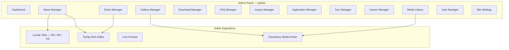
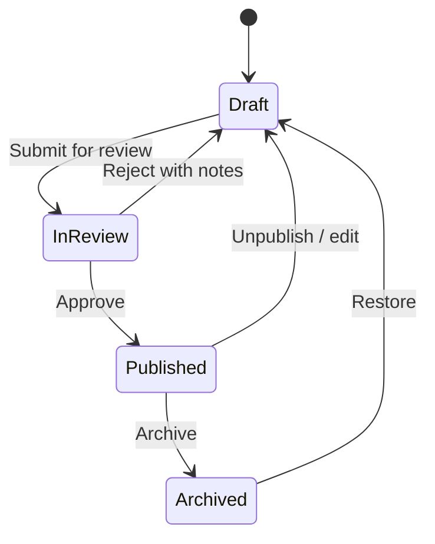

# 10 — CMS Strategy

---

## 1. CMS Approach Decision

### Options Evaluated

| Option                                 | Pros                                       | Cons                             | Score |
| -------------------------------------- | ------------------------------------------ | -------------------------------- | ----- |
| **A. Custom Admin (Next.js + Prisma)** | Full control, unified stack, no extra cost | Build effort, maintenance        | ★★★★★ |
| B. Sanity.io (Headless)                | Excellent editor UX, real-time             | Extra service, cost, complexity  | ★★★★  |
| C. Strapi (Self-hosted)                | Open source, flexible                      | Another server, security surface | ★★★   |
| D. WordPress (Headless)                | Familiar to school staff                   | Heavy, security concerns         | ★★    |
| E. Contentful                          | Enterprise-grade                           | Cost, overkill for single school | ★★★   |

### Decision: **Option A — Custom Admin Panel**

**Rationale:**

- Single codebase, single deployment, single auth system
- Content model defined in Prisma schema (see Database Design)
- School has 1–2 content editors; custom UI is sufficient
- No additional monthly SaaS cost
- Full control over i18n workflow (EN → AR → FR)
- API-ready for future headless evolution

---

## 2. CMS Content Types

| Content Type   | Editor                 | Workflow                 | i18n                |
| -------------- | ---------------------- | ------------------------ | ------------------- |
| News Articles  | Rich text + image      | Draft → Review → Publish | EN, AR, FR          |
| Events         | Form + rich text       | Draft → Publish          | EN, AR, FR          |
| Gallery Images | Upload + metadata      | Upload → Tag → Publish   | Alt text per locale |
| Downloads      | File upload + metadata | Upload → Publish         | Title per locale    |
| FAQs           | Question + answer      | Edit → Publish           | Per locale          |
| Careers        | Rich text              | Draft → Publish          | EN, AR              |
| Page Content   | Block editor (JSON)    | Edit → Preview → Publish | Per locale          |
| Settings       | Form fields            | Admin only               | Global              |

---

## 3. Admin Panel Architecture

### Admin Routes

| Route                 | Access            | Purpose                   |
| --------------------- | ----------------- | ------------------------- |
| `/admin`              | admin, editor     | Dashboard with stats      |
| `/admin/news`         | admin, editor     | CRUD news articles        |
| `/admin/events`       | admin, editor     | CRUD events               |
| `/admin/gallery`      | admin, editor     | Manage gallery            |
| `/admin/downloads`    | admin, editor     | Manage documents          |
| `/admin/faqs`         | admin, editor     | Manage FAQs               |
| `/admin/inquiries`    | admin, admissions | View/respond to inquiries |
| `/admin/tours`        | admin, admissions | Manage tour bookings      |
| `/admin/applications` | admin, admissions | Review applications       |
| `/admin/careers`      | admin, editor     | Manage job listings       |
| `/admin/media`        | admin, editor     | Media library             |
| `/admin/users`        | admin             | User management           |
| `/admin/settings`     | admin             | Site configuration        |

---

## 4. Editor Experience

### Rich Text Editor — TipTap

| Feature                          | Supported    |
| -------------------------------- | ------------ |
| Headings (H2–H4)                 | ✅           |
| Bold, italic, underline          | ✅           |
| Links                            | ✅           |
| Images (from media library)      | ✅           |
| Bullet/numbered lists            | ✅           |
| Blockquotes                      | ✅           |
| Tables                           | ✅           |
| Embed (YouTube)                  | ✅           |
| Custom blocks (CTA, testimonial) | ✅ (Phase 2) |

### Media Library

- Upload to Cloudinary via `/api/admin/media/upload`
- Auto-generate thumbnails
- Folders: `news/`, `gallery/`, `team/`, `campus/`, `documents/`
- Max file size: 10MB images, 25MB documents

### i18n Editing Workflow

- EN is primary locale (written first)
- AR/FR tabs show status: Complete / Partial / Missing
- Publish requires EN complete; AR/FR publish independently

---

## 5. Content Workflow

---

## 6. Content API (Headless-Ready)

| Endpoint                                      | Returns         |
| --------------------------------------------- | --------------- |
| `GET /api/news?locale=en&page=1`              | Paginated news  |
| `GET /api/news/[slug]?locale=en`              | Single article  |
| `GET /api/events?locale=en&upcoming=true`     | Upcoming events |
| `GET /api/gallery?category=campus`            | Gallery images  |
| `GET /api/downloads?category=admissions`      | Documents       |
| `GET /api/faqs?category=admissions&locale=en` | FAQ list        |

---

## 7. Static vs Dynamic Content

| Content           | Management         | Update Frequency |
| ----------------- | ------------------ | ---------------- |
| Homepage sections | CMS (PageContent)  | Monthly          |
| About pages       | CMS (PageContent)  | Quarterly        |
| Academic pages    | CMS (PageContent)  | Annually         |
| News              | CMS (NewsArticle)  | 2×/month         |
| Events            | CMS (Event)        | Ongoing          |
| Gallery           | CMS (GalleryImage) | Monthly          |
| FAQs              | CMS (FAQ)          | Quarterly        |
| Legal pages       | CMS (PageContent)  | Annually         |

---

## 8. CMS Training Plan

| Session | Audience        | Duration                                |
| ------- | --------------- | --------------------------------------- |
| 1       | Content editors | 2 hours — news, media                   |
| 2       | Content editors | 1 hour — events, gallery, downloads     |
| 3       | Admissions team | 1 hour — inquiries, tours, applications |
| 4       | Admin           | 1 hour — users, settings, SEO           |
| 5       | All             | 30 min — i18n workflow                  |

---

## 9. Future CMS Evolution

| Trigger                     | Action                             |
| --------------------------- | ---------------------------------- |
| 3+ editors struggling       | Evaluate Sanity migration          |
| Need visual page builder    | Add block-based composer           |
| Multi-school expansion      | Add `school_id` to content tables  |
| Marketing wants A/B testing | Add variant support to PageContent |
