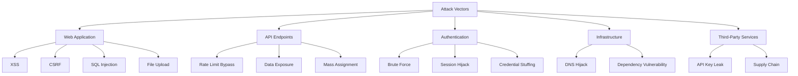

# 11 — Security Considerations

---

## 1. Threat Model

### 1.1 Assets to Protect

| Asset                             | Sensitivity  | Impact if Compromised      |
| --------------------------------- | ------------ | -------------------------- |
| Child application data            | **Critical** | Legal, reputational        |
| Parent contact information        | **High**     | Privacy violation          |
| Admin credentials                 | **Critical** | Full system compromise     |
| CMS content                       | Medium       | Defacement, misinformation |
| Email communications              | Medium       | Phishing, spam             |
| API keys (Cloudinary, Resend, AI) | **High**     | Financial, data exposure   |

### 1.2 Threat Actors

| Actor                 | Motivation                 | Likelihood |
| --------------------- | -------------------------- | ---------- |
| Automated bots        | Form spam, scraping        | High       |
| Opportunistic hackers | Defacement, ransomware     | Medium     |
| Disgruntled insider   | Data leak                  | Low        |
| Competitor            | Scraping content/data      | Medium     |
| Parent/student        | Unauthorized portal access | Low        |

### 1.3 Attack Vectors

---

## 2. Security Controls

### 2.1 Application Security

| Control                 | Implementation                                 | Priority |
| ----------------------- | ---------------------------------------------- | -------- |
| Input validation        | Zod schemas on all API inputs                  | P0       |
| Output encoding         | React auto-escaping (default)                  | P0       |
| CSRF protection         | NextAuth built-in + SameSite cookies           | P0       |
| SQL injection           | Prisma parameterized queries                   | P0       |
| XSS prevention          | CSP headers, sanitized rich text only          | P0       |
| File upload validation  | MIME type check, size limit, Cloudinary preset | P0       |
| Rate limiting           | Upstash Redis: 10 req/min on forms             | P0       |
| Honeypot fields         | Hidden fields on public forms                  | P0       |
| reCAPTCHA v3            | On inquiry, tour, application forms            | P1       |
| Content Security Policy | Strict CSP via middleware                      | P0       |
| HTTPS only              | HSTS header, Vercel enforced                   | P0       |

### 2.2 Authentication Security

| Control                | Implementation                             |
| ---------------------- | ------------------------------------------ |
| Password policy        | Min 12 chars, complexity required          |
| Password hashing       | bcrypt (cost factor 12) via NextAuth       |
| Session management     | JWT with 24h expiry, refresh on activity   |
| Brute force protection | 5 failed attempts → 15 min lockout         |
| MFA                    | TOTP optional for admin roles (Phase 2)    |
| OAuth                  | Google Workspace (school domain) for staff |
| Secure cookies         | `HttpOnly`, `Secure`, `SameSite=Lax`       |

### 2.3 Authorization (RBAC)

| Route Pattern       | admin | editor | admissions | parent | teacher | student |
| ------------------- | :---: | :----: | :--------: | :----: | :-----: | :-----: |
| `/admin/*`          |  ✅   |  ✅*   |    ✅*     |   ❌   |   ❌    |   ❌    |
| `/admin/users`      |  ✅   |   ❌   |     ❌     |   ❌   |   ❌    |   ❌    |
| `/admin/inquiries`  |  ✅   |   ❌   |     ✅     |   ❌   |   ❌    |   ❌    |
| `/portal/parent/*`  |  ✅   |   ❌   |     ❌     |   ✅   |   ❌    |   ❌    |
| `/portal/teacher/*` |  ✅   |   ❌   |     ❌     |   ❌   |   ✅    |   ❌    |

*Editor: content only. Admissions: inquiries, tours, applications only.

### 2.4 Data Protection

| Measure               | Detail                                   |
| --------------------- | ---------------------------------------- |
| Encryption at rest    | Neon PostgreSQL (AES-256)                |
| Encryption in transit | TLS 1.3 everywhere                       |
| PII minimization      | Collect only required fields             |
| Child data            | Admin-only access                        |
| Data deletion         | Anonymize PII on request                 |
| API keys              | Server-side only; never in client bundle |

---

## 3. Compliance

| Regulation                 | Applicability                | Actions                        |
| -------------------------- | ---------------------------- | ------------------------------ |
| Qatar Data Privacy Law     | **Yes**                      | Consent, right to deletion     |
| GDPR                       | Possible (EU expat families) | Cookie consent, privacy policy |
| COPPA                      | Possible (US families)       | No data from children under 13 |
| Cambridge Brand Guidelines | **Yes**                      | Approved logo usage only       |
| WCAG 2.2 AA                | **Yes**                      | Accessibility compliance       |

---

## 4. Incident Response Plan

| Phase     | Action                     | Timeline   |
| --------- | -------------------------- | ---------- |
| Detect    | Sentry alert / user report | Immediate  |
| Contain   | Disable affected endpoint  | < 1 hour   |
| Assess    | Scope and data affected    | < 4 hours  |
| Notify    | School leadership          | < 24 hours |
| Remediate | Fix + rotate keys          | < 48 hours |
| Review    | Post-incident report       | < 1 week   |

---

## 5. Security Testing Plan

| Test             | Frequency             | Tool                   |
| ---------------- | --------------------- | ---------------------- |
| Dependency audit | Every deploy          | npm audit + Dependabot |
| OWASP ZAP scan   | Monthly               | Staging environment    |
| Penetration test | Pre-launch + annually | External vendor        |
| CSP validation   | Per deploy            | Mozilla Observatory    |

---

## 6. Pre-Launch Security Checklist

- [ ] All env vars in Vercel (not in code)
- [ ] HTTPS enforced with HSTS
- [ ] CSP headers configured
- [ ] Rate limiting active on all forms
- [ ] Input validation on all API routes
- [ ] RBAC tested for all roles
- [ ] Admin routes require authentication
- [ ] Privacy policy published
- [ ] Cookie consent functional
- [ ] Dependency audit clean (no critical/high)
