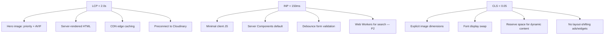

# 13 — Lighthouse Performance Strategy

---

## 1. Current Performance Baseline (aisdoha.net — Estimated)

| Metric                 | Estimated Value | Rating               |
| ---------------------- | --------------- | -------------------- |
| Lighthouse Performance | 35–45           | ❌ Poor              |
| LCP                    | 4.5–6.0s        | ❌ Poor              |
| INP                    | 300–500ms       | ❌ Poor              |
| CLS                    | 0.15–0.25       | ❌ Poor              |
| TTFB                   | 800–1200ms      | ⚠️ Needs improvement |
| Total page weight      | 2–4 MB          | ❌ Heavy (Wix bloat) |
| Requests               | 80–120          | ❌ Excessive         |

**Root causes:** Wix platform overhead, render-blocking scripts, no image optimization, CSS gradients as backgrounds, third-party widget loading, no CDN strategy.

---

## 2. Performance Targets

| Metric                       | Target   | Stretch  |
| ---------------------------- | -------- | -------- |
| Lighthouse Performance       | ≥ 90     | ≥ 95     |
| Lighthouse Accessibility     | ≥ 95     | 100      |
| Lighthouse Best Practices    | ≥ 95     | 100      |
| Lighthouse SEO               | ≥ 95     | 100      |
| LCP                          | < 2.0s   | < 1.5s   |
| INP                          | < 150ms  | < 100ms  |
| CLS                          | < 0.05   | < 0.02   |
| TTFB                         | < 600ms  | < 400ms  |
| FCP                          | < 1.2s   | < 0.8s   |
| Total page weight (homepage) | < 1.5 MB | < 1.0 MB |
| Requests (homepage)          | < 40     | < 25     |
| Time to Interactive          | < 3.0s   | < 2.0s   |

---

## 3. Performance Budget

### 3.1 Per-Resource Budget (Homepage)

| Resource Type | Budget                     | Strategy                             |
| ------------- | -------------------------- | ------------------------------------ |
| HTML          | < 50 KB                    | Server components, minimal client JS |
| CSS           | < 80 KB                    | Tailwind purge, critical CSS inline  |
| JavaScript    | < 150 KB (gzipped)         | Code splitting, dynamic imports      |
| Hero image    | < 200 KB                   | AVIF/WebP, responsive srcset         |
| Hero video    | < 2 MB (or skip on mobile) | Lazy load, poster frame              |
| Fonts         | < 100 KB                   | Subset, woff2, preload display fonts |
| Third-party   | < 50 KB                    | Defer GA4, minimal scripts           |
| **Total**     | **< 1.5 MB**               |                                      |

### 3.2 Per-Page Budget

| Page Type    | Weight Budget | LCP Target |
| ------------ | ------------- | ---------- |
| Homepage     | 1.5 MB        | 1.8s       |
| Content page | 800 KB        | 1.5s       |
| News listing | 600 KB        | 1.5s       |
| News article | 700 KB        | 1.5s       |
| Form page    | 500 KB        | 1.2s       |
| Gallery      | 1.2 MB (lazy) | 2.0s       |
| Portal       | 600 KB        | 1.5s       |

---

## 4. Optimization Strategy

### 4.1 Rendering (Highest Impact)

| Technique                             | Impact         | Implementation                       |
| ------------------------------------- | -------------- | ------------------------------------ |
| React Server Components               | -60% client JS | Default in App Router                |
| ISR (Incremental Static Regeneration) | Fast TTFB      | 1h revalidation on content pages     |
| Streaming SSR                         | Faster FCP     | `loading.tsx` + Suspense boundaries  |
| Static generation                     | Fastest        | Legal pages, downloads at build time |
| Edge middleware                       | Fast redirects | Locale detection at edge             |

### 4.2 Images (Second Highest Impact)

| Technique                         | Implementation                   |
| --------------------------------- | -------------------------------- |
| Next.js `<Image>`                 | Auto WebP/AVIF, responsive sizes |
| Cloudinary transforms             | `f_auto,q_auto,w_auto`           |
| Priority loading                  | `priority` on hero image only    |
| Lazy loading                      | All below-fold images            |
| Blur placeholder                  | `blurDataURL` from Cloudinary    |
| Responsive srcset                 | 640, 768, 1024, 1280, 1536       |
| No images > 200KB on initial load | Compression policy               |

### 4.3 Fonts

| Technique            | Implementation                          |
| -------------------- | --------------------------------------- |
| `next/font`          | Self-hosted, no external request        |
| Subset               | Latin + Arabic subsets only             |
| `font-display: swap` | Prevent FOIT                            |
| Preload              | Display font only (Fraunces/Noto Naskh) |
| Variable fonts       | Single file per family where available  |

### 4.4 JavaScript

| Technique         | Implementation                                    |
| ----------------- | ------------------------------------------------- |
| Code splitting    | `dynamic()` for heavy components                  |
| Tree shaking      | ESM imports, no barrel files                      |
| Defer third-party | GA4 via `next/script` strategy `afterInteractive` |
| No jQuery         | React-native interactions                         |
| Bundle analysis   | `@next/bundle-analyzer` in CI                     |
| Framer Motion     | `LazyMotion` + `domAnimation` features only       |

### 4.5 CSS

| Technique            | Implementation                      |
| -------------------- | ----------------------------------- |
| Tailwind purge       | Remove unused classes in production |
| No CSS-in-JS runtime | Tailwind = zero runtime cost        |
| Critical CSS         | Automatic via Next.js               |
| No @import chains    | Direct font loading via next/font   |

### 4.6 Caching

| Layer          | Strategy                 | TTL                      |
| -------------- | ------------------------ | ------------------------ |
| Vercel CDN     | Static assets            | 1 year (immutable hash)  |
| ISR pages      | CDN + revalidation       | Per-page (10min–24h)     |
| API responses  | `Cache-Control` headers  | 60s–300s for public data |
| Service Worker | App shell (PWA)          | Shell cached             |
| Browser        | `stale-while-revalidate` | For API data             |

### 4.7 Third-Party Scripts

| Script             | Loading Strategy                 | Size     |
| ------------------ | -------------------------------- | -------- |
| Google Analytics 4 | `afterInteractive`               | ~45 KB   |
| Google Maps        | `lazyOnload` (contact page only) | ~150 KB  |
| reCAPTCHA          | `lazyOnload` (form pages only)   | ~80 KB   |
| Sentry             | Server-side only                 | 0 client |
| Framer Motion      | Dynamic import                   | ~30 KB   |

**Rule:** No third-party script on homepage except GA4.

---

## 5. Core Web Vitals Optimization Map



---

## 6. Monitoring

| Tool                  | Metric               | Alert Threshold  |
| --------------------- | -------------------- | ---------------- |
| Vercel Analytics      | Web Vitals (RUM)     | LCP > 2.5s       |
| Vercel Speed Insights | Per-route vitals     | INP > 200ms      |
| Lighthouse CI         | Lab scores           | Performance < 85 |
| Sentry                | Transaction duration | P95 > 3s         |
| Uptime monitor        | Availability         | < 99.9%          |

**Review cadence:** Weekly for first month post-launch, then monthly.

---

## 7. Performance Testing in CI

```yaml
# lighthouse-ci reference config
assertions:
  categories:performance: ["error", { minScore: 0.90 }]
  categories:accessibility: ["error", { minScore: 0.95 }]
  categories:seo: ["error", { minScore: 0.95 }]
  first-contentful-paint: ["error", { maxNumericValue: 1200 }]
  largest-contentful-paint: ["error", { maxNumericValue: 2000 }]
  cumulative-layout-shift: ["error", { maxNumericValue: 0.05 }]
  total-blocking-time: ["error", { maxNumericValue: 200 }]
```

**Pages tested in CI:** Homepage, Admissions, Academics/Primary, News listing, Contact

---

## 8. Mobile-Specific Optimizations

| Optimization            | Detail                                                           |
| ----------------------- | ---------------------------------------------------------------- |
| No hero video on mobile | Static image hero (save 2MB)                                     |
| Smaller image srcset    | Max 768px on mobile                                              |
| Touch-optimized         | No hover-dependent content                                       |
| Reduced animations      | Simpler scroll animations on mobile                              |
| Network-aware           | `navigator.connection.saveData` → no video, lower quality images |
| PWA shell               | Instant repeat visits                                            |

---

## 9. Pre-Launch Performance Checklist

- [ ] Lighthouse Performance ≥ 90 on all key pages
- [ ] LCP < 2.0s on 75th percentile (Vercel RUM)
- [ ] CLS < 0.05
- [ ] INP < 150ms
- [ ] Total homepage weight < 1.5 MB
- [ ] Hero image < 200 KB (AVIF)
- [ ] JavaScript bundle < 150 KB gzipped
- [ ] No render-blocking third-party scripts
- [ ] Fonts self-hosted via next/font
- [ ] All images use next/image or Cloudinary CDN
- [ ] ISR configured for content pages
- [ ] Lighthouse CI passing in GitHub Actions
- [ ] Mobile hero uses static image (not video)
