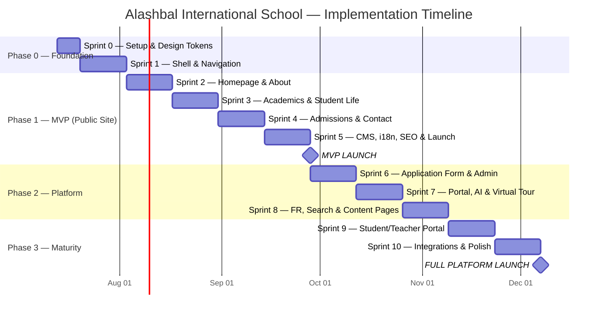

# 14 — Implementation Roadmap

**Total Duration:** 20 weeks (10 sprints × 2 weeks)  
**Team:** 2 developers, 1 designer, 1 PM/PO (school-side), 1 QA  
**Velocity:** ~18 story points per sprint

---

## 1. Milestone Overview

---

## 2. Sprint Details

### Sprint 0 — Project Foundation (Week 1)

**Goal:** Development environment, CI/CD, and design tokens ready.

| Task                                              | Owner    | Points |
| ------------------------------------------------- | -------- | ------ |
| Initialize Next.js 15 + TypeScript + Tailwind     | Dev 1    | 3      |
| Configure ESLint, Prettier, Husky                 | Dev 1    | 2      |
| Set up GitHub repo + branch strategy              | Dev 1    | 1      |
| GitHub Actions CI (lint, type-check, build)       | Dev 1    | 3      |
| Vercel project (staging + production)             | Dev 1    | 2      |
| Neon PostgreSQL (staging + prod)                  | Dev 1    | 2      |
| Prisma init + initial migration (users, settings) | Dev 2    | 3      |
| Design tokens → Tailwind config                   | Designer | 3      |
| Figma design file (homepage + design system)      | Designer | 5      |
| Cloudinary account + upload presets               | Dev 2    | 1      |
| **Total**                                         |          | **25** |

**Deliverables:**

- [ ] Repo with CI passing
- [ ] Staging deploy on Vercel
- [ ] Design tokens in code
- [ ] Figma file with homepage design

**Gate G3:** Stakeholder approves Figma homepage design.

---

### Sprint 1 — Shell & Navigation (Weeks 2–3)

**Goal:** Site skeleton with navigation, footer, i18n routing, and accessibility base.

| Task                                    | Owner | Points |
| --------------------------------------- | ----- | ------ |
| App Router `[locale]` structure (EN/AR) | Dev 1 | 5      |
| next-intl configuration + RTL           | Dev 1 | 3      |
| Header component (desktop mega menu)    | Dev 2 | 5      |
| Mobile navigation (hamburger + overlay) | Dev 2 | 3      |
| Footer component                        | Dev 2 | 2      |
| Language switcher                       | Dev 1 | 2      |
| Dark mode toggle + theme provider       | Dev 1 | 2      |
| Skip navigation link                    | Dev 1 | 1      |
| Breadcrumbs component                   | Dev 2 | 1      |
| Shadcn UI setup (button, input, card)   | Dev 2 | 2      |
| Cookie consent banner                   | Dev 1 | 2      |
| 404 + error pages (branded)             | Dev 2 | 1      |
| **Total**                               |       | **29** |

**Deliverables:**

- [ ] Navigable shell with EN/AR toggle
- [ ] Dark mode functional
- [ ] WCAG base (skip nav, landmarks, focus)
- [ ] All Shadcn primitives installed

---

### Sprint 2 — Homepage & About (Weeks 4–5)

**Goal:** High-impact homepage and complete About section.

| Task                                   | Owner          | Points |
| -------------------------------------- | -------------- | ------ |
| Hero section (video + fallback image)  | Dev 1          | 5      |
| Trust bar (Cambridge + accreditations) | Dev 1          | 2      |
| Value pillars section (×4)             | Dev 2          | 3      |
| Learning journey cards (×5 age bands)  | Dev 2          | 3      |
| Stats counter section                  | Dev 1          | 2      |
| Testimonials carousel                  | Dev 2          | 5      |
| CTA banner component                   | Dev 1          | 1      |
| About: Our Story page                  | Dev 2          | 2      |
| About: Mission & Vision page           | Dev 2          | 1      |
| About: Leadership page                 | Dev 1          | 3      |
| About: Accreditations page             | Dev 2          | 2      |
| About: Campus & Facilities page        | Dev 1          | 3      |
| Framer Motion scroll animations        | Dev 1          | 3      |
| Homepage responsive (mobile-first)     | Designer + Dev | 3      |
| **Total**                              |                | **38** |

**Deliverables:**

- [ ] Homepage visually complete (EN)
- [ ] 5 About pages live
- [ ] Scroll animations with reduced-motion support

**Dependency:** Professional photography or approved placeholders.

---

### Sprint 3 — Academics & Student Life (Weeks 6–7)

**Goal:** Full academic program section and student life pages.

| Task                      | Owner | Points |
| ------------------------- | ----- | ------ |
| Academics hub page        | Dev 1 | 2      |
| Early Years page          | Dev 2 | 2      |
| Primary page              | Dev 2 | 2      |
| Middle School page        | Dev 1 | 2      |
| High School page          | Dev 1 | 2      |
| Cambridge Pathway page    | Dev 2 | 3      |
| STEM page                 | Dev 1 | 2      |
| AI & Robotics page        | Dev 2 | 2      |
| Languages page            | Dev 1 | 2      |
| Student Life hub          | Dev 2 | 2      |
| Clubs page                | Dev 1 | 2      |
| Sports page               | Dev 2 | 2      |
| Gallery (grid + lightbox) | Dev 1 | 5      |
| **Total**                 |       | **30** |

**Deliverables:**

- [ ] 9 academic pages + 4 student life pages
- [ ] Gallery functional with Cloudinary

---

### Sprint 4 — Admissions & Contact (Weeks 8–9)

**Goal:** Complete admissions funnel — the primary conversion engine.

| Task                                | Owner | Points |
| ----------------------------------- | ----- | ------ |
| Admissions hub page                 | Dev 1 | 3      |
| How to Apply (step-by-step)         | Dev 2 | 3      |
| Tuition & Fees page                 | Dev 1 | 2      |
| Inquiry form + API + email          | Dev 2 | 5      |
| Book a Tour form + API + email      | Dev 1 | 5      |
| Admissions FAQ page (30+ questions) | Dev 2 | 3      |
| Age & Year Group guide              | Dev 1 | 2      |
| Contact page + Google Maps          | Dev 2 | 3      |
| Downloads center                    | Dev 1 | 3      |
| Careers listing page                | Dev 2 | 2      |
| Events listing page                 | Dev 1 | 3      |
| WhatsApp FAB component              | Dev 2 | 1      |
| Privacy Policy + Terms pages        | Dev 1 | 2      |
| **Total**                           |       | **39** |

**Deliverables:**

- [ ] Full admissions funnel live
- [ ] Forms sending email notifications
- [ ] Contact page with map

**Dependency:** Fee data from school. FAQ content from admissions team.

---

### Sprint 5 — CMS, i18n, SEO & Launch Prep (Weeks 10–11)

**Goal:** Content management, Arabic site, SEO, performance — launch ready.

| Task                                   | Owner              | Points |
| -------------------------------------- | ------------------ | ------ |
| News CMS (CRUD + public pages)         | Dev 1              | 5      |
| Events CMS                             | Dev 2              | 3      |
| Gallery CMS (admin upload)             | Dev 1              | 3      |
| Downloads CMS                          | Dev 2              | 2      |
| FAQ CMS                                | Dev 1              | 2      |
| Arabic translations (all public pages) | Translator + Dev 1 | 8      |
| SEO: meta, schema, sitemap, robots     | Dev 2              | 5      |
| 301 redirects from Wix                 | Dev 2              | 2      |
| Lighthouse optimization pass           | Dev 1              | 3      |
| Accessibility audit + fixes            | Dev 2 + QA         | 5      |
| Cross-browser testing                  | QA                 | 3      |
| Content population (all pages)         | Content editor     | 5      |
| DNS cutover planning                   | Dev 1              | 1      |
| **Total**                              |                    | **47** |

**Deliverables:**

- [ ] CMS functional for news, events, gallery
- [ ] Arabic site at 80% coverage
- [ ] Lighthouse 90+ on all key pages
- [ ] Zero critical accessibility violations

### 🚀 MVP LAUNCH (End of Sprint 5 — ~Week 11)

**Gate G4 Checklist:**

- [ ] 35+ public pages live (EN)
- [ ] Arabic 80% coverage
- [ ] Forms working (inquiry + tour)
- [ ] Lighthouse Performance ≥ 90
- [ ] Lighthouse Accessibility ≥ 95
- [ ] WCAG 2.2 AA — zero critical violations
- [ ] 301 redirects active
- [ ] Google Search Console verified
- [ ] Google Business Profile updated
- [ ] Analytics tracking confirmed

---

### Sprint 6 — Application Form & Admin Dashboard (Weeks 12–13)

| Task                             | Points |
| -------------------------------- | ------ |
| Multi-step application form      | 8      |
| Application document upload      | 3      |
| Admin dashboard (stats overview) | 5      |
| Admin: inquiry management        | 3      |
| Admin: tour management           | 3      |
| Admin: application review        | 5      |
| Email automation (confirmations) | 3      |
| GA4 conversion tracking          | 2      |
| **Total**                        | **32** |

---

### Sprint 7 — Portal, AI Chat & Virtual Tour (Weeks 14–15)

| Task                                | Points |
| ----------------------------------- | ------ |
| NextAuth.js setup (roles)           | 5      |
| Parent portal (calendar, downloads) | 8      |
| AI chat assistant (admissions FAQ)  | 5      |
| Virtual campus tour (video/360)     | 5      |
| Newsletter subscription             | 2      |
| Testimonial video integration       | 3      |
| **Total**                           | **28** |

---

### Sprint 8 — French, Search & Extended Content (Weeks 16–17)

| Task                              | Points |
| --------------------------------- | ------ |
| French language (key pages)       | 8      |
| Global search (⌘K)                | 5      |
| Relocating to Qatar guide         | 3      |
| Interactive campus map            | 3      |
| Staff directory with roles        | 3      |
| Social media feed integration     | 3      |
| Open day registration + countdown | 3      |
| **Total**                         | **28** |

---

### Sprint 9 — Student & Teacher Portals (Weeks 18–19)

| Task                                     | Points |
| ---------------------------------------- | ------ |
| Student portal (calendar, announcements) | 8      |
| Teacher portal (resources, calendar)     | 8      |
| PWA shell (service worker)               | 5      |
| Push notifications setup                 | 3      |
| **Total**                                | **24** |

---

### Sprint 10 — Integrations & Polish (Weeks 20–21)

| Task                             | Points |
| -------------------------------- | ------ |
| OpenApply integration evaluation | 5      |
| Blog categories + tags           | 3      |
| A/B testing framework            | 3      |
| Performance fine-tuning          | 3      |
| Security penetration test        | 3      |
| Documentation for school staff   | 3      |
| Final QA + bug fixes             | 5      |
| **Total**                        | **25** |

### 🚀 FULL PLATFORM LAUNCH (End of Sprint 10)

**Gate G5 Checklist:**

- [ ] All Must + Should features delivered
- [ ] Parent portal active
- [ ] AI chat resolving 70%+ queries
- [ ] French 60% coverage
- [ ] Penetration test passed
- [ ] Staff training completed

---

## 3. Team Structure

| Role                  | Responsibility                                | Allocation                  |
| --------------------- | --------------------------------------------- | --------------------------- |
| **Tech Lead / Dev 1** | Architecture, homepage, CMS, SEO, DevOps      | Full-time                   |
| **Developer 2**       | Components, forms, admin, portals             | Full-time                   |
| **UI/UX Designer**    | Figma, design system, responsive QA           | Full-time S0–S3, half S4+   |
| **Product Owner**     | School stakeholder, content approval, UAT     | Half-time                   |
| **Content Editor**    | Page content, news, translations coordination | Half-time S4+               |
| **QA**                | Testing, accessibility, cross-browser         | S4–S5 full, then per-sprint |
| **Translator**        | AR/FR professional translation                | Sprint 5, 8                 |

---

## 4. Definition of Done (per Sprint)

- [ ] All tasks meet acceptance criteria
- [ ] Code reviewed and merged to `develop`
- [ ] TypeScript strict — no errors
- [ ] ESLint — no warnings
- [ ] Unit tests for critical paths
- [ ] Responsive on mobile, tablet, desktop
- [ ] Accessibility: no new axe violations
- [ ] Deployed to staging
- [ ] PO sign-off on staging

---

## 5. Post-Launch Support Plan

| Period               | Support Level                       |
| -------------------- | ----------------------------------- |
| Week 1–2 post-launch | Daily monitoring, hotfix within 4h  |
| Week 3–4             | Bug fixes within 24h                |
| Month 2–3            | Sprint cadence continues (features) |
| Month 4+             | Maintenance retainer (optional)     |

| Metric           | Monitor                     |
| ---------------- | --------------------------- |
| Uptime           | 99.9% (Vercel)              |
| Error rate       | < 0.1% (Sentry)             |
| Form submissions | Daily check (first 2 weeks) |
| 404 errors       | Weekly (GSC)                |
| Performance      | Weekly (Vercel Analytics)   |

---

## 6. Budget Estimate (Infrastructure)

| Service                  | Monthly Cost (est.) |
| ------------------------ | ------------------- |
| Vercel Pro               | $20                 |
| Neon PostgreSQL Pro      | $19                 |
| Cloudinary Plus          | $0–45               |
| Resend                   | $0–20               |
| Upstash Redis            | $0–10               |
| Sentry                   | $0–26               |
| Domain (aisdoha.net)     | Existing            |
| **Total infrastructure** | **~$50–140/month**  |

_Development cost excluded — depends on team rates and contract._
