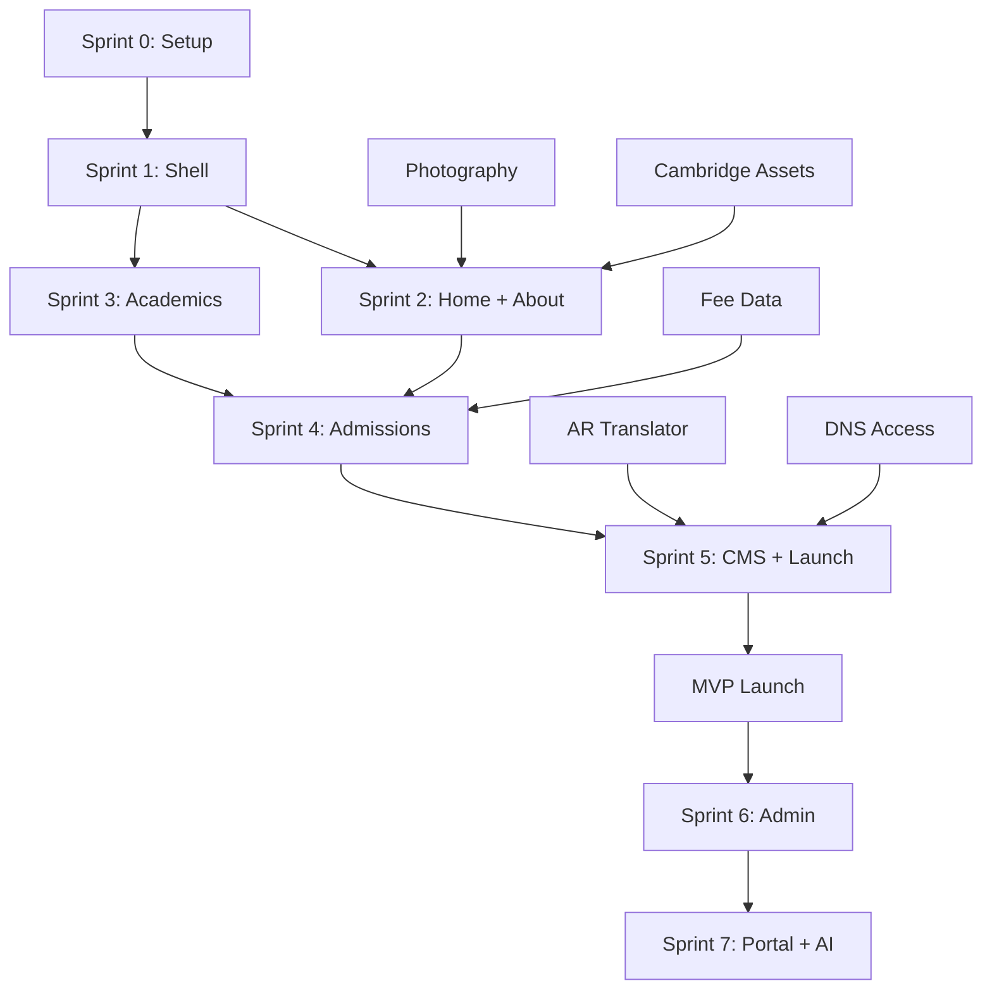
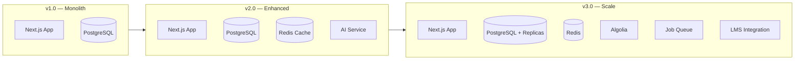

# 15 — Risks, Assumptions, Dependencies & Scalability

---

## 1. Risk Register

| ID  | Risk                                          | Probability | Impact | Score | Mitigation                                                                   | Owner     |
| --- | --------------------------------------------- | ----------- | ------ | ----- | ---------------------------------------------------------------------------- | --------- |
| R01 | No professional photography at launch         | High        | High   | **9** | Schedule photo day Week -4; branded illustration fallback                    | PO        |
| R02 | Fee data not provided before Sprint 4         | Medium      | High   | **6** | Placeholder page with "Contact admissions"; block launch gate if unresolved  | PO        |
| R03 | Arabic translation delays                     | Medium      | Medium | **4** | Launch EN first; AR within 2 weeks; professional translator contracted early | PM        |
| R04 | Cambridge brand guideline violation           | Low         | High   | **3** | Review Cambridge brand guide; approved assets only                           | Designer  |
| R05 | Wix DNS migration issues                      | Medium      | High   | **6** | DNS cutover checklist; lower TTL 48h before; rollback plan                   | Dev 1     |
| R06 | Scope creep from stakeholders                 | High        | Medium | **6** | MoSCoW enforced; change request process; sprint reviews                      | PM        |
| R07 | Key developer unavailable                     | Low         | High   | **3** | Documentation (this package); code conventions; bus factor mitigation        | Tech Lead |
| R08 | Third-party API downtime (Cloudinary, Resend) | Low         | Medium | **2** | Graceful degradation; retry logic; status page monitoring                    | Dev 1     |
| R09 | Low initial traffic / poor SEO traction       | Medium      | Medium | **4** | SEO strategy executed; content calendar; Google Ads consideration            | Marketing |
| R10 | Form spam / bot submissions                   | High        | Low    | **3** | Rate limiting, honeypot, reCAPTCHA v3                                        | Dev 2     |
| R11 | Data privacy complaint                        | Low         | High   | **3** | Privacy policy, consent, data retention policy, anonymization                | Tech Lead |
| R12 | Accessibility lawsuit / complaint             | Low         | High   | **3** | WCAG 2.2 AA from Sprint 1; automated + manual testing                        | QA        |
| R13 | School staff unable to use CMS                | Medium      | Medium | **4** | Training sessions; screen-recorded tutorials; simple UI                      | PM        |
| R14 | Performance regression after launch           | Medium      | Medium | **4** | Lighthouse CI in pipeline; performance budgets enforced                      | Dev 1     |
| R15 | Curriculum pathway unclear                    | Medium      | High   | **6** | Confirm Cambridge stages with academic lead before Sprint 3                  | PO        |

### Risk Score Matrix

```
Impact
  ↑
H │  R02 R05 R15    R01
  │  R04 R07 R11 R12
M │  R03 R06 R09 R13 R14
  │  R08 R10
L │
  └────────────────────→ Probability
    L      M       H
```

---

## 2. Assumptions

| ID  | Assumption                                                             | If Wrong                                        |
| --- | ---------------------------------------------------------------------- | ----------------------------------------------- |
| A01 | Domain `aisdoha.net` remains the production domain                     | Update all docs, SEO, redirects                 |
| A02 | School provides professional photography before Sprint 2               | Use illustration fallback; reschedule photo day |
| A03 | Cambridge International is the primary curriculum pathway              | Rework academics section IA and content         |
| A04 | Fee structure can be published publicly                                | Replace with "Contact for fees"                 |
| A05 | 2 developers available full-time for 20 weeks                          | Extend timeline or reduce scope                 |
| A06 | School has 1–2 staff for content editing post-launch                   | Provide content management as a service         |
| A07 | WhatsApp Business API account can be set up                            | Fall back to wa.me link                         |
| A08 | No online payment processing needed in v1                              | Manual fee collection continues                 |
| A09 | Single campus (Old Airport Area)                                       | Remove multi-campus IA                          |
| A10 | English and Arabic are mandatory at launch; French can wait            | Reprioritize Sprint 8 FR work                   |
| A11 | Current Wix site has < 10 indexed pages                                | Simplify redirect map                           |
| A12 | School email (info@aisdoha.net) can send via Resend domain             | Use Resend subdomain initially                  |
| A13 | Vercel is acceptable for hosting (no Qatar data residency requirement) | Evaluate Azure Qatar or AWS Bahrain             |
| A14 | PostgreSQL (Neon, US/EU region) is acceptable for data storage         | Evaluate Qatar-compliant hosting                |

---

## 3. Dependencies

### 3.1 External Dependencies

| Dependency                            | Required By | Lead Time      | Status                  |
| ------------------------------------- | ----------- | -------------- | ----------------------- |
| Professional photography              | Sprint 2    | 2 weeks        | **Not started**         |
| Fee structure data                    | Sprint 4    | 1 week         | **Pending from school** |
| Cambridge brand assets                | Sprint 2    | 1 week         | **Pending approval**    |
| Accreditation logos (MoE Qatar, etc.) | Sprint 2    | 1 week         | **Pending**             |
| Head of School video                  | Sprint 2    | 2 weeks        | **Not started**         |
| Testimonials (3 families + principal) | Sprint 2    | 2 weeks        | **Not started**         |
| Arabic translator                     | Sprint 5    | 1 week booking | **Not contracted**      |
| DNS access (aisdoha.net)              | Sprint 5    | —              | **Verify ownership**    |
| Google Business Profile access        | Launch      | —              | **Verify access**       |
| WhatsApp Business account             | Sprint 4    | 1 week         | **Not started**         |
| Resend domain verification            | Sprint 4    | 3 days         | **Not started**         |
| Cloudinary account                    | Sprint 0    | 1 day          | **Not started**         |

### 3.2 Internal Dependencies



### 3.3 Critical Path

```
Photography → Homepage → Admissions → CMS → Arabic → SEO → LAUNCH
     ↑           ↑           ↑                    ↑
  Week -4    Sprint 2    Sprint 4            Sprint 5
```

**Longest dependency chain:** 11 weeks from project start to MVP launch.

---

## 4. Future Scalability

### 4.1 Traffic Scalability

| Stage   | Monthly Visits | Infrastructure                    |
| ------- | -------------- | --------------------------------- |
| Launch  | 1K–5K          | Vercel Hobby/Pro, Neon Free       |
| Year 1  | 5K–20K         | Vercel Pro, Neon Pro              |
| Year 2  | 20K–50K        | Vercel Pro, Neon scale, Redis     |
| Year 3+ | 50K+           | Consider dedicated infrastructure |

Vercel serverless auto-scales. No manual intervention needed until 100K+ visits.

### 4.2 Content Scalability

| Content Volume     | Strategy                                       |
| ------------------ | ---------------------------------------------- |
| 50 pages           | Current IA sufficient                          |
| 100+ pages         | Add Algolia search                             |
| 500+ news articles | Archive strategy, pagination                   |
| Multi-school       | Add `schoolId` to all tables; multi-tenant CMS |

### 4.3 Feature Scalability Roadmap

| Phase      | Timeline | Features                                      |
| ---------- | -------- | --------------------------------------------- |
| v1.0 (MVP) | Week 11  | Public site, forms, CMS, EN/AR                |
| v1.5       | Week 15  | Portal, AI chat, virtual tour                 |
| v2.0       | Week 21  | Full platform, FR, OpenApply                  |
| v2.5       | Q1 2027  | Mobile app (PWA enhanced), push notifications |
| v3.0       | Q2 2027  | Online payments, advanced analytics           |
| v3.5       | Q3 2027  | Multi-campus support (if expansion)           |
| v4.0       | 2028     | LMS integration, parent-teacher messaging     |

### 4.4 Database Scalability

| Stage         | Strategy                           |
| ------------- | ---------------------------------- |
| < 10K rows    | Single Neon instance               |
| 10K–100K rows | Connection pooling (PgBouncer)     |
| 100K+ rows    | Read replicas, query optimization  |
| Multi-tenant  | Row-level `school_id` partitioning |

### 4.5 Architecture Evolution



### 4.6 Team Scalability

| Stage        | Team Size | Roles Added                              |
| ------------ | --------- | ---------------------------------------- |
| Launch       | 4–5       | —                                        |
| 6 months     | 5–6       | Content editor (full-time)               |
| 12 months    | 6–8       | Marketing, dedicated QA                  |
| Multi-school | 8–12      | Per-school content editor, network admin |

---

## 5. Change Management

### 5.1 Change Request Process

1. Stakeholder submits change request (feature, content, design)
2. PM assesses impact on scope, timeline, budget
3. MoSCoW re-evaluation: does it displace an existing item?
4. If approved: added to backlog; prioritized next sprint
5. If rejected: documented with reason; revisit in future phase

### 5.2 Scope Change Thresholds

| Change Size | Approval Required | Timeline Impact        |
| ----------- | ----------------- | ---------------------- |
| < 2 points  | Tech Lead         | None                   |
| 2–5 points  | PM + PO           | Current sprint extends |
| 5–13 points | PO + Stakeholder  | Future sprint          |
| > 13 points | Stakeholder board | Phase replan           |

---

## 6. Success Criteria (6-Month Review)

| Metric                   | Target                 | Measurement     |
| ------------------------ | ---------------------- | --------------- |
| Organic traffic          | 1,500+ sessions/month  | GA4             |
| Inquiry form submissions | 30+/month              | Database        |
| Tour bookings            | 20+/month              | Database        |
| Lighthouse Performance   | ≥ 90                   | CI + RUM        |
| Uptime                   | 99.9%                  | Vercel          |
| Parent portal adoption   | 50+ active users       | Auth logs       |
| Content freshness        | 2+ news articles/month | CMS             |
| Arabic page coverage     | 95%+                   | Manual audit    |
| Accessibility complaints | 0                      | Support channel |
| Stakeholder satisfaction | ≥ 8/10                 | Survey          |

---

## 7. Document Maintenance

| Document               | Review Frequency    | Owner     |
| ---------------------- | ------------------- | --------- |
| This risk register     | Monthly             | PM        |
| SEO strategy           | Quarterly           | Marketing |
| Design system          | On component change | Designer  |
| Database schema        | On migration        | Tech Lead |
| Security controls      | Quarterly           | Tech Lead |
| Implementation roadmap | Per sprint          | PM        |

**Next review date:** August 5, 2026 (post Sprint 1)
