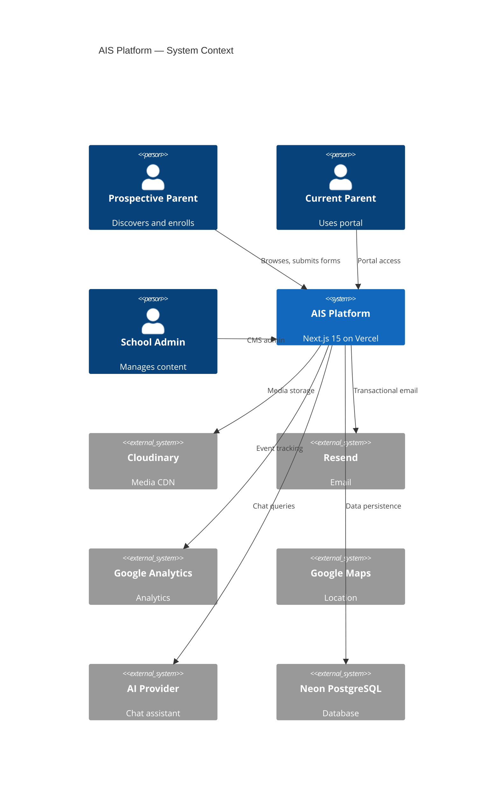
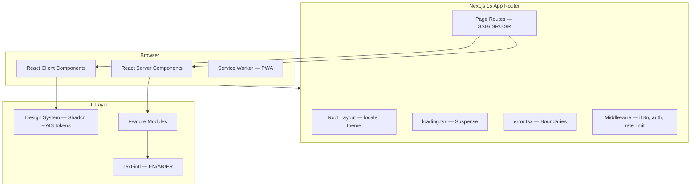
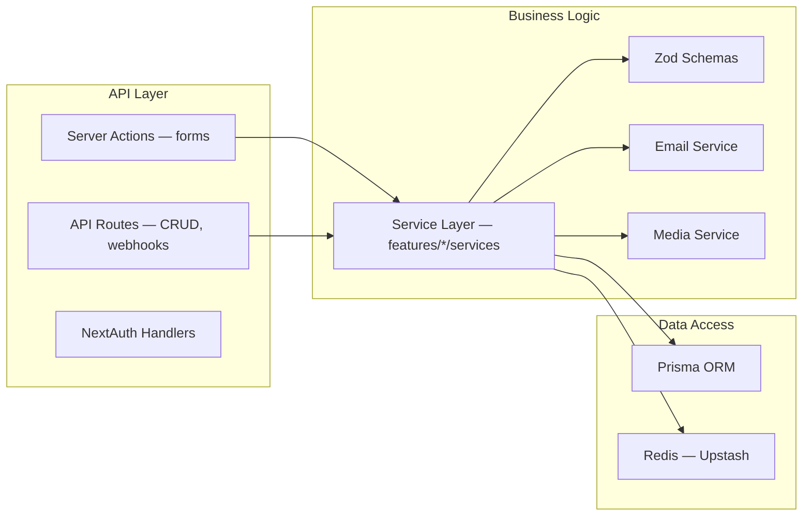
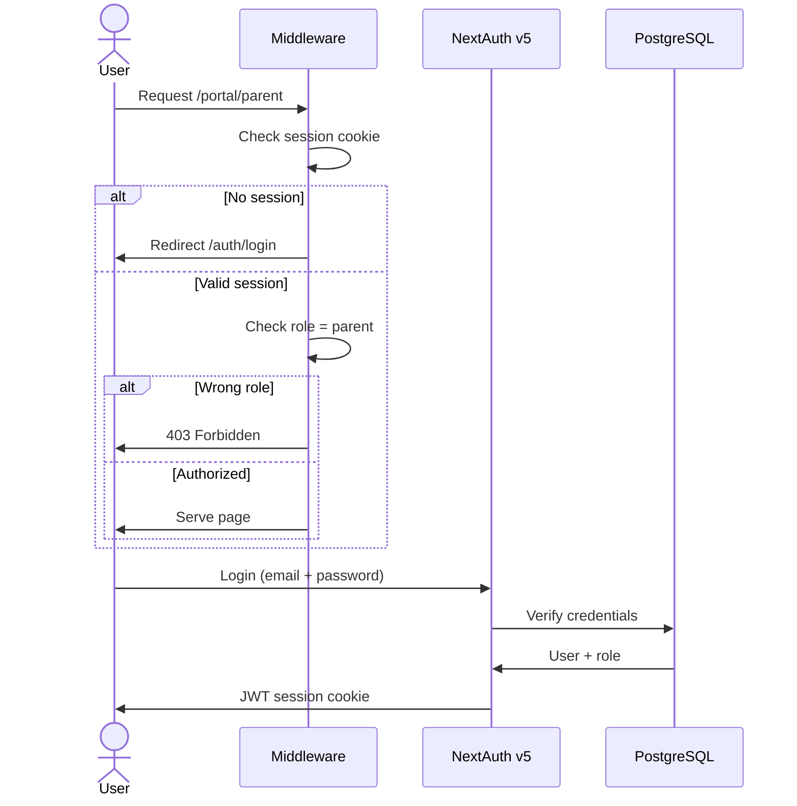
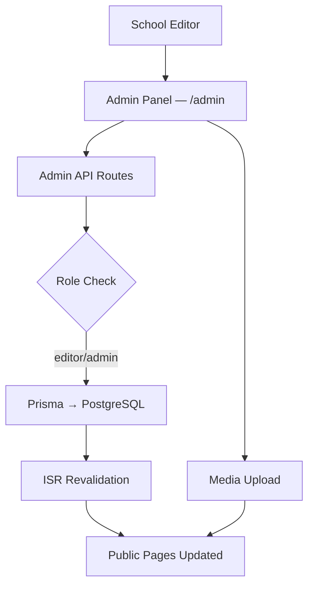
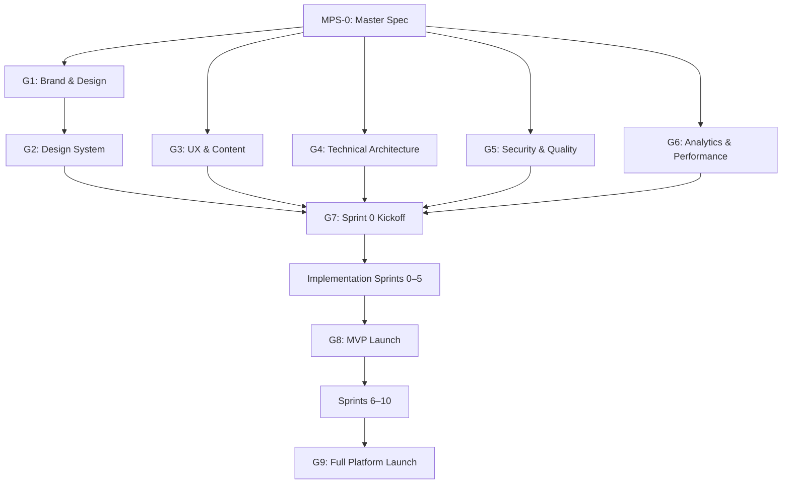

# Alashbal International School

# MASTER PRODUCT SPECIFICATION (MPS)

| Field                   | Value                                                                                                                                             |
| ----------------------- | ------------------------------------------------------------------------------------------------------------------------------------------------- |
| **Document ID**         | AIS-MPS-2026-001                                                                                                                                  |
| **Version**             | 1.0.0                                                                                                                                             |
| **Status**              | **DRAFT — AWAITING FINAL APPROVAL**                                                                                                               |
| **Classification**      | Internal — Engineering & Product                                                                                                                  |
| **Date**                | July 5, 2026                                                                                                                                      |
| **Authors**             | Principal Software Architect · Product Director · Creative Director · Design System Architect · DevOps Lead · QA Lead · Technical Program Manager |
| **Supersedes**          | Docs 01–15 (retained as reference appendices)                                                                                                     |
| **Implementation Rule** | **NO CODE MAY BE WRITTEN UNTIL THIS DOCUMENT IS APPROVED AT GATE MPS-0**                                                                          |

---

## Document Control

| Version | Date       | Author            | Changes             |
| ------- | ---------- | ----------------- | ------------------- |
| 1.0.0   | 2026-07-05 | Architecture Team | Initial MPS release |

### Distribution

| Role                | Responsibility              |
| ------------------- | --------------------------- |
| School Leadership   | Final business approval     |
| Product Owner       | Scope and priority approval |
| Creative Director   | Brand and design approval   |
| Principal Architect | Technical approval          |
| DevOps Lead         | Infrastructure approval     |
| QA Lead             | Quality standards approval  |
| Development Team    | Execution reference         |

### Table of Contents

1. [Product Vision](#1-product-vision)
2. [Brand Book](#2-brand-book)
3. [Design Tokens](#3-design-tokens)
4. [Complete Design System](#4-complete-design-system)
5. [Motion Design Specification](#5-motion-design-specification)
6. [UX Guidelines](#6-ux-guidelines)
7. [Content Design](#7-content-design)
8. [Technical Architecture](#8-technical-architecture)
9. [Feature-Based Architecture](#9-feature-based-architecture)
10. [API Specification](#10-api-specification)
11. [Database Specification](#11-database-specification)
12. [Security](#12-security)
13. [Analytics](#13-analytics)
14. [Performance](#14-performance)
15. [Testing Strategy](#15-testing-strategy)
16. [DevOps & CI/CD](#16-devops--cicd)
17. [Scalability Roadmap](#17-scalability-roadmap)
18. [Figma Blueprint](#18-figma-blueprint)
19. [Definition of Done](#19-definition-of-done)
20. [Final Approval Gates](#20-final-approval-gates)

---

# 1. Product Vision

## 1.1 Mission

**To build the definitive digital platform for Alashbal International School** — a premium, trilingual, performance-engineered experience that transforms how families discover, evaluate, enroll in, and engage with one of Qatar's leading Cambridge-accredited international schools.

This is not a brochure website. It is a **decision-support platform**, **admissions engine**, **community portal**, and **brand flagship** unified into one system.

## 1.2 Vision

By 2027, `aisdoha.net` will be recognized among the **top 3 international school digital platforms in the GCC** — measured by Lighthouse scores, accessibility compliance, admissions conversion, and parent satisfaction — setting a new benchmark that competitors in Doha and Dubai will study.

## 1.3 Business Goals

| #    | Goal                                                | Target                                  | Timeline             |
| ---- | --------------------------------------------------- | --------------------------------------- | -------------------- |
| BG-1 | Increase qualified admission inquiries              | 30+ / month                             | 6 months post-launch |
| BG-2 | Increase campus tour bookings                       | 20+ / month                             | 6 months post-launch |
| BG-3 | Reduce admissions team response time                | < 24 hours                              | Launch               |
| BG-4 | Establish Cambridge + Innovation brand position     | Top 3 SERP for "cambridge school qatar" | 12 months            |
| BG-5 | Enable self-service parent information access       | 50+ portal users month 1                | 3 months post-portal |
| BG-6 | Eliminate accessibility and performance liabilities | WCAG 2.2 AA + Lighthouse 90+            | Launch               |
| BG-7 | Reduce dependency on manual WhatsApp/email for FAQs | 70% AI chat resolution                  | 6 months post-AI     |
| BG-8 | Support trilingual stakeholder communication        | EN 100%, AR 95%, FR 60%                 | 6 months             |

## 1.4 Success Metrics

| Category        | Metric                    | Baseline (2026) | Target     |
| --------------- | ------------------------- | --------------- | ---------- |
| **Acquisition** | Organic sessions / month  | < 100           | 4,000      |
| **Acquisition** | Brand keyword position    | Not top 10      | #1         |
| **Conversion**  | Homepage → Inquiry rate   | 0%              | 8%         |
| **Conversion**  | Inquiry → Tour booked     | N/A             | 60%        |
| **Conversion**  | Tour → Application        | N/A             | 40%        |
| **Engagement**  | Avg. session duration     | < 1 min         | 3+ min     |
| **Engagement**  | Pages per session         | 1.2             | 4+         |
| **Quality**     | Lighthouse Performance    | ~40             | ≥ 90       |
| **Quality**     | Lighthouse Accessibility  | ~15             | ≥ 95       |
| **Quality**     | Core Web Vitals pass rate | 0%              | 100%       |
| **Retention**   | Parent portal MAU         | 0               | 200+       |
| **Reputation**  | Google Business rating    | Unmanaged       | 4.5+ stars |

## 1.5 KPIs (Dashboard — Reviewed Monthly)

```
┌─────────────────────────────────────────────────────────────┐
│  AIS DIGITAL HEALTH DASHBOARD                               │
├──────────────┬──────────────┬──────────────┬────────────────┤
│ Inquiries    │ Tours        │ Applications │ Organic Traffic│
│  [30/mo]     │  [20/mo]     │  [12/mo]     │  [4K/mo]       │
├──────────────┼──────────────┼──────────────┼────────────────┤
│ LCP          │ INP          │ CLS          │ Uptime         │
│  [<2.0s]     │  [<150ms]    │  [<0.05]     │  [99.9%]       │
├──────────────┴──────────────┴──────────────┴────────────────┤
│ Accessibility Violations: 0 critical │ SEO Indexed: 80+    │
└─────────────────────────────────────────────────────────────┘
```

## 1.6 Brand Positioning

**Positioning Statement:**

> For internationally-minded families in Qatar seeking a Cambridge-accredited education with future-ready STEM and innovation programs, **Alashbal International School** is the premium digital gateway that combines academic heritage with technological excellence — unlike generic school websites, AIS delivers a platform as refined as the education it represents.

**Position Map:**

| Dimension        | Alashbal Current | Competitors (Avg) | AIS Target |
| ---------------- | ---------------- | ----------------- | ---------- |
| Visual Quality   | 2.5/10           | 7/10              | 9.5/10     |
| Performance      | 3/10             | 5/10              | 9.5/10     |
| Accessibility    | 1.5/10           | 5/10              | 9.5/10     |
| Admissions UX    | 2/10             | 7.5/10            | 9.5/10     |
| Innovation Story | 3/10             | 5/10              | 9.5/10     |
| Multilingual     | 0/10             | 3/10              | 9/10       |

## 1.7 Competitive Advantage

| #    | Advantage                                                                      | Competitor Gap                            |
| ---- | ------------------------------------------------------------------------------ | ----------------------------------------- |
| CA-1 | **Performance leadership** — Lighthouse 90+ in a market of Wix/WordPress 40–60 | 2–3× faster than Doha average             |
| CA-2 | **Accessibility certification** — WCAG 2.2 AA from day one                     | Most schools fail contrast requirements   |
| CA-3 | **Cambridge + Innovation dual positioning**                                    | Schools pick one or the other             |
| CA-4 | **Trilingual native RTL** — not Google Translate overlay                       | 80% of Doha schools are EN-only           |
| CA-5 | **AI admissions assistant** — 24/7 trilingual support                          | Only Nord Anglia exploring AI             |
| CA-6 | **Feature-based architecture** — scales to portals, LMS, payments              | Competitors are page-based brochure sites |
| CA-7 | **Design system at 40+ components** — consistent, maintainable                 | Template/Wix inconsistency                |
| CA-8 | **Decision-support content architecture** — every page drives action           | Text-heavy brochure pattern               |

---

# 2. Brand Book

## 2.1 Brand Personality

| Trait                | Description                          | We Are                | We Are Not                |
| -------------------- | ------------------------------------ | --------------------- | ------------------------- |
| **Prestigious**      | Refined, confident, authoritative    | A leading institution | Elitist or exclusionary   |
| **Warm**             | Welcoming, community-focused         | A family              | Corporate or cold         |
| **Forward-thinking** | Innovation, STEM, AI, future careers | Future-ready          | Trend-chasing or gimmicky |
| **Trustworthy**      | Accredited, transparent, honest      | Reliable              | Boastful or vague         |
| **International**    | Multicultural, multilingual, global  | Globally minded       | Western-only              |
| **Nurturing**        | Child-centered, supportive growth    | Empowering            | Passive or hand-holding   |

**Brand Archetype:** The Sage (wisdom) + The Creator (innovation)

## 2.2 Brand Voice

- **Authoritative** but never arrogant
- **Warm** but never casual/slang
- **Clear** but never simplistic
- **Inspiring** but never hyperbolic
- **Inclusive** but never generic

## 2.3 Tone of Voice by Context

| Context       | Tone                          | Example                                                              |
| ------------- | ----------------------------- | -------------------------------------------------------------------- |
| Homepage hero | Inspiring, bold               | "Where Young Achievers become Global Leaders"                        |
| Admissions    | Reassuring, helpful           | "We'll guide you through every step"                                 |
| Academics     | Precise, confident            | "Cambridge Primary: rigorous, inquiry-based learning for ages 5–11"  |
| Student life  | Energetic, authentic          | "From robotics to rugby — find your passion"                         |
| Leadership    | Personal, sincere             | "It is my privilege to welcome you to AIS"                           |
| Error states  | Friendly, helpful             | "Something went wrong. Please try again or call us."                 |
| Legal         | Clear, direct                 | "We collect only the information necessary to process your inquiry." |
| Arabic        | Respectful, warm (فصحى مبسطة) | "نسعد بترحيبكم في مدرسة الأشبال الدولية"                             |
| French        | Professional, elegant         | "Bienvenue à Alashbal International School"                          |

## 2.4 Writing Style

| Rule               | Standard                                            |
| ------------------ | --------------------------------------------------- |
| Sentence length    | Max 25 words average                                |
| Paragraph length   | Max 4 sentences                                     |
| Voice              | Active ("We nurture") not passive                   |
| Jargon             | Avoid; explain Cambridge terms on first use         |
| Inclusive language | Gender-neutral, culturally sensitive                |
| Numbers            | Numerals for ages, dates, statistics                |
| Capitalization     | Sentence case for headings; Title Case for nav only |
| Oxford comma       | Yes                                                 |
| Contractions       | Avoid in formal content; acceptable in CTAs         |

## 2.5 Logo Usage Rules

| Rule           | Specification                                 |
| -------------- | --------------------------------------------- |
| Primary logo   | Full wordmark + emblem (horizontal)           |
| Secondary logo | Emblem only (app icon, favicon, small spaces) |
| Stacked logo   | Wordmark below emblem (square formats)        |

## 2.6 Logo Spacing (Clear Space)

```
        ┌─────────────────────────┐
        │    ↑ 1× logo height     │
        │  ← [LOGO] →             │
        │    ↓ 1× logo height     │
        └─────────────────────────┘
```

Clear space on all sides = **1× the height of the emblem**.

## 2.7 Logo Minimum Size

| Format                  | Minimum Width                           |
| ----------------------- | --------------------------------------- |
| Digital — full wordmark | 120px                                   |
| Digital — emblem only   | 32px                                    |
| Print — full wordmark   | 30mm                                    |
| Favicon                 | 32×32px (emblem), 180×180 (apple-touch) |

## 2.8 Incorrect Logo Usage

| ❌ Don't                                  | Why                    |
| ----------------------------------------- | ---------------------- |
| Stretch or distort proportions            | Breaks brand integrity |
| Rotate the logo                           | Disorienting           |
| Change logo colors (non-approved)         | Off-brand              |
| Add shadows, glows, outlines              | Dated, unprofessional  |
| Place on busy photography without overlay | Illegible              |
| Use on non-approved backgrounds           | Contrast failure       |
| Rearrange emblem/wordmark relationship    | Breaks lockup          |
| Use outdated logo versions                | Inconsistent           |

## 2.9 Photography Direction

| Attribute         | Direction                                                          |
| ----------------- | ------------------------------------------------------------------ |
| **Subject**       | Real AIS students, teachers, campus — never stock                  |
| **Lighting**      | Natural, warm; golden hour for exteriors                           |
| **Composition**   | Rule of thirds; candid over posed                                  |
| **Diversity**     | Reflect 40+ nationalities authentically                            |
| **Emotion**       | Joy, curiosity, confidence, collaboration                          |
| **Settings**      | Classrooms in action, STEM labs, sports, events                    |
| **Avoid**         | Staged handshakes, empty rooms, heavy filters, outdated uniforms   |
| **Treatment**     | Subtle warmth (+5% saturation); consistent color grade across site |
| **Aspect ratios** | Hero 16:9, Cards 16:9, Portraits 1:1, Gallery mixed                |

## 2.10 Illustration Style

| Attribute  | Direction                                                                  |
| ---------- | -------------------------------------------------------------------------- |
| Usage      | Secondary to photography; used for empty states, onboarding, STEM diagrams |
| Style      | Clean line art with burgundy/gold accents; geometric, not cartoonish       |
| Complexity | Minimal; single-color or two-color                                         |
| Characters | Abstract/geometric human forms (no detailed faces)                         |
| Background | Transparent or subtle gradient                                             |
| Avoid      | Clip-art, 3D renders, mascots, childish cartoons                           |

## 2.11 Iconography

| Attribute    | Standard                                                         |
| ------------ | ---------------------------------------------------------------- |
| Library      | Lucide Icons (primary)                                           |
| Style        | Outlined, 1.5px stroke                                           |
| Sizes        | 16px (inline), 20px (default), 24px (standalone), 32px (feature) |
| Color        | Inherit from text; burgundy-700 for interactive                  |
| RTL          | Directional icons mirrored (arrows, chevrons)                    |
| Custom icons | STEM, Cambridge badge, WhatsApp only                             |

## 2.12 Image Treatment

| Treatment     | Application                                                   |
| ------------- | ------------------------------------------------------------- |
| Border radius | 12px (cards), 16px (feature), 0 (full-bleed hero)             |
| Overlay       | Hero: `linear-gradient(135deg, burgundy-900/70, navy-900/50)` |
| Hover         | Scale 1.03, shadow elevate (cards)                            |
| Lazy load     | All below-fold; blur placeholder                              |
| Format        | AVIF > WebP > JPEG fallback                                   |
| Caption       | Optional; body-sm, gray-600, below image                      |

## 2.13 Video Direction

| Type              | Spec                                           |
| ----------------- | ---------------------------------------------- |
| Hero loop         | 15–30s, muted, no UI chrome, campus b-roll     |
| Principal welcome | 2–3 min, subtitled (EN/AR), warm lighting      |
| Testimonials      | 60s max, student/parent, authentic             |
| STEM demo         | 60s, lab footage, dynamic cuts                 |
| Technical         | H.264 + WebM, max 1080p, poster frame required |
| Accessibility     | Captions mandatory; no autoplay with sound     |

## 2.14 Social Media Branding

| Platform  | Profile Image          | Cover/Banner                | Content Style                               |
| --------- | ---------------------- | --------------------------- | ------------------------------------------- |
| Instagram | Emblem on burgundy-900 | Campus photo + logo overlay | Events, student achievements, behind-scenes |
| Facebook  | Emblem on burgundy-900 | 1640×624 campus banner      | News, events, community                     |
| LinkedIn  | Emblem on white        | Professional campus shot    | Careers, thought leadership                 |
| X/Twitter | Emblem on burgundy-900 | Campus photo                | News, quick updates                         |
| YouTube   | Emblem on burgundy-900 | 2560×1440 branded           | Videos, virtual tour                        |
| WhatsApp  | School logo            | N/A                         | Admissions communication                    |

**Social template rules:** Burgundy-900 or white background; Fraunces for headlines; consistent lower-third for videos; Cambridge badge when referencing curriculum.

---

# 3. Design Tokens

## 3.1 Color Tokens — Primary (Burgundy)

| Token         | Hex       | Usage                              |
| ------------- | --------- | ---------------------------------- |
| `primary-50`  | `#FDF5F6` | Tinted backgrounds                 |
| `primary-100` | `#F9E8EC` | Light badges, hover backgrounds    |
| `primary-200` | `#EFC5CD` | Borders, dividers (light)          |
| `primary-300` | `#DF92A3` | Decorative accents                 |
| `primary-400` | `#C95D76` | Secondary buttons (light mode)     |
| `primary-500` | `#B13A58` | Interactive elements               |
| `primary-600` | `#A52840` | Primary button hover               |
| `primary-700` | `#8B1E35` | **Primary button default**         |
| `primary-800` | `#6B1528` | Dark sections, footer              |
| `primary-900` | `#4A0E1B` | **Brand anchor**, headers          |
| `primary-950` | `#2D0810` | Deepest shade, dark mode bg accent |

## 3.2 Color Tokens — Secondary (Gold)

| Token           | Hex       | Usage                   |
| --------------- | --------- | ----------------------- |
| `secondary-50`  | `#FBF8F3` | Warm white backgrounds  |
| `secondary-100` | `#F5EDE0` | Card accents            |
| `secondary-200` | `#E8D5B5` | Subtle borders          |
| `secondary-300` | `#DCC29A` | Decorative lines        |
| `secondary-400` | `#D0AE7E` | Icon accents            |
| `secondary-500` | `#C5A572` | **Gold accent default** |
| `secondary-600` | `#B08C55` | Hover                   |
| `secondary-700` | `#8F7040` | Active                  |
| `secondary-800` | `#6E5530` | Dark accent             |
| `secondary-900` | `#4D3B22` | Deep gold               |
| `secondary-950` | `#2E2314` | Darkest                 |

## 3.3 Color Tokens — Accent (Navy)

| Token        | Hex       | Usage              |
| ------------ | --------- | ------------------ |
| `accent-50`  | `#F0F4FA` | Light navy tint    |
| `accent-100` | `#D9E2F0` | Trust section bg   |
| `accent-200` | `#B3C5E0` | Borders            |
| `accent-300` | `#7A9BC7` | Links (light)      |
| `accent-400` | `#4A73A8` | Interactive        |
| `accent-500` | `#2B5294` | Secondary CTA      |
| `accent-600` | `#1E3A6E` | **Link default**   |
| `accent-700` | `#162D57` | Hover              |
| `accent-800` | `#0F1D3A` | **Trust sections** |
| `accent-900` | `#0A1428` | Deepest navy       |
| `accent-950` | `#050A16` | Dark mode surface  |

## 3.4 Color Tokens — Neutral

| Token         | Hex       | Usage                  |
| ------------- | --------- | ---------------------- |
| `neutral-0`   | `#FFFFFF` | Pure white             |
| `neutral-50`  | `#F8F9FA` | Page background alt    |
| `neutral-100` | `#F1F3F5` | Card background        |
| `neutral-200` | `#E9ECEF` | Borders                |
| `neutral-300` | `#DEE2E6` | Disabled borders       |
| `neutral-400` | `#CED4DA` | Placeholder            |
| `neutral-500` | `#ADB5BD` | Muted text             |
| `neutral-600` | `#6C757D` | Secondary text         |
| `neutral-700` | `#495057` | Body text (light mode) |
| `neutral-800` | `#343A40` | Headings               |
| `neutral-900` | `#212529` | Primary text           |
| `neutral-950` | `#0A0A0F` | Dark mode background   |

## 3.5 Semantic Colors

| Token         | Default   | Light BG  | Dark BG   |
| ------------- | --------- | --------- | --------- |
| `success-500` | `#2D6A4F` | `#D8F3DC` | `#1B4332` |
| `success-600` | `#1B4332` | —         | —         |
| `warning-500` | `#E9C46A` | `#FFF3CD` | `#7A6200` |
| `warning-600` | `#CA8A04` | —         | —         |
| `danger-500`  | `#BC4749` | `#F8D7DA` | `#7F1D1D` |
| `danger-600`  | `#9B2226` | —         | —         |
| `info-500`    | `#457B9D` | `#D0E7F8` | `#1D3557` |
| `info-600`    | `#1D3557` | —         | —         |

## 3.6 Typography Tokens

| Token              | Family            | Size            | Weight | Line Height | Letter Spacing |
| ------------------ | ----------------- | --------------- | ------ | ----------- | -------------- |
| `font-display-2xl` | Fraunces          | 4.5rem / 72px   | 600    | 1.1         | -0.02em        |
| `font-display-xl`  | Fraunces          | 3.75rem / 60px  | 600    | 1.1         | -0.02em        |
| `font-display-lg`  | Fraunces          | 3rem / 48px     | 600    | 1.15        | -0.01em        |
| `font-heading-xl`  | Fraunces          | 2.25rem / 36px  | 600    | 1.2         | -0.01em        |
| `font-heading-lg`  | Inter             | 1.875rem / 30px | 600    | 1.25        | 0              |
| `font-heading-md`  | Inter             | 1.5rem / 24px   | 600    | 1.3         | 0              |
| `font-heading-sm`  | Inter             | 1.25rem / 20px  | 600    | 1.35        | 0              |
| `font-body-lg`     | Inter             | 1.125rem / 18px | 400    | 1.6         | 0              |
| `font-body-md`     | Inter             | 1rem / 16px     | 400    | 1.6         | 0              |
| `font-body-sm`     | Inter             | 0.875rem / 14px | 400    | 1.5         | 0              |
| `font-label`       | Inter             | 0.75rem / 12px  | 500    | 1.4         | 0.05em         |
| `font-overline`    | Inter             | 0.75rem / 12px  | 600    | 1.4         | 0.1em          |
| `font-ar-display`  | Noto Naskh Arabic | 3rem            | 700    | 1.3         | 0              |
| `font-ar-body`     | Noto Sans Arabic  | 1rem            | 400    | 1.7         | 0              |

## 3.7 Spacing Scale

| Token       | Value | Usage                     |
| ----------- | ----- | ------------------------- |
| `space-0`   | 0     | Reset                     |
| `space-px`  | 1px   | Hairline                  |
| `space-0.5` | 2px   | Micro                     |
| `space-1`   | 4px   | Icon gap                  |
| `space-1.5` | 6px   | Tight                     |
| `space-2`   | 8px   | Compact padding           |
| `space-2.5` | 10px  | —                         |
| `space-3`   | 12px  | Input padding             |
| `space-4`   | 16px  | Card padding (mobile)     |
| `space-5`   | 20px  | —                         |
| `space-6`   | 24px  | Card padding (desktop)    |
| `space-8`   | 32px  | Section inner gap         |
| `space-10`  | 40px  | —                         |
| `space-12`  | 48px  | Between components        |
| `space-16`  | 64px  | Section padding (mobile)  |
| `space-20`  | 80px  | —                         |
| `space-24`  | 96px  | Section padding (desktop) |
| `space-32`  | 128px | Hero padding              |
| `space-40`  | 160px | Large section gaps        |

## 3.8 Radius Scale

| Token         | Value  | Usage                 |
| ------------- | ------ | --------------------- |
| `radius-none` | 0      | Full-bleed images     |
| `radius-sm`   | 4px    | Badges, tags          |
| `radius-md`   | 8px    | Inputs, buttons       |
| `radius-lg`   | 12px   | Cards                 |
| `radius-xl`   | 16px   | Feature cards, modals |
| `radius-2xl`  | 24px   | Hero overlays         |
| `radius-full` | 9999px | Avatars, pills, FAB   |

## 3.9 Elevation & Shadow System

| Token             | Value                              | Usage               |
| ----------------- | ---------------------------------- | ------------------- |
| `elevation-0`     | none                               | Flat elements       |
| `elevation-1`     | `0 1px 2px rgba(0,0,0,0.05)`       | Cards at rest       |
| `elevation-2`     | `0 4px 12px rgba(0,0,0,0.08)`      | Hover cards         |
| `elevation-3`     | `0 8px 24px rgba(0,0,0,0.12)`      | Dropdowns, popovers |
| `elevation-4`     | `0 16px 48px rgba(0,0,0,0.16)`     | Modals              |
| `elevation-glow`  | `0 0 20px rgba(139,30,53,0.15)`    | Primary CTA hover   |
| `elevation-inner` | `inset 0 2px 4px rgba(0,0,0,0.06)` | Pressed buttons     |

## 3.10 Opacity Tokens

| Token         | Value | Usage              |
| ------------- | ----- | ------------------ |
| `opacity-0`   | 0     | Hidden             |
| `opacity-5`   | 0.05  | Subtle bg tint     |
| `opacity-10`  | 0.10  | Glass backgrounds  |
| `opacity-20`  | 0.20  | Overlays           |
| `opacity-40`  | 0.40  | Disabled text      |
| `opacity-50`  | 0.50  | Disabled elements  |
| `opacity-60`  | 0.60  | Muted content      |
| `opacity-80`  | 0.80  | Secondary emphasis |
| `opacity-100` | 1.00  | Full               |

## 3.11 Blur Tokens

| Token       | Value | Usage                  |
| ----------- | ----- | ---------------------- |
| `blur-none` | 0     | Default                |
| `blur-sm`   | 4px   | Subtle                 |
| `blur-md`   | 8px   | —                      |
| `blur-lg`   | 12px  | Glass effect           |
| `blur-xl`   | 16px  | Sticky header backdrop |
| `blur-2xl`  | 24px  | Modal backdrop         |

## 3.12 Border Tokens

| Token                  | Value         | Usage                          |
| ---------------------- | ------------- | ------------------------------ |
| `border-width-0`       | 0             | No border                      |
| `border-width-1`       | 1px           | Default cards, inputs          |
| `border-width-2`       | 2px           | Focus rings, secondary buttons |
| `border-width-3`       | 3px           | Active accordion indicator     |
| `border-color-default` | `neutral-200` | Standard                       |
| `border-color-focus`   | `primary-700` | Focus state                    |
| `border-color-error`   | `danger-500`  | Validation                     |

## 3.13 Motion Tokens

### Duration

| Token              | Value | Usage            |
| ------------------ | ----- | ---------------- |
| `duration-instant` | 0ms   | Reduced motion   |
| `duration-fast`    | 150ms | Hover, focus     |
| `duration-normal`  | 250ms | Accordion, tabs  |
| `duration-slow`    | 400ms | Page transitions |
| `duration-slower`  | 600ms | Hero reveals     |

### Easing

| Token          | Value                               | Usage                       |
| -------------- | ----------------------------------- | --------------------------- |
| `ease-default` | `cubic-bezier(0.4, 0, 0.2, 1)`      | General                     |
| `ease-in`      | `cubic-bezier(0.4, 0, 1, 1)`        | Exit                        |
| `ease-out`     | `cubic-bezier(0, 0, 0.2, 1)`        | Enter                       |
| `ease-in-out`  | `cubic-bezier(0.4, 0, 0.2, 1)`      | Symmetric                   |
| `ease-spring`  | `spring(1, 80, 10)`                 | Card hover (Framer)         |
| `ease-bounce`  | `cubic-bezier(0.34, 1.56, 0.64, 1)` | Playful micro (limited use) |

## 3.14 Responsive Breakpoints

| Token           | Min Width | Target Device                   |
| --------------- | --------- | ------------------------------- |
| `screen-xs`     | 375px     | Small phone                     |
| `screen-sm`     | 640px     | Large phone                     |
| `screen-md`     | 768px     | Tablet portrait                 |
| `screen-lg`     | 1024px    | Tablet landscape / small laptop |
| `screen-xl`     | 1280px    | Desktop                         |
| `screen-2xl`    | 1536px    | Large desktop                   |
| `container-max` | 1400px    | Content max-width               |

## 3.15 Dark Mode Tokens

| Token            | Light         | Dark          |
| ---------------- | ------------- | ------------- |
| `bg-primary`     | `neutral-0`   | `neutral-950` |
| `bg-secondary`   | `neutral-50`  | `neutral-900` |
| `bg-elevated`    | `neutral-0`   | `neutral-800` |
| `text-primary`   | `neutral-900` | `neutral-50`  |
| `text-secondary` | `neutral-600` | `neutral-400` |
| `border-default` | `neutral-200` | `neutral-700` |
| `brand-primary`  | `primary-700` | `primary-500` |
| `brand-accent`   | `accent-600`  | `accent-400`  |

## 3.16 RTL Tokens

| Token                 | LTR           | RTL               |
| --------------------- | ------------- | ----------------- |
| `direction`           | `ltr`         | `rtl`             |
| `text-align-start`    | `left`        | `right`           |
| `margin-inline-start` | `margin-left` | `margin-right`    |
| `chevron-direction`   | `right`       | `left`            |
| `slide-direction`     | `x: 20`       | `x: -20`          |
| `font-display`        | Fraunces      | Noto Naskh Arabic |
| `font-body`           | Inter         | Noto Sans Arabic  |

---

# 4. Complete Design System

**System Name:** AIS Design System v1.0  
**Component Prefix:** `AIS-` (internal) / Shadcn primitives extended  
**Total Components:** 42

### Component Documentation Template

Every component below follows this structure:

- **Purpose** — Why it exists
- **Variants** — Visual/functional options
- **States** — Interactive states
- **Accessibility** — WCAG requirements
- **Responsive** — Breakpoint behavior
- **Motion** — Animation spec
- **Example** — Usage context

---

## 4.1 Navbar

| Attribute         | Specification                                                                |
| ----------------- | ---------------------------------------------------------------------------- |
| **Purpose**       | Global wayfinding, brand presence, persistent CTA access                     |
| **Variants**      | `transparent` (hero overlay), `solid` (scrolled), `inverted` (dark sections) |
| **States**        | Default, scrolled (backdrop-blur + shadow), mobile-open                      |
| **Accessibility** | `<nav aria-label="Main">`; `aria-current="page"`; skip link before           |
| **Responsive**    | Desktop: mega menu. Mobile: hamburger → full-screen drawer                   |
| **Motion**        | Background fade 150ms on scroll; logo scale 0.95→1 on load                   |
| **Example**       | Sticky at top; utility bar above on desktop (email, phone, portal link)      |

**Specs:** Height 72px desktop / 64px mobile. Logo left (RTL: right). CTA "Book a Tour" right.

---

## 4.2 Mega Menu

| Attribute         | Specification                                                  |
| ----------------- | -------------------------------------------------------------- |
| **Purpose**       | Organize 35+ pages into scannable groups without overwhelming  |
| **Variants**      | 2-column (Admissions), 3-column (Academics)                    |
| **States**        | Closed, open (hover/click), focus-trapped                      |
| **Accessibility** | `aria-expanded`, `aria-haspopup`; Escape closes; arrow key nav |
| **Responsive**    | Hidden on mobile; replaced by accordion in drawer              |
| **Motion**        | Fade + slide down 200ms ease-out                               |
| **Example**       | About ▾ → 2 columns: Story/Mission + Leadership/Accreditations |

---

## 4.3 Hero

| Attribute         | Specification                                                                                                  |
| ----------------- | -------------------------------------------------------------------------------------------------------------- |
| **Purpose**       | First impression; communicate value proposition; drive dual CTA                                                |
| **Variants**      | `video` (loop, muted), `image` (static), `split` (text + image 50/50)                                          |
| **States**        | Loading (poster frame), playing, reduced-motion (static image)                                                 |
| **Accessibility** | Video: `aria-hidden`, no autoplay sound; text contrast ≥ 4.5:1 over overlay                                    |
| **Responsive**    | Mobile: no video (image only), stacked CTAs, display-2xl → 40px                                                |
| **Motion**        | Text fade-up stagger 100ms; parallax max 20px (desktop only)                                                   |
| **Example**       | Full-bleed campus video + "Young Achievers of Today, Global Leaders of Tomorrow" + [Book a Tour] [Inquire Now] |

---

## 4.4 Cards

| Attribute         | Specification                                                               |
| ----------------- | --------------------------------------------------------------------------- |
| **Purpose**       | Contain related content in scannable, clickable units                       |
| **Variants**      | `default`, `elevated`, `glass`, `feature` (dark), `image-top`, `horizontal` |
| **States**        | Default, hover (lift + shadow), active, disabled                            |
| **Accessibility** | If clickable: `<a>` or `<button>` wrapper; heading inside `<h3>`            |
| **Responsive**    | Grid: 1 col mobile → 2 col tablet → 3–4 col desktop                         |
| **Motion**        | Hover: translateY(-4px) + elevation-2, 200ms spring                         |
| **Example**       | Age-band card: image 16:9, "Early Years", "Ages 3–5", [Discover →]          |

---

## 4.5 Buttons

| Attribute         | Specification                                                              |
| ----------------- | -------------------------------------------------------------------------- |
| **Purpose**       | Trigger actions; drive conversion                                          |
| **Variants**      | `primary`, `secondary`, `ghost`, `gold`, `inverted`, `destructive`, `link` |
| **States**        | Default, hover, active, focus, disabled, loading (spinner)                 |
| **Accessibility** | `aria-label` if icon-only; `aria-busy` when loading; min 44×44px touch     |
| **Responsive**    | Full-width on mobile for primary CTAs in forms                             |
| **Motion**        | Scale 0.98 on active; glow on primary hover                                |
| **Example**       | Primary: burgundy-700 bg, white text, 52px height (lg)                     |

**Sizes:** `sm` 36px · `md` 44px · `lg` 52px

---

## 4.6 Inputs

| Attribute         | Specification                                                        |
| ----------------- | -------------------------------------------------------------------- |
| **Purpose**       | Collect user text data in forms                                      |
| **Variants**      | `text`, `email`, `tel`, `number`, `password`, `search`               |
| **States**        | Default, focus, error, disabled, readonly                            |
| **Accessibility** | Associated `<label>`; `aria-invalid` + `aria-describedby` for errors |
| **Responsive**    | Full-width; 48px height all breakpoints                              |
| **Motion**        | Border color transition 150ms on focus                               |
| **Example**       | `<Input label="Parent Name" required error="Name is required" />`    |

---

## 4.7 Select

| Attribute         | Specification                                                       |
| ----------------- | ------------------------------------------------------------------- |
| **Purpose**       | Choose from predefined options (year group, tour time)              |
| **Variants**      | `single`, `multi` (admin only)                                      |
| **States**        | Closed, open (dropdown), focus, error, disabled                     |
| **Accessibility** | `role="combobox"`; `aria-expanded`; keyboard: arrows, Enter, Escape |
| **Responsive**    | Native select fallback on very small screens (optional)             |
| **Motion**        | Dropdown fade 150ms                                                 |
| **Example**       | Year group: FS1, FS2, Year 1–13                                     |

---

## 4.8 Accordion

| Attribute         | Specification                                                    |
| ----------------- | ---------------------------------------------------------------- |
| **Purpose**       | Progressive disclosure for dense content (FAQs, fees, discounts) |
| **Variants**      | `default`, `bordered`, `flush`                                   |
| **States**        | Collapsed, expanded, focus                                       |
| **Accessibility** | `<button aria-expanded>` trigger; `aria-controls` panel id       |
| **Responsive**    | Full-width all breakpoints                                       |
| **Motion**        | Height auto-animate 250ms ease-in-out; chevron rotate 180°       |
| **Example**       | Admissions FAQ: "What documents are required?"                   |

---

## 4.9 Tabs

| Attribute         | Specification                                                 |
| ----------------- | ------------------------------------------------------------- |
| **Purpose**       | Switch between related content panels without page navigation |
| **Variants**      | `underline`, `pills`, `enclosed`                              |
| **States**        | Active tab, inactive, focus, disabled                         |
| **Accessibility** | `role="tablist"`; arrow keys; `aria-selected`                 |
| **Responsive**    | Horizontal scroll on mobile if > 3 tabs                       |
| **Motion**        | Underline slide 200ms to active tab                           |
| **Example**       | Fees page: tabs per school level (EY, Primary, Secondary)     |

---

## 4.10 Timeline

| Attribute         | Specification                                                      |
| ----------------- | ------------------------------------------------------------------ |
| **Purpose**       | Visualize sequential processes (admissions steps, school history)  |
| **Variants**      | `vertical` (default), `horizontal` (desktop admissions)            |
| **States**        | Completed step, current, upcoming                                  |
| **Accessibility** | Ordered list `<ol>`; step numbers visible                          |
| **Responsive**    | Vertical on mobile; horizontal on desktop (admissions)             |
| **Motion**        | Steps fade-in on scroll, stagger 150ms                             |
| **Example**       | Admissions: 01 Enquire → 02 Tour → 03 Apply → 04 Assess → 05 Offer |

---

## 4.11 Gallery

| Attribute         | Specification                                                       |
| ----------------- | ------------------------------------------------------------------- |
| **Purpose**       | Showcase campus life through photography                            |
| **Variants**      | `grid` (3–4 col), `masonry` (optional), `featured` (1 large + grid) |
| **States**        | Default, lightbox-open, loading                                     |
| **Accessibility** | Alt text required (CMS enforced); lightbox focus trap               |
| **Responsive**    | 1 col mobile → 2 col tablet → 3–4 col desktop                       |
| **Motion**        | Lightbox fade 250ms; image scale from thumbnail position            |
| **Example**       | Filter tabs: Campus, Classroom, Sports, Events                      |

---

## 4.12 Carousel

| Attribute         | Specification                                                 |
| ----------------- | ------------------------------------------------------------- |
| **Purpose**       | Rotate through testimonials, news, hero slides                |
| **Variants**      | `testimonial`, `news`, `hero`, `logo` (trust bar)             |
| **States**        | Auto-playing, paused, manual navigation                       |
| **Accessibility** | Pause button; `aria-live="polite"`; prev/next buttons labeled |
| **Responsive**    | Swipe on touch; 1 slide mobile, 3 desktop (news)              |
| **Motion**        | Slide transition 400ms ease-in-out; auto-advance 6s           |
| **Example**       | Testimonials: Principal, Student, Parent rotation             |

---

## 4.13 Testimonials

| Attribute         | Specification                                                    |
| ----------------- | ---------------------------------------------------------------- |
| **Purpose**       | Social proof from stakeholders                                   |
| **Variants**      | `card` (single), `carousel` (multiple), `inline` (quote in text) |
| **States**        | Default, active (carousel)                                       |
| **Accessibility** | `<blockquote>` + `<cite>`; photo `alt="Name, Role"`              |
| **Responsive**    | Card: stacked on mobile; carousel on desktop                     |
| **Motion**        | Carousel slide; quote mark decorative fade                       |
| **Example**       | Navy-900 bg, circular portrait, gold quote mark, name + role     |

---

## 4.14 Pricing (Tuition Fees)

| Attribute         | Specification                                          |
| ----------------- | ------------------------------------------------------ |
| **Purpose**       | Transparent fee display by year group                  |
| **Variants**      | `table` (default), `cards` (per level)                 |
| **States**        | Default, highlighted (most popular year)               |
| **Accessibility** | `<table>` with `<th scope="col/row">`; caption element |
| **Responsive**    | Table → stacked cards on mobile                        |
| **Motion**        | Row highlight on hover                                 |
| **Example**       | Columns: Year Group, Annual Fee, Registration, Notes   |

---

## 4.15 Forms

| Attribute         | Specification                                                         |
| ----------------- | --------------------------------------------------------------------- |
| **Purpose**       | Collect structured user input (inquiry, tour, application, contact)   |
| **Variants**      | `single-page`, `multi-step` (application), `inline` (newsletter)      |
| **States**        | Empty, filling, validating, submitting, success, error                |
| **Accessibility** | Fieldset/legend for groups; error summary at top on submit fail       |
| **Responsive**    | Single column mobile; two-column for name fields on desktop           |
| **Motion**        | Step transition slide-left 300ms (multi-step); success checkmark draw |
| **Example**       | Inquiry: 5 fields (name, email, phone, child age, message) + submit   |

---

## 4.16 Calendar

| Attribute         | Specification                                                             |
| ----------------- | ------------------------------------------------------------------------- |
| **Purpose**       | Display school events; tour date selection                                |
| **Variants**      | `month-view` (portal), `date-picker` (tour booking), `list` (events page) |
| **States**        | Default, selected date, disabled (past dates), event dot                  |
| **Accessibility** | Grid with `aria-label` per day; keyboard date navigation                  |
| **Responsive**    | Full-width mobile; sidebar + grid on desktop (portal)                     |
| **Motion**        | Month transition fade 200ms                                               |
| **Example**       | Tour booking: next 30 weekdays, morning/afternoon slots                   |

---

## 4.17 Footer

| Attribute         | Specification                                                                                       |
| ----------------- | --------------------------------------------------------------------------------------------------- |
| **Purpose**       | Secondary navigation, contact, legal, social, trust                                                 |
| **Variants**      | `full` (4-column), `minimal` (portal)                                                               |
| **States**        | Default                                                                                             |
| **Accessibility** | `<footer>` landmark; heading per column (`<h3>`)                                                    |
| **Responsive**    | 4 col → 2 col → 1 col stacked                                                                       |
| **Motion**        | None                                                                                                |
| **Example**       | burgundy-900 bg; columns: About, Academics, Admissions, Contact; bottom bar: © privacy terms social |

---

## 4.18 Breadcrumb

| Attribute         | Specification                                         |
| ----------------- | ----------------------------------------------------- |
| **Purpose**       | Show location in site hierarchy; aid navigation + SEO |
| **Variants**      | `default`, `with-icon` (home)                         |
| **States**        | Current page (not linked)                             |
| **Accessibility** | `<nav aria-label="Breadcrumb">`; `<ol>` structure     |
| **Responsive**    | Truncate middle on mobile (Home > … > Current)        |
| **Motion**        | None                                                  |
| **Example**       | Home > Academics > Early Years                        |

---

## 4.19 Search

| Attribute         | Specification                                                       |
| ----------------- | ------------------------------------------------------------------- |
| **Purpose**       | Find content across site (pages, news, FAQs, downloads)             |
| **Variants**      | `inline` (header), `command` (⌘K modal overlay)                     |
| **States**        | Closed, open, typing, results, empty                                |
| **Accessibility** | `role="search"`; `aria-activedescendant` for results; Escape closes |
| **Responsive**    | Icon in header mobile → opens full-screen search                    |
| **Motion**        | Modal fade 200ms; results stagger 50ms                              |
| **Example**       | ⌘K opens centered overlay; grouped results by type                  |

---

## 4.20 Modal

| Attribute         | Specification                                                   |
| ----------------- | --------------------------------------------------------------- |
| **Purpose**       | Focused overlay for confirmations, video playback, quick forms  |
| **Variants**      | `default`, `video`, `confirmation`                              |
| **States**        | Open, closing                                                   |
| **Accessibility** | `role="dialog"`; `aria-modal="true"`; focus trap; Escape closes |
| **Responsive**    | Full-screen on mobile; centered 600px max on desktop            |
| **Motion**        | Backdrop fade 200ms; content scale 0.95→1                       |
| **Example**       | Video testimonial playback                                      |

---

## 4.21 Drawer

| Attribute         | Specification                                              |
| ----------------- | ---------------------------------------------------------- |
| **Purpose**       | Mobile navigation; filter panels                           |
| **Variants**      | `left` (nav), `right` (filters), `bottom` (mobile actions) |
| **States**        | Open, closing                                              |
| **Accessibility** | `aria-modal`; focus trap; return focus to trigger on close |
| **Responsive**    | Primary mobile navigation pattern                          |
| **Motion**        | Slide 300ms ease-out                                       |
| **Example**       | Hamburger → left drawer with full nav tree + CTA           |

---

## 4.22 Sidebar

| Attribute         | Specification                                         |
| ----------------- | ----------------------------------------------------- |
| **Purpose**       | Portal and admin secondary navigation                 |
| **Variants**      | `expanded`, `collapsed` (icon only)                   |
| **States**        | Active item, hover                                    |
| **Accessibility** | `<nav aria-label="Portal">`; `aria-current` on active |
| **Responsive**    | Collapsed on tablet; drawer on mobile                 |
| **Motion**        | Width transition 250ms                                |
| **Example**       | Portal: Dashboard, Calendar, Downloads, Messages      |

---

## 4.23 Table

| Attribute         | Specification                                       |
| ----------------- | --------------------------------------------------- |
| **Purpose**       | Display tabular data (admin lists, fee tables)      |
| **Variants**      | `default`, `striped`, `compact` (admin)             |
| **States**        | Default, sorted, selected row                       |
| **Accessibility** | `<th scope>`; sort buttons with `aria-sort`         |
| **Responsive**    | Horizontal scroll or card-transform on mobile       |
| **Motion**        | Sort column highlight                               |
| **Example**       | Admin inquiries: Name, Email, Date, Status, Actions |

---

## 4.24 Badge

| Attribute         | Specification                                                |
| ----------------- | ------------------------------------------------------------ |
| **Purpose**       | Status indicators, labels, counts                            |
| **Variants**      | `default`, `success`, `warning`, `danger`, `info`, `outline` |
| **States**        | Static                                                       |
| **Accessibility** | Text content (not color-only)                                |
| **Responsive**    | Inline                                                       |
| **Motion**        | None (pulse for notification count optional)                 |
| **Example**       | "New" on inquiry; "Open" on event; "Cambridge" accreditation |

---

## 4.25 Toast

| Attribute         | Specification                                                     |
| ----------------- | ----------------------------------------------------------------- |
| **Purpose**       | Temporary feedback after actions                                  |
| **Variants**      | `success`, `error`, `info`, `warning`                             |
| **States**        | Entering, visible, exiting                                        |
| **Accessibility** | `role="status"`; `aria-live="polite"`                             |
| **Responsive**    | Bottom-center mobile; top-right desktop                           |
| **Motion**        | Slide in 200ms; auto-dismiss 5s; slide out                        |
| **Example**       | "Your inquiry has been submitted. We'll respond within 24 hours." |

---

## 4.26 Alert

| Attribute         | Specification                                                 |
| ----------------- | ------------------------------------------------------------- |
| **Purpose**       | Persistent page-level messages (closures, urgent news)        |
| **Variants**      | `info`, `success`, `warning`, `danger`, `banner` (full-width) |
| **States**        | Visible, dismissible                                          |
| **Accessibility** | `role="alert"` for urgent; dismiss button labeled             |
| **Responsive**    | Full-width                                                    |
| **Motion**        | Slide down on appear                                          |
| **Example**       | Banner: "Admissions open for 2026–2027. Apply today."         |

---

## 4.27 Empty States

| Attribute         | Specification                                                         |
| ----------------- | --------------------------------------------------------------------- |
| **Purpose**       | Guide users when no content exists                                    |
| **Variants**      | `no-results`, `no-data`, `error`, `first-use`                         |
| **States**        | Static                                                                |
| **Accessibility** | Heading + description; action button                                  |
| **Responsive**    | Centered, max-w-md                                                    |
| **Motion**        | Illustration fade-in                                                  |
| **Example**       | Search: "No results for 'scholarship'. Try browsing Admissions FAQs." |

---

## 4.28 Loading

| Attribute         | Specification                                |
| ----------------- | -------------------------------------------- |
| **Purpose**       | Indicate processing state                    |
| **Variants**      | `spinner`, `progress-bar`, `button-spinner`  |
| **States**        | Active                                       |
| **Accessibility** | `aria-busy="true"`; `aria-label="Loading"`   |
| **Responsive**    | Centered                                     |
| **Motion**        | Spinner rotate 1s linear infinite            |
| **Example**       | Form submit button: text → spinner → success |

---

## 4.29 Skeleton

| Attribute         | Specification                                                |
| ----------------- | ------------------------------------------------------------ |
| **Purpose**       | Placeholder during content load (perceived performance)      |
| **Variants**      | `text`, `card`, `image`, `table-row`                         |
| **States**        | Shimmer animation                                            |
| **Accessibility** | `aria-busy="true"` on parent; `aria-label="Loading content"` |
| **Responsive**    | Match target component dimensions                            |
| **Motion**        | Shimmer gradient sweep 1.5s infinite                         |
| **Example**       | News card skeleton: image rect + 3 text lines                |

---

## 4.30 Charts

| Attribute         | Specification                                           |
| ----------------- | ------------------------------------------------------- |
| **Purpose**       | Visualize data in admin dashboard (inquiries over time) |
| **Variants**      | `line`, `bar`, `donut`                                  |
| **States**        | Loading, loaded, empty                                  |
| **Accessibility** | Data table fallback; `aria-label` on chart              |
| **Responsive**    | Full-width; simplified on mobile                        |
| **Motion**        | Draw animation 600ms on enter                           |
| **Example**       | Admin: inquiries per month (bar chart)                  |

---

## 4.31 Portal Components

| Component          | Purpose                                    |
| ------------------ | ------------------------------------------ |
| `PortalHeader`     | Simplified nav with user menu + logout     |
| `PortalSidebar`    | Role-based navigation                      |
| `DashboardCard`    | Stat summary (events, messages, downloads) |
| `CalendarWidget`   | Monthly event view                         |
| `DocumentList`     | Downloadable files with icons              |
| `AnnouncementFeed` | School news for parents                    |
| `NotificationBell` | Unread count + dropdown                    |

---

## 4.32 CMS Components

| Component         | Purpose                           |
| ----------------- | --------------------------------- |
| `RichEditor`      | TipTap WYSIWYG for news/content   |
| `MediaPicker`     | Cloudinary browser/uploader       |
| `LocaleTabs`      | EN/AR/FR content switching        |
| `PublishControls` | Draft/Publish/Schedule/Archive    |
| `DataTable`       | Admin CRUD lists with sort/filter |
| `StatusBadge`     | Content status indicator          |
| `SlugGenerator`   | Auto URL slug from title          |
| `SEOFields`       | Meta title, description, OG image |

---

## 4.33 Admin Components

| Component           | Purpose                                            |
| ------------------- | -------------------------------------------------- |
| `AdminLayout`       | Sidebar + header + content area                    |
| `StatsGrid`         | Dashboard metrics (inquiries, tours, applications) |
| `InquiryDetail`     | View/respond to inquiry                            |
| `ApplicationReview` | Multi-tab application viewer                       |
| `UserManager`       | CRUD users with role assignment                    |
| `AuditLogViewer`    | Change history                                     |
| `SettingsForm`      | School info, social links, feature flags           |

---

# 5. Motion Design Specification

## 5.1 Principles

1. **Purposeful** — Motion communicates state, not decoration
2. **Subtle** — Never distract from content
3. **Performant** — Only `transform` and `opacity` for animations
4. **Respectful** — `prefers-reduced-motion: reduce` disables all non-essential motion

## 5.2 Page Transitions

| Transition      | Spec                                                       |
| --------------- | ---------------------------------------------------------- |
| Route change    | Crossfade 200ms (content area only; header/footer persist) |
| Locale switch   | Fade 150ms + RTL direction swap                            |
| Portal → Public | Slide-left 300ms                                           |

## 5.3 Scroll Animations

| Pattern          | Spec                                                      |
| ---------------- | --------------------------------------------------------- |
| Section fade-up  | opacity 0→1, y 20→0, viewport trigger once, threshold 0.2 |
| Stagger children | 100ms delay between sibling elements                      |
| Stats counter    | Count 0→target over 1.5s, ease-out, on viewport enter     |
| Parallax (hero)  | Background y-shift max 20px, desktop only                 |

## 5.4 Hover Animations

| Element        | Spec                                            |
| -------------- | ----------------------------------------------- |
| Button primary | elevation-glow + scale 1.02, 150ms              |
| Card           | translateY(-4px) + elevation-2, 200ms spring    |
| Link           | underline slide-in from left, 150ms             |
| Image card     | scale 1.05 inner image, 400ms (overflow hidden) |
| Nav item       | color transition 150ms                          |

## 5.5 Micro-interactions

| Interaction       | Spec                               |
| ----------------- | ---------------------------------- |
| Form field focus  | border-color → primary-700, 150ms  |
| Checkbox check    | scale 0→1 bounce, 200ms            |
| Toast appear      | slide-in from bottom + fade, 200ms |
| Accordion chevron | rotate 0→180°, 250ms               |
| Dark mode toggle  | icon rotate + fade swap, 300ms     |
| Copy to clipboard | icon checkmark swap, 300ms         |
| Favorite/save     | heart scale pulse, 400ms           |

## 5.6 Loading States

| Context         | Pattern                             |
| --------------- | ----------------------------------- |
| Page load       | Skeleton matching layout            |
| Form submit     | Button → spinner → checkmark        |
| Image load      | Blur placeholder → sharp fade 300ms |
| Search          | Inline spinner in input             |
| Infinite scroll | Skeleton rows at bottom             |

## 5.7 Skeleton Strategy

- Match exact dimensions of target component
- Shimmer: `neutral-100` → `neutral-200` → `neutral-100`, 1.5s infinite
- Max 3 skeleton items visible before content loads
- Replace skeleton with content using crossfade 200ms

## 5.8 Stagger Animations

```javascript
// Framer Motion reference pattern
const container = { hidden: {}, show: { transition: { staggerChildren: 0.1 } } };
const item = {
  hidden: { opacity: 0, y: 20 },
  show: { opacity: 1, y: 0, transition: { duration: 0.4, ease: [0, 0, 0.2, 1] } },
};
```

## 5.9 Parallax

- Hero background only; max shift 20px
- Disabled on mobile and `prefers-reduced-motion`
- Uses `transform: translateY()` only

## 5.10 Spring Configuration

| Use            | Config                        |
| -------------- | ----------------------------- |
| Card hover     | `spring(1, 80, 10)`           |
| Modal open     | `spring(1, 100, 15)`          |
| Drawer slide   | `damping: 30, stiffness: 300` |
| Drag (gallery) | `damping: 25, stiffness: 200` |

## 5.11 Animation Timing Summary

| Category                   | Duration        | Easing      |
| -------------------------- | --------------- | ----------- |
| Micro (hover, focus)       | 150ms           | ease-out    |
| Standard (accordion, tabs) | 250ms           | ease-in-out |
| Emphasis (page, modal)     | 300–400ms       | ease-out    |
| Hero reveal                | 600ms           | ease-out    |
| Auto-carousel              | 6000ms interval | —           |

## 5.12 Reduced Motion Support

```css
@media (prefers-reduced-motion: reduce) {
  *,
  *::before,
  *::after {
    animation-duration: 0.01ms !important;
    animation-iteration-count: 1 !important;
    transition-duration: 0.01ms !important;
    scroll-behavior: auto !important;
  }
}
```

All scroll animations disabled. Carousels show static first slide. Counters show final value immediately.

---

# 6. UX Guidelines

## 6.1 Personas (Summary)

| ID  | Name              | Role                | Priority | Key Need                                     |
| --- | ----------------- | ------------------- | -------- | -------------------------------------------- |
| P1  | Sarah Al-Mansouri | Expat parent        | ★★★★★    | Virtual tour, fee transparency, fast inquiry |
| P2  | Ahmed Hassan      | Local Qatari parent | ★★★★★    | Arabic site, WhatsApp, cultural values       |
| P3  | Maria Santos      | Current parent      | ★★★★☆    | Portal, calendar, downloads                  |
| P4  | James Okonkwo     | Teacher/recruit     | ★★★☆☆    | Careers, culture, easy apply                 |
| P5  | Fatima Al-Kuwari  | Student (14)        | ★★★☆☆    | Student life, STEM, social proof             |
| P6  | David Chen        | Education agent     | ★★★★☆    | Prospectus, fees, professional site          |

_Full persona details: Appendix — Doc 03_

## 6.2 Customer Journeys (Summary)

| Journey                      | Persona | Stages                                        | Key Conversion               |
| ---------------------------- | ------- | --------------------------------------------- | ---------------------------- |
| A: Discovery → Enrollment    | P1      | Discover → Explore → Engage → Decide → Enroll | Inquiry → Tour → Application |
| B: Arabic Research → Contact | P2      | AR Search → AR Browse → WhatsApp/Form         | Arabic inquiry               |
| C: Daily Information         | P3      | Need → Portal/Downloads                       | Portal login                 |
| D: Teacher Recruitment       | P4      | Discover → Evaluate → Apply                   | Career application           |

## 6.3 Accessibility (WCAG 2.2 AA)

| Requirement     | Standard                                                 |
| --------------- | -------------------------------------------------------- |
| Contrast (text) | ≥ 4.5:1 normal, ≥ 3:1 large                              |
| Contrast (UI)   | ≥ 3:1 for interactive elements                           |
| Touch targets   | ≥ 44×44px                                                |
| Focus visible   | 2px ring, 2px offset                                     |
| Keyboard        | All functionality keyboard-operable                      |
| Screen reader   | Semantic HTML, ARIA where needed                         |
| Motion          | `prefers-reduced-motion` respected                       |
| Language        | `lang` attribute per locale                              |
| Forms           | Labels, errors, autocomplete                             |
| **Target**      | Lighthouse Accessibility ≥ 95; 0 critical axe violations |

## 6.4 Interaction Principles

1. **Feedback** — Every action gets a response within 100ms (visual) or 5s (server)
2. **Forgiveness** — Undo where possible; confirm destructive actions
3. **Consistency** — Same patterns for same actions across the platform
4. **Efficiency** — 3-click rule for any key information
5. **Clarity** — One primary action per viewport section

## 6.5 Navigation Principles

1. Max 7 top-level items
2. Current location always visible (breadcrumbs + active nav)
3. Admissions CTA persistent in header
4. Mobile: reach any page within 2 taps from hamburger
5. Footer mirrors header for redundancy
6. Search as safety net (⌘K)

## 6.6 Search Strategy

| Phase     | Implementation                                 |
| --------- | ---------------------------------------------- |
| MVP       | PostgreSQL full-text search                    |
| Phase 2   | Evaluate Algolia if > 100 pages                |
| Index     | Pages, news, FAQs, downloads                   |
| UX        | Command palette (⌘K); grouped results          |
| Analytics | Track queries with zero results → content gaps |

## 6.7 Mobile-First Rules

1. Design mobile layout first, enhance for desktop
2. Touch targets ≥ 44px; no hover-dependent content
3. Hero: image not video on mobile
4. Forms: single column; native input types (`tel`, `email`)
5. Navigation: drawer pattern
6. CTAs: full-width primary buttons
7. Tables: transform to cards
8. Test on: iPhone SE (375px), iPhone 15 (393px), iPad (768px)

## 6.8 Decision-Making Flow

```
Visit Homepage (5-sec value prop)
    ↓
Trust Bar (Cambridge, accreditations) — trust established?
    ↓ Yes
Explore Academics (age-band match?)
    ↓ Yes
Check Fees (within budget?)
    ↓ Yes
Read Testimonials / Gallery (emotional connection?)
    ↓ Yes
Submit Inquiry OR Book Tour
    ↓
Attend Tour → Apply → Enroll
```

Every page supports this funnel with contextual CTAs.

## 6.9 Trust Building

| Element                      | Placement              | Purpose             |
| ---------------------------- | ---------------------- | ------------------- |
| Cambridge badge              | Trust bar (above fold) | Accreditation       |
| Principal video              | Homepage, About        | Leadership humanity |
| Testimonials                 | Homepage, Admissions   | Social proof        |
| Stats (years, nationalities) | Homepage               | Scale credibility   |
| Staff photos                 | About, Admissions      | Community           |
| Physical address + map       | Contact, Footer        | Real institution    |
| Response SLA ("24 hours")    | Inquiry form           | Reliability         |

## 6.10 Conversion Optimization

| Tactic                  | Implementation                                                      |
| ----------------------- | ------------------------------------------------------------------- |
| Dual CTA                | "Book a Tour" (primary) + "Inquire" (secondary) on every major page |
| Sticky mobile CTA       | Bottom bar on scroll (mobile)                                       |
| Micro-forms             | 5 fields max on inquiry (reduce friction)                           |
| Social proof near forms | Testimonial adjacent to inquiry form                                |
| Urgency (ethical)       | "Admissions open 2026–2027" banner                                  |
| Exit intent             | Not in v1 (avoid dark patterns)                                     |
| WhatsApp                | FAB for immediate personal contact                                  |
| Progress indicators     | Multi-step application form                                         |

---

# 7. Content Design

## 7.1 Voice Summary

Confident · Warm · Clear · Inspiring · Inclusive (see Section 2)

## 7.2 Headings

| Level    | Use                       | Style                                     |
| -------- | ------------------------- | ----------------------------------------- |
| H1       | One per page; page title  | `font-display-xl`                         |
| H2       | Section headings          | `font-heading-xl`                         |
| H3       | Sub-sections, card titles | `font-heading-lg`                         |
| H4       | Component headings        | `font-heading-md`                         |
| Overline | Section labels            | `font-overline`, secondary-500, uppercase |

**Rules:** Never skip levels. H1 ≠ site name on inner pages. Question-format H2s for FAQ sections.

## 7.3 Button Copy

| Type        | Pattern               | Examples                                              |
| ----------- | --------------------- | ----------------------------------------------------- |
| Primary CTA | Verb + benefit        | "Book a Campus Tour", "Start Your Application"        |
| Secondary   | Verb + low commitment | "Learn More", "Download Prospectus"                   |
| Destructive | Explicit action       | "Cancel Booking"                                      |
| Loading     | Progressive verb      | "Submitting…", "Sending…"                             |
| **Avoid**   | Vague                 | "Click Here", "Submit", "Read More" (without context) |

## 7.4 CTA Writing

| Page         | Primary CTA        | Secondary CTA |
| ------------ | ------------------ | ------------- |
| Homepage     | Book a Campus Tour | Inquire Now   |
| Academics    | Explore Admissions | Book a Tour   |
| Admissions   | Start Application  | Book a Tour   |
| About        | Meet Our Team      | Inquire Now   |
| Student Life | Apply Now          | View Gallery  |
| Contact      | Send Message       | Call Us       |
| News article | Apply Now          | Share         |

## 7.5 Error Messages

| Type             | Pattern                  | Example                                                                  |
| ---------------- | ------------------------ | ------------------------------------------------------------------------ |
| Field validation | Specific + actionable    | "Please enter a valid email address"                                     |
| Form submit fail | Reassuring + alternative | "We couldn't send your inquiry. Please try again or call +974 4450 7882" |
| 404              | Helpful + links          | "This page doesn't exist. Try our Admissions page or search."            |
| 500              | Apologetic + contact     | "Something went wrong on our end. Please try again shortly."             |
| Network          | Offline-aware            | "You appear to be offline. Check your connection and try again."         |

## 7.6 Success Messages

| Action                | Message                                                                       |
| --------------------- | ----------------------------------------------------------------------------- |
| Inquiry submitted     | "Thank you! We've received your inquiry and will respond within 24 hours."    |
| Tour booked           | "Your tour is booked for [date]. A confirmation email is on its way."         |
| Application submitted | "Application received. Our admissions team will contact you within 48 hours." |
| Newsletter            | "You're subscribed. Welcome to the AIS community."                            |
| Contact form          | "Message sent. We'll get back to you soon."                                   |

## 7.7 Form Labels & Placeholders

- Labels: always visible (never placeholder-only)
- Required: asterisk + `aria-required`
- Placeholders: example format, not instructions ("e.g., john@email.com")
- Help text: below field, `font-body-sm`, `neutral-600`

## 7.8 Admissions Wording

| Term        | Use                                 | Not                                     |
| ----------- | ----------------------------------- | --------------------------------------- |
| Inquiry     | Initial contact                     | "Request"                               |
| Application | Formal enrollment submission        | "Registration" (reserved for confirmed) |
| Tour        | Campus visit (in-person or virtual) | "Visit" (too generic)                   |
| Assessment  | Entry evaluation                    | "Test" (intimidating)                   |
| Offer       | Accepted placement                  | "Acceptance letter" (on web)            |
| Year group  | FS1, Year 1–13                      | "Grade" (American; clarify if used)     |

## 7.9 News Guidelines

- Headline: max 70 chars; active voice; specific
- Excerpt: 1–2 sentences, 155 chars max (SEO)
- Body: inverted pyramid; who/what/when/where
- Images: required; caption optional
- Categories: Achievements, Events, Community, Announcements
- Frequency: 2×/month minimum

## 7.10 Blog Guidelines (Phase 2)

- Long-form: 800–1500 words
- SEO-targeted keyword in H1 and first paragraph
- Internal links: 2+ per article
- CTA at end: relevant admissions action
- Author byline: staff name + role

## 7.11 Arabic Translation Workflow

```
EN content finalized → Translation queue → Professional translator (3 days)
→ Native reviewer (1 day) → CMS publish AR tab → QA (RTL layout check)
```

- فصحى مبسطة (Modern Standard Arabic, accessible)
- Never machine-translate public content
- Numerals: Eastern Arabic optional; phone/email remain LTR
- Cambridge terms: use official Arabic Cambridge terminology

## 7.12 English Style Guide

- British English preferred (international school convention): "programme" not "program" (except proper nouns), "colour" in non-UI prose
- UI elements: American English acceptable for consistency with tech conventions
- Dates: "5 July 2026" (day month year)
- Currency: "QAR 45,000" or "45,000 QAR"
- Phone: "+974 4450 7882"
- Ages: "ages 3–5" (en dash)

## 7.13 French Style Guide

- Standard French (français standard); formal "vous"
- Diacritics required (é, è, à, ç)
- Dates: "5 juillet 2026"
- School terms: use French international school vocabulary
- Priority pages: Home, About, Admissions, Academics overview

---

# 8. Technical Architecture

## 8.1 System Context



## 8.2 Frontend Architecture



**Key decisions:**

- Server Components default (60–70% of components)
- Client Components only for: forms, animations, toggles, carousels, modals
- No global state library v1 (React context + server state sufficient)
- Feature-based folder structure (Section 9)

## 8.3 Backend Architecture



## 8.4 Authentication Architecture



## 8.5 Database Architecture

See Section 11 for full ERD. Summary:

- PostgreSQL 16 on Neon (serverless)
- Prisma ORM with typed queries
- Base + Translation pattern for i18n
- Connection pooling via PgBouncer (Neon built-in)
- Soft delete on content tables
- Audit logs on admin actions

## 8.6 CMS Architecture



## 8.7 Media Architecture

| Stage     | Handler                                               |
| --------- | ----------------------------------------------------- |
| Upload    | Browser → Cloudinary (signed preset)                  |
| Transform | Cloudinary auto-format, auto-quality, responsive      |
| Delivery  | Cloudinary CDN → `next/image`                         |
| Storage   | Cloudinary (primary); URL in PostgreSQL               |
| Folders   | `campus/`, `news/`, `gallery/`, `team/`, `documents/` |

## 8.8 Email Architecture

| Trigger      | Service | Template                                           |
| ------------ | ------- | -------------------------------------------------- |
| Inquiry      | Resend  | `inquiry-confirmation` + `admin-inquiry-alert`     |
| Tour booking | Resend  | `tour-confirmation` + `admin-tour-alert`           |
| Application  | Resend  | `application-received` + `admin-application-alert` |
| Newsletter   | Resend  | `newsletter-welcome`                               |
| Auth         | Resend  | `password-reset`, `welcome`                        |

Domain: `mail.aisdoha.net` (Resend verified domain)

## 8.9 Search Architecture

| Phase | Engine                      | Index                        |
| ----- | --------------------------- | ---------------------------- |
| v1    | PostgreSQL FTS (`tsvector`) | Pages, news, FAQs, downloads |
| v2    | Algolia (if needed)         | All public content + facets  |

## 8.10 Analytics Architecture

| Tool              | Scope         | Data                            |
| ----------------- | ------------- | ------------------------------- |
| GA4               | User behavior | Page views, events, conversions |
| GSC               | SEO           | Indexation, queries, CWV        |
| Vercel Analytics  | Performance   | RUM Web Vitals                  |
| Microsoft Clarity | UX            | Heatmaps, session recordings    |
| Sentry            | Errors        | Exceptions, performance traces  |

## 8.11 Monitoring Architecture

| Layer       | Tool                   | Alert                      |
| ----------- | ---------------------- | -------------------------- |
| Uptime      | Vercel / Better Uptime | Downtime > 1 min           |
| Errors      | Sentry                 | Error rate > 1%            |
| Performance | Vercel Speed Insights  | LCP > 2.5s (P75)           |
| Security    | Dependabot + npm audit | Critical vulnerability     |
| Database    | Neon dashboard         | Connection pool exhaustion |

## 8.12 Caching Architecture

| Layer             | What                                         | TTL          |
| ----------------- | -------------------------------------------- | ------------ |
| CDN (Vercel Edge) | Static assets, ISR pages                     | Per-route    |
| Redis             | Rate limits, search cache                    | 60s–300s     |
| Browser           | `Cache-Control: immutable` for hashed assets | 1 year       |
| ISR               | Content pages                                | 600s–86400s  |
| Service Worker    | App shell (PWA)                              | Until update |

## 8.13 Deployment Architecture

| Environment | Branch      | URL                 | Auto-deploy            |
| ----------- | ----------- | ------------------- | ---------------------- |
| Development | local       | localhost:3000      | —                      |
| Preview     | PR branches | `*.vercel.app`      | On PR                  |
| Staging     | `develop`   | staging.aisdoha.net | On merge               |
| Production  | `main`      | aisdoha.net         | On merge (manual gate) |

## 8.14 Backup & Recovery

| Component          | Backup                                | RPO              | RTO       |
| ------------------ | ------------------------------------- | ---------------- | --------- |
| PostgreSQL         | Neon continuous WAL + daily snapshots | < 1 hour         | < 4 hours |
| Media (Cloudinary) | Cloudinary managed                    | N/A              | N/A       |
| Code               | GitHub                                | 0 (every commit) | < 1 hour  |
| Env vars           | Vercel encrypted backup               | 0                | < 30 min  |

**Recovery procedure:** Restore DB from Neon snapshot → redeploy last known good Vercel deployment → verify → switch DNS if needed.

---

# 9. Feature-Based Architecture

## 9.1 Directory Structure

```
src/
├── app/                          # Next.js App Router (routes only — thin)
│   ├── [locale]/                 # Public pages (i18n)
│   ├── portal/                   # Authenticated portals
│   ├── admin/                    # CMS admin
│   └── api/                      # API route handlers
│
├── features/                     # Feature modules (domain-driven)
│   ├── admissions/
│   │   ├── components/           # InquiryForm, TourForm, ApplicationForm, Timeline
│   │   ├── services/             # inquiryService, tourService, applicationService
│   │   ├── schemas/              # Zod validation schemas
│   │   ├── types/                # Inquiry, TourBooking, Application types
│   │   ├── hooks/                # useInquiry, useTourBooking
│   │   └── constants/            # Steps, statuses, year groups
│   │
│   ├── academics/
│   │   ├── components/           # AgeBandCard, CurriculumSection, StemHighlight
│   │   ├── services/             # programService
│   │   ├── types/                # Program, AgeGroup
│   │   └── constants/            # Age bands, curriculum data
│   │
│   ├── students/
│   │   ├── components/           # StudentLifeCard, ClubCard, SportCard
│   │   ├── services/             # studentLifeService
│   │   └── types/
│   │
│   ├── teachers/
│   │   ├── components/           # TeamCard, CareerCard, CareerDetail
│   │   ├── services/             # careerService, teamService
│   │   └── types/
│   │
│   ├── news/
│   │   ├── components/           # NewsCard, NewsGrid, ArticleContent
│   │   ├── services/             # newsService
│   │   ├── types/                # NewsArticle, NewsTranslation
│   │   └── hooks/                # useNews, useArticle
│   │
│   ├── events/
│   │   ├── components/           # EventCard, EventCalendar, Countdown
│   │   ├── services/             # eventService
│   │   └── types/
│   │
│   ├── portal/
│   │   ├── components/           # Dashboard, Calendar, DocumentList
│   │   ├── services/             # portalService
│   │   └── types/
│   │
│   ├── cms/
│   │   ├── components/           # RichEditor, MediaPicker, DataTable, LocaleTabs
│   │   ├── services/             # cmsService, mediaService
│   │   └── types/
│   │
│   └── gallery/
│       ├── components/           # GalleryGrid, Lightbox
│       ├── services/             # galleryService
│       └── types/
│
├── shared/                       # Cross-feature shared code
│   ├── components/               # Navbar, Footer, Hero, TrustBar, Breadcrumb
│   ├── hooks/                    # useMediaQuery, useScrollPosition, useLocale
│   ├── utils/                    # formatDate, slugify, truncate
│   └── constants/                # Site config, navigation data
│
├── core/                         # Infrastructure / framework glue
│   ├── auth/                     # NextAuth config, providers, callbacks
│   ├── db/                       # Prisma client singleton
│   ├── email/                    # Resend client, templates
│   ├── media/                    # Cloudinary config, upload helpers
│   ├── cache/                    # Redis client, cache helpers
│   ├── i18n/                     # next-intl config, routing
│   ├── analytics/                # GA4, event tracking helpers
│   └── ai/                       # AI chat provider, prompt templates
│
├── lib/                          # Pure utility functions (no side effects)
│   ├── cn.ts                     # Class name merger
│   ├── seo.ts                    # Metadata generators
│   ├── schema.ts                 # JSON-LD generators
│   └── validators.ts             # Shared Zod primitives
│
├── hooks/                        # Global hooks
│   ├── use-theme.ts
│   ├── use-toast.ts
│   └── use-debounce.ts
│
├── services/                     # External service integrations
│   ├── search.service.ts
│   ├── whatsapp.service.ts
│   └── maps.service.ts
│
├── ui/                           # Design system primitives (Shadcn)
│   ├── button.tsx
│   ├── input.tsx
│   ├── card.tsx
│   ├── ... (40+ primitives)
│   └── index.ts
│
├── types/                        # Global TypeScript types
│   ├── api.ts                    # ApiResponse envelope
│   ├── auth.ts                   # Session, Role types
│   └── global.d.ts
│
├── config/                       # Application configuration
│   ├── site.ts                   # School name, URL, contact
│   ├── navigation.ts             # Nav structure
│   ├── seo.ts                    # Default meta
│   └── features.ts               # Feature flags
│
└── styles/                       # Global styles
    ├── globals.css               # Tailwind directives + CSS variables
    └── tokens.css                # Design token custom properties
```

## 9.2 Folder Responsibilities

| Folder       | Responsibility                               | May Import From                   |
| ------------ | -------------------------------------------- | --------------------------------- |
| `app/`       | Route definitions only; delegate to features | `features/`, `shared/`, `core/`   |
| `features/*` | Self-contained domain logic + UI             | `shared/`, `ui/`, `lib/`, `core/` |
| `shared/`    | Cross-feature components + utilities         | `ui/`, `lib/`, `config/`          |
| `core/`      | Infrastructure (auth, db, email, cache)      | `lib/`, `types/`                  |
| `lib/`       | Pure functions (no imports from features)    | Nothing above `lib/`              |
| `ui/`        | Design system primitives only                | `lib/cn.ts`                       |
| `types/`     | Global type definitions                      | Nothing                           |
| `config/`    | Static configuration                         | Nothing                           |
| `services/`  | External API wrappers                        | `core/`, `lib/`                   |
| `hooks/`     | Global React hooks                           | `lib/`                            |

## 9.3 Import Rules

1. **No cross-feature imports** — `features/admissions/` never imports from `features/news/`
2. **Features import shared, not vice versa** — `shared/` never imports from `features/`
3. **Core is infrastructure** — features use `core/db`, never import Prisma directly in components
4. **UI is primitive-only** — `ui/button.tsx` has no business logic
5. **App routes are thin** — max 20 lines; compose from features

## 9.4 Feature Module Anatomy

```
features/admissions/
├── components/
│   ├── inquiry-form.tsx          # Client component
│   ├── tour-booking-form.tsx
│   ├── application-form/
│   │   ├── index.tsx
│   │   ├── step-personal.tsx
│   │   ├── step-child.tsx
│   │   └── step-documents.tsx
│   └── admissions-timeline.tsx   # Server component
├── services/
│   └── admissions.service.ts     # createInquiry(), bookTour(), submitApplication()
├── schemas/
│   └── admissions.schema.ts      # inquirySchema, tourSchema, applicationSchema
├── types/
│   └── index.ts                  # Inquiry, TourBooking, Application interfaces
├── hooks/
│   └── use-application-steps.ts
└── constants/
    └── index.ts                  # ADMISSION_STEPS, YEAR_GROUPS, STATUSES
```

---

# 10. API Specification

**Base URL:** `https://aisdoha.net/api`  
**Version:** v1 (implicit; version header optional v2+)  
**Format:** JSON (`Content-Type: application/json`)  
**OpenAPI:** Generate from Zod schemas via `zod-to-openapi` (Phase 2)

## 10.1 Response Envelope

```typescript
// Success
{ "success": true, "data": T, "meta"?: { page, total, limit } }

// Error
{ "success": false, "error": { "code": string, "message": string, "details"?: unknown } }
```

## 10.2 Public Endpoints

### POST `/api/v1/inquiries`

| Field          | Value                 |
| -------------- | --------------------- |
| **Auth**       | None (rate limited)   |
| **Rate Limit** | 10 req/min/IP         |
| **Validation** | `inquirySchema` (Zod) |

**Request:**

```json
{
  "parentName": "string, required, max 255",
  "email": "string, email, required",
  "phone": "string, optional, max 50",
  "childName": "string, optional",
  "childAge": "number, optional, 2-18",
  "yearGroup": "string, optional, enum",
  "message": "string, optional, max 2000",
  "locale": "string, default 'en', enum: en|ar|fr",
  "honeypot": "string, must be empty"
}
```

**Response 201:** `{ "success": true, "data": { "id": "uuid", "message": "Inquiry received" } }`  
**Errors:** 400 (validation), 429 (rate limit), 500 (server)

---

### POST `/api/v1/tours`

| Field          | Value               |
| -------------- | ------------------- |
| **Auth**       | None (rate limited) |
| **Rate Limit** | 10 req/min/IP       |

**Request:**

```json
{
  "parentName": "string, required",
  "email": "string, email, required",
  "phone": "string, required",
  "numChildren": "number, default 1",
  "preferredDate": "string, ISO date, required, future",
  "preferredTime": "enum: morning|afternoon",
  "tourType": "enum: in_person|virtual, default in_person",
  "locale": "string, default 'en'"
}
```

**Response 201:** `{ "success": true, "data": { "id": "uuid", "confirmationSent": true } }`

---

### POST `/api/v1/applications`

| Field          | Value                       |
| -------------- | --------------------------- |
| **Auth**       | Optional (logged-in parent) |
| **Rate Limit** | 5 req/min/IP                |

**Request:** Multi-part form or JSON with `formData` object + document URLs  
**Response 201:** `{ "success": true, "data": { "id": "uuid", "status": "submitted" } }`

---

### POST `/api/v1/contact`

**Request:** `{ name, email, phone?, subject, message, locale }`  
**Response 201:** Standard success

---

### POST `/api/v1/newsletter`

**Request:** `{ email, locale }`  
**Response 201:** Standard success  
**Errors:** 409 if already subscribed

---

### GET `/api/v1/search`

| Param    | Type   | Description                          |
| -------- | ------ | ------------------------------------ |
| `q`      | string | Query (min 2 chars)                  |
| `locale` | string | Filter by locale                     |
| `type`   | string | Filter: pages, news, faqs, downloads |
| `limit`  | number | Max 20                               |

**Response 200:** `{ "success": true, "data": [{ "title", "url", "type", "excerpt" }] }`

---

### POST `/api/v1/chat`

| Field          | Value               |
| -------------- | ------------------- |
| **Auth**       | None (rate limited) |
| **Rate Limit** | 20 req/min/IP       |

**Request:** `{ "message": "string, max 500", "locale": "en|ar|fr", "sessionId": "string" }`  
**Response 200:** `{ "success": true, "data": { "reply": "string", "sessionId": "string" } }`  
**Rules:** No PII storage; admissions FAQ knowledge base only

---

### GET `/api/v1/news`

**Query:** `locale, page, limit, category`  
**Response 200:** Paginated news articles

---

### GET `/api/v1/events`

**Query:** `locale, upcoming=true, page, limit`  
**Response 200:** Paginated events

---

## 10.3 Admin Endpoints (Auth Required)

| Method    | Endpoint                         | Role                      | Purpose              |
| --------- | -------------------------------- | ------------------------- | -------------------- |
| GET       | `/api/v1/admin/inquiries`        | admin, admissions         | List inquiries       |
| PATCH     | `/api/v1/admin/inquiries/:id`    | admin, admissions         | Update status        |
| GET       | `/api/v1/admin/tours`            | admin, admissions         | List tours           |
| PATCH     | `/api/v1/admin/tours/:id`        | admin, admissions         | Confirm/cancel       |
| GET       | `/api/v1/admin/applications`     | admin, admissions         | List applications    |
| PATCH     | `/api/v1/admin/applications/:id` | admin, admissions         | Update status        |
| CRUD      | `/api/v1/admin/news`             | admin, editor             | News management      |
| CRUD      | `/api/v1/admin/events`           | admin, editor             | Event management     |
| CRUD      | `/api/v1/admin/gallery`          | admin, editor             | Gallery management   |
| CRUD      | `/api/v1/admin/downloads`        | admin, editor             | Downloads management |
| CRUD      | `/api/v1/admin/faqs`             | admin, editor             | FAQ management       |
| CRUD      | `/api/v1/admin/careers`          | admin, editor             | Career management    |
| POST      | `/api/v1/admin/media/upload`     | admin, editor             | Cloudinary upload    |
| CRUD      | `/api/v1/admin/users`            | admin                     | User management      |
| GET/PATCH | `/api/v1/admin/settings`         | admin                     | Site settings        |
| GET       | `/api/v1/admin/audit-logs`       | admin                     | Audit trail          |
| GET       | `/api/v1/admin/dashboard`        | admin, admissions, editor | Dashboard stats      |

## 10.4 Error Codes

| Code               | HTTP | Meaning            |
| ------------------ | ---- | ------------------ |
| `VALIDATION_ERROR` | 400  | Invalid input      |
| `UNAUTHORIZED`     | 401  | Not authenticated  |
| `FORBIDDEN`        | 403  | Insufficient role  |
| `NOT_FOUND`        | 404  | Resource not found |
| `CONFLICT`         | 409  | Duplicate resource |
| `RATE_LIMITED`     | 429  | Too many requests  |
| `INTERNAL_ERROR`   | 500  | Server error       |

## 10.5 Versioning Strategy

- v1: Current (implicit in URL `/api/v1/`)
- Breaking changes: new version `/api/v2/`
- Deprecation: 6-month notice in response headers
- OpenAPI spec auto-generated in CI (Phase 2)

---

# 11. Database Specification

_Full ERD in Appendix — Doc 09. Expanded here._

## 11.1 Naming Conventions

| Element            | Convention                        | Example                            |
| ------------------ | --------------------------------- | ---------------------------------- |
| Tables             | snake_case, plural                | `news_articles`                    |
| Columns            | snake_case                        | `parent_name`                      |
| PK                 | `id` (UUID)                       | `id UUID PRIMARY KEY`              |
| FK                 | `{table_singular}_id`             | `article_id`                       |
| Timestamps         | `created_at`, `updated_at`        | `TIMESTAMPTZ`                      |
| Soft delete        | `deleted_at`                      | `TIMESTAMPTZ NULL`                 |
| Enums              | PascalCase in Prisma, snake in DB | `InquiryStatus` → `inquiry_status` |
| Indexes            | `idx_{table}_{columns}`           | `idx_inquiries_status`             |
| Translation tables | `{entity}_translations`           | `news_translations`                |

## 11.2 Soft Delete

Applied to: `news_articles`, `events`, `gallery_images`, `downloads`, `careers`, `faqs`, `users`

```sql
-- All queries filter: WHERE deleted_at IS NULL
-- Admin can view/restore deleted records
```

## 11.3 Audit Logs

```sql
audit_logs (
  id UUID PK,
  user_id UUID FK → users,
  action VARCHAR(50),     -- CREATE, UPDATE, DELETE, PUBLISH, LOGIN
  entity VARCHAR(50),     -- news_article, inquiry, user, etc.
  entity_id UUID,
  changes JSONB,          -- { before: {}, after: {} }
  ip_address INET,
  created_at TIMESTAMPTZ
)
```

Retention: 2 years. Admin-only access.

## 11.4 Localization Pattern

```
{entity} (language-neutral)     →  {entity}_translations (per locale)
─────────────────────────────        ─────────────────────────────────
id, slug, status, image_url        entity_id, locale, title, content, meta_title, meta_description
```

**Unique:** `(entity_id, locale)` on all translation tables.

## 11.5 Index Strategy

| Table            | Index                  | Type           | Purpose          |
| ---------------- | ---------------------- | -------------- | ---------------- |
| All PKs          | `id`                   | B-tree         | Primary lookup   |
| `news_articles`  | `slug`                 | Unique         | URL routing      |
| `news_articles`  | `published_at DESC`    | B-tree         | Listing sort     |
| `inquiries`      | `(status, created_at)` | B-tree         | Admin dashboard  |
| `tour_bookings`  | `preferred_date`       | B-tree         | Calendar view    |
| `*_translations` | `(entity_id, locale)`  | Unique         | i18n fetch       |
| Search           | `title \|\| content`   | GIN (tsvector) | Full-text search |

## 11.6 Performance Strategy

| Technique          | Application                                                             |
| ------------------ | ----------------------------------------------------------------------- |
| Connection pooling | Neon PgBouncer (built-in)                                               |
| Query optimization | Prisma `select` (no `SELECT *`)                                         |
| Pagination         | Cursor-based for admin lists; offset for public                         |
| Caching            | Redis for search results (300s TTL)                                     |
| Read replicas      | At 50K+ monthly visits (Neon scale)                                     |
| Archival           | Move old inquiries/applications to archive table after retention period |

## 11.7 Constraints

- Email unique on `users`, `newsletter_subscribers`
- Slug unique on `news_articles`, `events`, `careers`
- `locale` enum: `en`, `ar`, `fr` on all translation tables
- `status` enums per entity (documented in Prisma schema)
- FK cascades: translation deleted when parent deleted
- NOT NULL on all required business fields

---

# 12. Security

_Expanded from Doc 11._

## 12.1 OWASP Top 10 (2021) Mitigation

| #   | Risk                      | Mitigation                                             |
| --- | ------------------------- | ------------------------------------------------------ |
| A01 | Broken Access Control     | RBAC middleware; route guards; Prisma row-level checks |
| A02 | Cryptographic Failures    | TLS 1.3; bcrypt passwords; encrypted env vars          |
| A03 | Injection                 | Prisma parameterized queries; Zod input validation     |
| A04 | Insecure Design           | Threat model (Section 12.2); security by design        |
| A05 | Security Misconfiguration | CSP headers; hardened defaults; no debug in prod       |
| A06 | Vulnerable Components     | Dependabot; `npm audit` in CI                          |
| A07 | Auth Failures             | NextAuth v5; brute force lockout; secure sessions      |
| A08 | Data Integrity Failures   | Audit logs; signed uploads (Cloudinary)                |
| A09 | Logging Failures          | Sentry + audit logs; no PII in logs                    |
| A10 | SSRF                      | No user-controlled URLs in server fetches              |

## 12.2 Threat Model

See Section 12 in original security doc. Critical assets: child application data, parent PII, admin credentials.

## 12.3 RBAC Permissions Matrix

| Permission          | admin | editor | admissions | parent | teacher | student |
| ------------------- | :---: | :----: | :--------: | :----: | :-----: | :-----: |
| Manage users        |  ✅   |   ❌   |     ❌     |   ❌   |   ❌    |   ❌    |
| Manage settings     |  ✅   |   ❌   |     ❌     |   ❌   |   ❌    |   ❌    |
| CRUD news/events    |  ✅   |   ✅   |     ❌     |   ❌   |   ❌    |   ❌    |
| View inquiries      |  ✅   |   ❌   |     ✅     |   ❌   |   ❌    |   ❌    |
| Manage applications |  ✅   |   ❌   |     ✅     |   ❌   |   ❌    |   ❌    |
| View portal         |  ✅   |   ❌   |     ❌     |   ✅   |   ✅    |   ✅    |
| Upload media        |  ✅   |   ✅   |     ❌     |   ❌   |   ❌    |   ❌    |
| View audit logs     |  ✅   |   ❌   |     ❌     |   ❌   |   ❌    |   ❌    |

## 12.4 CSP, CSRF, XSS

- **CSP:** Strict policy (see Section 12 in security doc)
- **CSRF:** NextAuth SameSite cookies; Server Actions built-in protection
- **XSS:** React auto-escape; DOMPurify for rich text rendering; no `eval()`

## 12.5 Secrets Management

| Secret             | Storage                | Rotation      |
| ------------------ | ---------------------- | ------------- |
| `DATABASE_URL`     | Vercel env (encrypted) | On compromise |
| `NEXTAUTH_SECRET`  | Vercel env             | Annual        |
| `CLOUDINARY_*`     | Vercel env             | On compromise |
| `RESEND_API_KEY`   | Vercel env             | On compromise |
| `AI_API_KEY`       | Vercel env             | Quarterly     |
| `RECAPTCHA_SECRET` | Vercel env             | Annual        |

**Rules:** Never in git; never in client bundle; `.env.example` with placeholder names only.

## 12.6 Incident Response

Detect → Contain (< 1h) → Assess (< 4h) → Notify (< 24h) → Remediate (< 48h) → Review (< 1 week)

---

# 13. Analytics

## 13.1 Measurement Plan

| Tool                  | Purpose                        | Owner     | Setup Sprint |
| --------------------- | ------------------------------ | --------- | ------------ |
| Google Analytics 4    | Traffic, behavior, conversions | Marketing | S5           |
| Google Search Console | SEO indexation, queries, CWV   | Marketing | S5           |
| Microsoft Clarity     | Heatmaps, session recordings   | UX/PM     | S6           |
| Vercel Analytics      | Real-user Web Vitals           | Dev       | S0           |
| Vercel Speed Insights | Per-route performance          | Dev       | S0           |
| Sentry                | Errors, performance traces     | Dev       | S0           |

## 13.2 GA4 Event Tracking

### Automatic Events

| Event            | Trigger                        |
| ---------------- | ------------------------------ |
| `page_view`      | Every route change             |
| `scroll`         | 90% depth                      |
| `file_download`  | PDF/document download          |
| `video_start`    | Hero or testimonial video play |
| `video_complete` | Video watched to end           |

### Custom Events

| Event                  | Parameters                     | Trigger                 |
| ---------------------- | ------------------------------ | ----------------------- |
| `inquiry_submit`       | `locale`, `year_group`         | Inquiry form success    |
| `tour_book`            | `locale`, `tour_type`, `date`  | Tour form success       |
| `application_start`    | `locale`                       | Application form step 1 |
| `application_submit`   | `locale`, `year_group`         | Application complete    |
| `cta_click`            | `cta_name`, `page`, `position` | Any CTA button click    |
| `whatsapp_click`       | `page`                         | WhatsApp FAB click      |
| `phone_click`          | `page`                         | Phone number click      |
| `search`               | `query`, `results_count`       | Search performed        |
| `language_switch`      | `from`, `to`                   | Locale changed          |
| `newsletter_subscribe` | `locale`                       | Newsletter signup       |
| `gallery_view`         | `category`                     | Gallery lightbox open   |
| `ai_chat_message`      | `locale`                       | AI chat message sent    |
| `portal_login`         | `role`                         | Portal authentication   |

## 13.3 Conversion Funnels

### Admissions Funnel (GA4 Explorations)

```
Step 1: page_view (homepage)
Step 2: page_view (/admissions/*)
Step 3: inquiry_submit OR tour_book
Step 4: application_start
Step 5: application_submit
```

**Target conversion rates:**

- Step 1→2: 40%
- Step 2→3: 20%
- Step 3→4: 50%
- Step 4→5: 60%

### Engagement Funnel

```
homepage → academics → student-life → gallery → inquiry
```

## 13.4 Cookie Consent

| Requirement   | Implementation                              |
| ------------- | ------------------------------------------- |
| Banner        | Bottom bar on first visit                   |
| Categories    | Essential (always on), Analytics, Marketing |
| Default       | Analytics OFF until consent                 |
| Storage       | `localStorage` consent preference           |
| GA4           | Load only after analytics consent           |
| Clarity       | Load only after analytics consent           |
| Reject option | Equal prominence to Accept                  |
| Policy link   | Link to `/privacy`                          |

## 13.5 SEO Monitoring

| Check               | Tool              | Frequency  |
| ------------------- | ----------------- | ---------- |
| Indexation coverage | GSC               | Weekly     |
| Core Web Vitals     | GSC + Vercel      | Weekly     |
| Keyword rankings    | GSC + manual      | Monthly    |
| Broken links        | Screaming Frog    | Monthly    |
| Schema validation   | Rich Results Test | Per deploy |
| hreflang errors     | GSC International | Monthly    |

## 13.6 Heatmaps (Microsoft Clarity)

- Homepage: scroll depth, CTA click zones
- Admissions: form abandonment points
- Mobile vs desktop comparison
- Review monthly; feed insights to UX iterations

## 13.7 Dashboard & Reporting

| Report             | Audience        | Frequency |
| ------------------ | --------------- | --------- |
| Traffic overview   | Leadership      | Monthly   |
| Admissions funnel  | Admissions team | Weekly    |
| SEO performance    | Marketing       | Monthly   |
| Performance CWV    | Dev team        | Weekly    |
| Error summary      | Dev team        | Weekly    |
| Content engagement | Content editor  | Monthly   |

---

# 14. Performance

## 14.1 Performance Budgets

| Resource       | Budget (gzipped) |
| -------------- | ---------------- |
| HTML           | 50 KB            |
| CSS            | 80 KB            |
| JavaScript     | 150 KB           |
| Hero image     | 200 KB (AVIF)    |
| Fonts          | 100 KB           |
| Third-party    | 50 KB            |
| **Total page** | **< 1.5 MB**     |

## 14.2 Lighthouse Targets

| Category       | Target | Gate          |
| -------------- | ------ | ------------- |
| Performance    | ≥ 90   | CI block < 85 |
| Accessibility  | ≥ 95   | CI block < 90 |
| Best Practices | ≥ 95   | CI block < 90 |
| SEO            | ≥ 95   | CI block < 90 |

## 14.3 Core Web Vitals

| Metric | Target (P75) | Strategy                             |
| ------ | ------------ | ------------------------------------ |
| LCP    | < 2.0s       | Hero preload, AVIF, CDN, SSR         |
| INP    | < 150ms      | Minimal client JS, Server Components |
| CLS    | < 0.05       | Image dimensions, font-display: swap |
| TTFB   | < 600ms      | Edge, ISR, connection pooling        |
| FCP    | < 1.2s       | Critical CSS, preconnect             |

## 14.4 Optimization Techniques

| Technique          | Implementation                            |
| ------------------ | ----------------------------------------- |
| Image optimization | `next/image` + Cloudinary auto-format     |
| Code splitting     | `dynamic()` for heavy components          |
| Caching            | ISR (per-route TTL), CDN, Redis           |
| Prefetching        | `<Link prefetch>` for nav routes          |
| Streaming          | React Suspense + `loading.tsx`            |
| Server Components  | 60–70% of component tree                  |
| Edge Runtime       | Middleware only (i18n, auth, rate limit)  |
| Font optimization  | `next/font` with subset + preload         |
| Third-party defer  | GA4 `afterInteractive`; Maps `lazyOnload` |
| Mobile hero        | Static image (no video)                   |

## 14.5 Per-Route ISR Strategy

| Route         | Strategy | Revalidation |
| ------------- | -------- | ------------ |
| Homepage      | ISR      | 3600s        |
| Content pages | ISR      | 86400s       |
| News listing  | ISR      | 600s         |
| News article  | ISR      | 3600s        |
| Forms         | SSR      | —            |
| Portal/Admin  | SSR      | —            |
| Legal         | SSG      | Build time   |

---

# 15. Testing Strategy

## 15.1 Testing Pyramid

```
         ╱ E2E (10%) ╲          Playwright — critical journeys
        ╱ Integration (20%) ╲   API routes + DB
       ╱ Unit Tests (70%) ╲     Vitest — services, schemas, utils
```

## 15.2 Unit Testing

| Tool | Vitest |
| Scope | `services/`, `schemas/`, `lib/`, `utils/` |
| Coverage target | 80% on services and schemas |
| Run | Every PR (CI) |

**Key test files:**

- `admissions.schema.test.ts` — all validation rules
- `admissions.service.test.ts` — CRUD operations
- `seo.test.ts` — metadata generation
- `schema.test.ts` — JSON-LD output

## 15.3 Integration Testing

| Tool | Vitest + test database |
| Scope | API routes with real Prisma (test DB) |
| Coverage | All public + admin API endpoints |

## 15.4 E2E Testing

| Tool | Playwright |
| Scope | Critical user journeys |

| Test                    | Journey                                      |
| ----------------------- | -------------------------------------------- |
| `homepage.spec.ts`      | Load → verify hero, trust bar, CTAs          |
| `inquiry.spec.ts`       | Fill inquiry form → submit → success message |
| `tour.spec.ts`          | Book tour → confirmation                     |
| `navigation.spec.ts`    | All mega menu links resolve                  |
| `i18n.spec.ts`          | Switch to Arabic → RTL layout verified       |
| `admissions.spec.ts`    | Full admissions page flow                    |
| `accessibility.spec.ts` | axe-core scan on key pages                   |

**Run:** Pre-deploy on staging; nightly on `develop`.

## 15.5 Accessibility Tests

| Tool            | Scope       | Gate                     |
| --------------- | ----------- | ------------------------ |
| axe-core        | All pages   | 0 critical/serious in CI |
| Lighthouse a11y | Key pages   | ≥ 95                     |
| Manual SR test  | Per release | NVDA + VoiceOver         |
| Keyboard nav    | Per sprint  | All interactive elements |

## 15.6 SEO Tests

| Test                           | Tool                     |
| ------------------------------ | ------------------------ |
| Meta title/description present | Custom script in CI      |
| Schema.org valid               | Google Rich Results Test |
| Sitemap generated              | CI assertion             |
| robots.txt correct             | CI assertion             |
| hreflang present               | CI assertion             |
| Canonical URLs                 | CI assertion             |

## 15.7 Performance Tests

| Test          | Tool                    | Gate             |
| ------------- | ----------------------- | ---------------- |
| Lighthouse CI | lighthouse-ci           | Performance ≥ 85 |
| Bundle size   | `@next/bundle-analyzer` | JS < 150KB       |
| LCP (lab)     | Lighthouse              | < 2.0s           |

## 15.8 Visual Regression

| Tool | Chromatic or Percy (Phase 2) |
| Scope | Design system components + key pages |
| Run | On PR with `visual` label |

## 15.9 Browser Compatibility

| Browser          | Versions               | Priority |
| ---------------- | ---------------------- | -------- |
| Chrome           | Latest 2               | P0       |
| Safari           | Latest 2 (iOS + macOS) | P0       |
| Firefox          | Latest 2               | P1       |
| Edge             | Latest 2               | P1       |
| Samsung Internet | Latest                 | P1       |

## 15.10 Device Matrix

| Device             | Viewport  | Priority |
| ------------------ | --------- | -------- |
| iPhone SE          | 375×667   | P0       |
| iPhone 15          | 393×852   | P0       |
| iPad Air           | 820×1180  | P0       |
| Samsung Galaxy S23 | 360×780   | P1       |
| Desktop 1080p      | 1920×1080 | P0       |
| Desktop 4K         | 2560×1440 | P1       |

## 15.11 Acceptance Criteria (Per Feature)

Every feature must define:

1. **Given** — preconditions
2. **When** — action
3. **Then** — expected outcome
4. **Accessibility** — keyboard + screen reader verified
5. **Responsive** — tested on 3 breakpoints
6. **i18n** — EN + AR verified
7. **Performance** — no Lighthouse regression

---

# 16. DevOps & CI/CD

## 16.1 Git Strategy

| Element            | Standard                             |
| ------------------ | ------------------------------------ |
| Repository         | GitHub (private)                     |
| Default branch     | `main` (production)                  |
| Development branch | `develop` (staging)                  |
| Feature branches   | `feature/{ticket}-{description}`     |
| Bugfix branches    | `fix/{ticket}-{description}`         |
| Hotfix branches    | `hotfix/{description}` (from `main`) |

## 16.2 Branch Naming

```
feature/AIS-123-admissions-form
fix/AIS-456-rtl-navigation
hotfix/csp-header-missing
chore/update-dependencies
docs/api-spec-update
```

## 16.3 Pull Request Process

1. Create branch from `develop`
2. Implement feature per MPS spec
3. Self-review against Definition of Done (Section 19)
4. Open PR with template (description, screenshots, test plan)
5. CI must pass (lint, types, tests, Lighthouse)
6. Code review by 1+ team member
7. Squash merge to `develop`
8. Staging auto-deploys
9. PO approves on staging
10. Merge `develop` → `main` for production

## 16.4 Conventional Commits

```
feat(admissions): add inquiry form with email notification
fix(i18n): correct RTL chevron direction in mega menu
docs(mps): update API specification
chore(deps): update Next.js to 15.1
test(admissions): add inquiry schema validation tests
perf(homepage): optimize hero image to AVIF
style(ui): update button hover animation
refactor(auth): extract RBAC to middleware
ci(lighthouse): add performance budget check
```

## 16.5 GitHub Actions Pipeline

```yaml
# Trigger: push to any branch, PR to develop/main
jobs:
  lint: # ESLint + Prettier check
  typecheck: # tsc --noEmit
  test: # Vitest unit + integration
  build: # next build
  e2e: # Playwright (staging only)
  lighthouse: # Lighthouse CI (PR previews)
  security: # npm audit + dependency review
  deploy: # Vercel deploy (on merge)
```

## 16.6 Preview Deployments

- Every PR gets a Vercel preview URL
- Preview uses staging database (isolated)
- Lighthouse CI runs on preview
- QA reviews on preview before merge

## 16.7 Production Deployments

- Merge `develop` → `main` triggers production deploy
- Manual approval gate (Vercel Git integration)
- Database migrations run pre-deploy (`prisma migrate deploy`)
- Post-deploy: smoke test (homepage, inquiry form, admin login)
- Rollback: revert commit on `main` → auto-redeploy previous

## 16.8 Rollback Strategy

| Scenario             | Action                                      | Time      |
| -------------------- | ------------------------------------------- | --------- |
| Bad deploy           | Revert `main` commit → Vercel auto-redeploy | < 5 min   |
| DB migration failure | `prisma migrate resolve` + fix forward      | < 30 min  |
| DNS issue            | Revert DNS to previous provider             | < 1 hour  |
| Data corruption      | Restore Neon snapshot                       | < 4 hours |

## 16.9 Environment Variables

| Variable                | Environments  | Secret |
| ----------------------- | ------------- | ------ |
| `DATABASE_URL`          | all           | ✅     |
| `NEXTAUTH_SECRET`       | all           | ✅     |
| `NEXTAUTH_URL`          | per-env       | ❌     |
| `CLOUDINARY_CLOUD_NAME` | all           | ❌     |
| `CLOUDINARY_API_KEY`    | all           | ✅     |
| `CLOUDINARY_API_SECRET` | all           | ✅     |
| `RESEND_API_KEY`        | all           | ✅     |
| `GOOGLE_MAPS_API_KEY`   | all           | ✅     |
| `GA4_MEASUREMENT_ID`    | prod, staging | ❌     |
| `SENTRY_DSN`            | all           | ✅     |
| `UPSTASH_REDIS_URL`     | all           | ✅     |
| `AI_API_KEY`            | prod, staging | ✅     |
| `RECAPTCHA_SITE_KEY`    | all           | ❌     |
| `RECAPTCHA_SECRET_KEY`  | all           | ✅     |

## 16.10 Release Process

```
1. Feature complete on develop
2. QA pass on staging
3. PO sign-off
4. Create release PR: develop → main
5. Review CHANGELOG
6. Merge → production deploy
7. Smoke test production
8. Monitor Sentry + Vercel for 24 hours
9. Tag release: v1.0.0, v1.1.0, etc.
```

---

# 17. Scalability Roadmap (V1 → V5)

## 17.1 Version Roadmap

| Version  | Timeline | Theme            | Key Features                                            |
| -------- | -------- | ---------------- | ------------------------------------------------------- |
| **V1.0** | Week 11  | **Launch**       | Public site, forms, CMS, EN/AR, SEO                     |
| **V1.5** | Week 15  | **Engage**       | Portal, AI chat, virtual tour, newsletter               |
| **V2.0** | Week 21  | **Platform**     | Full admin, FR, search, OpenApply, PWA                  |
| **V2.5** | Q1 2027  | **Mobile**       | Enhanced PWA, push notifications, offline               |
| **V3.0** | Q2 2027  | **Commerce**     | Online payments, fee calculator, invoices               |
| **V3.5** | Q3 2027  | **Learn**        | LMS integration (Canvas/Moodle link)                    |
| **V4.0** | Q4 2027  | **Apps**         | Native parent app (React Native)                        |
| **V4.5** | Q1 2028  | **Intelligence** | AI analytics, personalization, predictive               |
| **V5.0** | Q2 2028  | **Ecosystem**    | Multi-campus, student app, teacher app, API marketplace |

## 17.2 Future Features Detail

| Feature                    | Version | Description                                      |
| -------------------------- | ------- | ------------------------------------------------ |
| Native Mobile App (Parent) | V4.0    | React Native; push, portal, payments             |
| Student App                | V4.5    | Timetable, assignments, announcements            |
| Teacher App                | V4.5    | Attendance, grades, communication                |
| LMS Integration            | V3.5    | Canvas/Moodle SSO + grade sync                   |
| Online Payments            | V3.0    | Registration fees, tuition installments          |
| AI Assistant (advanced)    | V4.5    | Personalized recommendations, multilingual voice |
| AI Analytics               | V4.5    | Predictive enrollment, churn analysis            |
| Multi-campus               | V5.0    | Campus selector, per-campus content              |
| Alumni Portal              | V3.0    | Alumni network, events, giving                   |
| Live Chat (human)          | V2.5    | Admissions team during business hours            |
| A/B Testing                | V2.5    | Conversion optimization                          |
| Parent-Teacher Messaging   | V3.5    | In-platform communication                        |
| Virtual Classroom          | V5.0    | Integration with video conferencing              |

## 17.3 Infrastructure Scaling Triggers

| Trigger           | Action                    |
| ----------------- | ------------------------- |
| 20K visits/month  | Neon Pro plan             |
| 50K visits/month  | Read replicas             |
| 100K visits/month | Dedicated Vercel team     |
| 100+ CMS pages    | Algolia search            |
| 5+ editors        | Evaluate headless CMS     |
| Multi-school      | Multi-tenant architecture |

---

# 18. Figma Blueprint

## 18.1 Figma File Structure

```
📁 AIS Design System v1.0
├── 📄 Cover (project info, version, status)
├── 📄 Foundations
│   ├── Colors (all token scales)
│   ├── Typography (all text styles)
│   ├── Spacing (scale visualization)
│   ├── Shadows & Elevation
│   ├── Icons (Lucide subset)
│   └── Grid & Breakpoints
├── 📄 Components
│   ├── Buttons (all variants × sizes × states)
│   ├── Inputs & Forms
│   ├── Cards (all variants)
│   ├── Navigation (Navbar, Mega Menu, Drawer)
│   ├── Feedback (Toast, Alert, Badge, Empty)
│   ├── Data Display (Table, Timeline, Accordion, Tabs)
│   ├── Overlay (Modal, Drawer)
│   └── Media (Gallery, Carousel, Video)
├── 📄 Templates
│   ├── Landing Page
│   ├── Hub Page
│   ├── Detail Page
│   ├── Form Page
│   ├── Listing Page
│   └── Article Page
├── 📁 Pages — Desktop (1440px)
│   ├── 01 Home
│   ├── 02 About (×5 sub-pages)
│   ├── 03 Academics (×9 sub-pages)
│   ├── 04 Admissions (×7 sub-pages)
│   ├── 05 Student Life (×5 sub-pages)
│   ├── 06 News
│   ├── 07 Contact
│   ├── 08 Careers
│   └── 09 Legal
├── 📁 Pages — Mobile (375px)
│   ├── 01 Home
│   ├── 02 Admissions Hub
│   ├── 03 Inquiry Form
│   └── 04 Navigation Drawer
├── 📁 Pages — Arabic (RTL)
│   ├── 01 Home (AR)
│   ├── 02 Admissions (AR)
│   └── 03 Navigation (AR)
└── 📁 Admin & Portal
    ├── Admin Dashboard
    ├── News Editor
    └── Parent Portal Dashboard
```

## 18.2 Page Blueprints (Section-Level)

### 01 — Homepage

| #   | Section           | Component                  | Spacing          | Responsive        |
| --- | ----------------- | -------------------------- | ---------------- | ----------------- |
| 1   | Utility Bar       | Text links + language      | 40px h           | Hidden mobile     |
| 2   | Navbar            | AIS-Navbar (transparent)   | 72px h           | → Drawer          |
| 3   | Hero              | AIS-Hero (video)           | 100vh max        | Image only mobile |
| 4   | Trust Bar         | AIS-TrustBar               | 64px h           | Scroll horizontal |
| 5   | Value Pillars     | 4× AIS-FeatureCard         | space-24 section | 1→2→4 col         |
| 6   | Learning Journey  | 5× AIS-AgeBandCard         | space-24         | 1→2→5 col         |
| 7   | Cambridge         | Split layout + badge       | space-24         | Stack mobile      |
| 8   | STEM Spotlight    | AIS-Card (dark) + image    | space-24         | Stack             |
| 9   | Principal Message | Video + quote              | space-24         | Stack             |
| 10  | Stats             | 4× AIS-StatCounter         | space-16         | 2×2 mobile        |
| 11  | Testimonials      | AIS-Carousel (testimonial) | space-24         | Single slide      |
| 12  | News              | 3× AIS-NewsCard            | space-24         | 1→3 col           |
| 13  | Events            | 2× AIS-EventCard           | space-24         | Stack             |
| 14  | Gallery Preview   | 4-image grid               | space-24         | 2×2               |
| 15  | CTA Banner        | AIS-CTABanner (burgundy)   | space-24         | Full-width        |
| 16  | Footer            | AIS-Footer (4-col)         | space-16         | 1-col stack       |

### 02 — Admissions Hub

| #   | Section          | Component                          |
| --- | ---------------- | ---------------------------------- |
| 1   | Breadcrumb       | AIS-Breadcrumb                     |
| 2   | Hero             | AIS-Hero (image, split)            |
| 3   | Quick Actions    | 3× AIS-Card (Inquire, Tour, Apply) |
| 4   | Process Timeline | AIS-Timeline (7 steps)             |
| 5   | Testimonial      | AIS-Testimonial (parent)           |
| 6   | FAQ Preview      | 5× AIS-Accordion                   |
| 7   | CTA Banner       | Dual CTA                           |

### 03 — Inquiry Form Page

| #   | Section     | Component                           |
| --- | ----------- | ----------------------------------- |
| 1   | Breadcrumb  | AIS-Breadcrumb                      |
| 2   | Header      | H1 + reassurance copy               |
| 3   | Form        | AIS-InquiryForm (5 fields)          |
| 4   | Sidebar     | Contact info + WhatsApp + SLA badge |
| 5   | Testimonial | Inline quote                        |

### 04–09 — Remaining Pages

Each page follows template pattern:

- **Hub:** Header → Card grid → CTA banner
- **Detail:** Breadcrumb → Hero image → Content blocks → FAQ → CTA
- **Form:** Breadcrumb → Header → Form + sidebar
- **Listing:** Header → Filters → Grid → Pagination
- **Article:** Breadcrumb → Hero image → Meta → Content → Related → CTA

_Full page-by-page blueprints for all 35+ pages follow the same section-level pattern documented in IA (Section 5 / Doc 05)._

## 18.3 Responsive Breakpoint Frames

| Frame   | Width  | Columns | Margin          |
| ------- | ------ | ------- | --------------- |
| Mobile  | 375px  | 4       | 16px            |
| Tablet  | 768px  | 8       | 24px            |
| Desktop | 1440px | 12      | auto (max 1400) |

## 18.4 Component Spacing in Figma

- Auto-layout everywhere
- Spacing from token scale only (4, 8, 12, 16, 24, 32, 48, 64, 96)
- Grid: 12-column with 24px gutter (desktop), 16px (mobile)

---

# 19. Definition of Done

## 19.1 Universal DoD

**Nothing is considered complete unless ALL criteria are met:**

| #   | Criterion              | Verification                                                          |
| --- | ---------------------- | --------------------------------------------------------------------- |
| 1   | **Accessibility**      | 0 critical/serious axe violations; keyboard navigable; SR tested      |
| 2   | **SEO**                | Meta title + description; JSON-LD schema; heading hierarchy; alt text |
| 3   | **Performance**        | No Lighthouse regression; images optimized; no client JS bloat        |
| 4   | **Security**           | Input validated (Zod); rate limited (if API); no secrets in code      |
| 5   | **Responsiveness**     | Tested 375px, 768px, 1440px; no horizontal scroll                     |
| 6   | **Translation**        | EN complete; AR queued or complete; RTL verified                      |
| 7   | **Testing**            | Unit tests for services/schemas; E2E for critical paths               |
| 8   | **Design consistency** | Matches Figma; uses design tokens; correct component variants         |

## 19.2 Per-Deliverable DoD

### Page DoD

- [ ] Renders correctly EN + AR (RTL)
- [ ] Breadcrumb + meta + schema
- [ ] All images have alt text
- [ ] CTA present at page bottom
- [ ] Lighthouse 90+ Performance
- [ ] Mobile tested
- [ ] PO content approved

### Component DoD

- [ ] All variants and states implemented
- [ ] Storybook/docs entry (or Figma reference)
- [ ] Accessibility requirements met
- [ ] Responsive behavior verified
- [ ] Motion with reduced-motion fallback
- [ ] Unit tests (if logic-heavy)

### API DoD

- [ ] Zod validation schema
- [ ] Rate limiting configured
- [ ] Error responses standardized
- [ ] Integration test written
- [ ] Audit logged (if admin mutation)

### CMS Feature DoD

- [ ] CRUD complete
- [ ] i18n tabs functional
- [ ] ISR revalidation on publish
- [ ] Editor tested by school staff
- [ ] Audit trail recorded

---

# 20. Final Approval Gates

## 20.1 Gate Summary

**⛔ NO IMPLEMENTATION MAY BEGIN UNTIL GATE MPS-0 IS APPROVED ⛔**

| Gate      | Name                     | Requirement                                                  | Approver                      | Status     |
| --------- | ------------------------ | ------------------------------------------------------------ | ----------------------------- | ---------- |
| **MPS-0** | **Master Specification** | This entire MPS document approved                            | School Leadership + Tech Lead | ⏳ PENDING |
| **G1**    | Brand & Design           | Brand Book (§2) + Design Tokens (§3) + Figma Blueprint (§18) | Creative Director + PO        | ⏳ PENDING |
| **G2**    | Design System            | All components (§4) + Motion (§5) approved                   | Design Lead + Tech Lead       | ⏳ PENDING |
| **G3**    | UX & Content             | Personas, journeys (§6) + Content Design (§7)                | Product Director + PO         | ⏳ PENDING |
| **G4**    | Technical Architecture   | Architecture (§8–9) + API (§10) + DB (§11)                   | Principal Architect           | ⏳ PENDING |
| **G5**    | Security & Quality       | Security (§12) + Testing (§15) + DevOps (§16)                | Security Lead + QA Lead       | ⏳ PENDING |
| **G6**    | Analytics & Performance  | Analytics (§13) + Performance (§14)                          | Product Director + DevOps     | ⏳ PENDING |
| **G7**    | Sprint 0 Kickoff         | All gates passed; Figma homepage ready; env provisioned      | Tech Lead + PO                | ⏳ PENDING |
| **G8**    | MVP Launch               | DoD (§19) met for all MVP features                           | All stakeholders              | ⏳ PENDING |
| **G9**    | Full Platform Launch     | V2.0 complete per §17                                        | All stakeholders              | ⏳ PENDING |

## 20.2 Gate Dependencies



## 20.3 Approval Sign-Off Template

```
Gate: _______________
Date: _______________
Approved by:
  [ ] School Leadership: _______________
  [ ] Product Owner: _______________
  [ ] Creative Director: _______________
  [ ] Principal Architect: _______________
  [ ] QA Lead: _______________
  [ ] DevOps Lead: _______________

Notes: _______________
```

## 20.4 Implementation Authorization

> **Implementation is authorized ONLY when:**
>
> 1. Gate MPS-0 is signed by School Leadership
> 2. Gates G1–G6 are signed by respective leads
> 3. Gate G7 is signed by Tech Lead + PO
> 4. Figma homepage design is approved
> 5. All critical dependencies (§17.2 in risks doc) are resolved or have documented fallback plans
>
> **First code allowed:** Sprint 0 scaffolding (project init, CI/CD, design tokens in Tailwind config)
> **First public page:** After G2 + Figma homepage approved (Sprint 2)

---

## Appendices

| Appendix | Reference Document                           |
| -------- | -------------------------------------------- |
| A        | 01 — Competitive Analysis                    |
| B        | 02 — SEO Strategy (full audit)               |
| C        | 03 — UX Personas & Journeys (full detail)    |
| D        | 05 — Information Architecture (full sitemap) |
| E        | 06 — Content Strategy (page-level plan)      |
| F        | 07 — Feature Prioritization (MoSCoW)         |
| G        | 09 — Database Design (full ERD)              |
| H        | 14 — Implementation Roadmap (sprint detail)  |
| I        | 15 — Risks & Scalability (full register)     |

---

**END OF MASTER PRODUCT SPECIFICATION**

_Document ID: AIS-MPS-2026-001 · Version 1.0.0 · Status: DRAFT — AWAITING APPROVAL_
